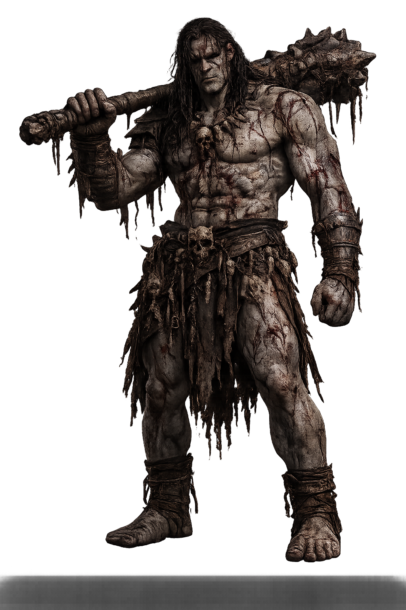
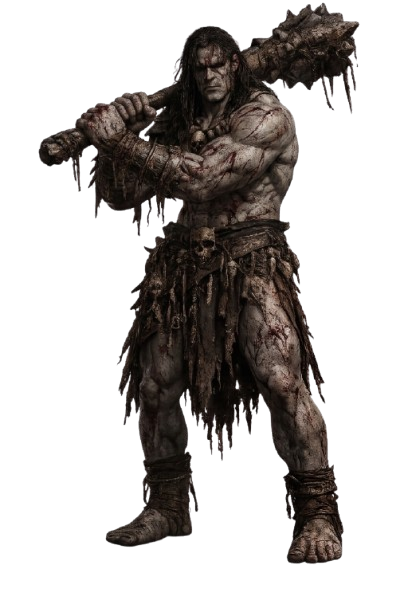
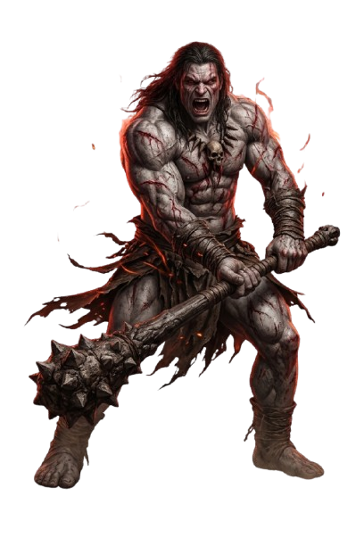
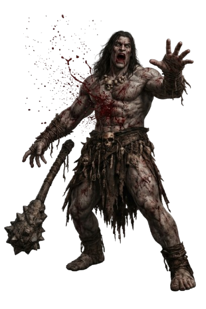
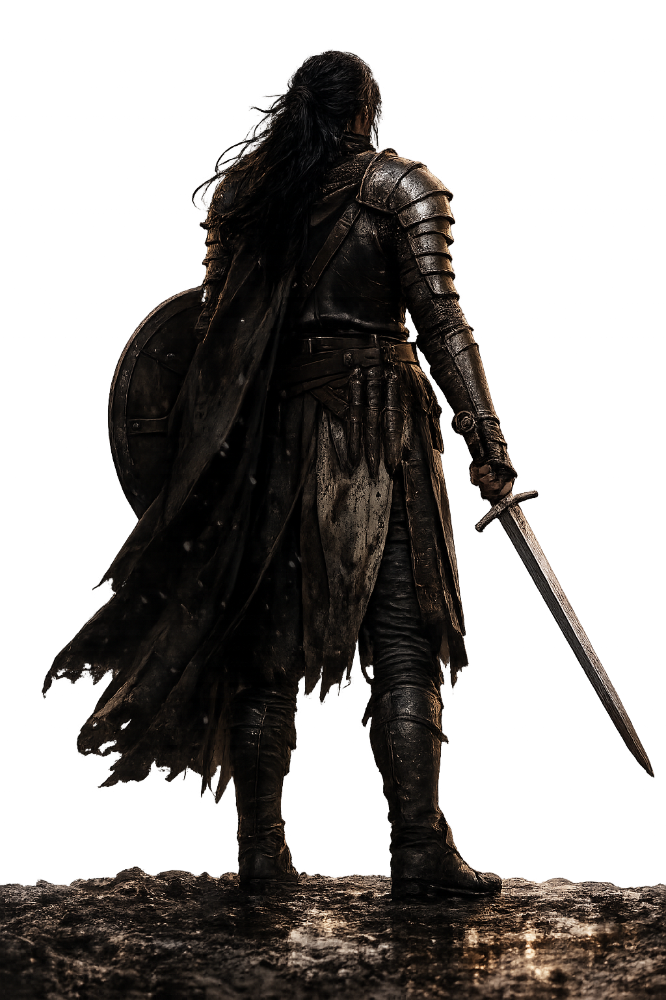
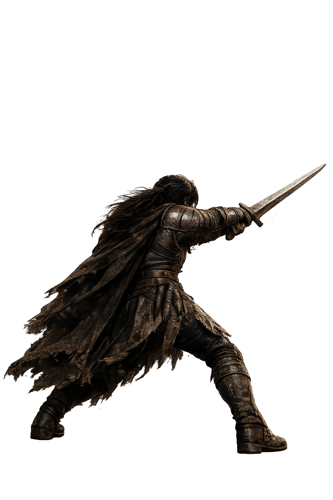
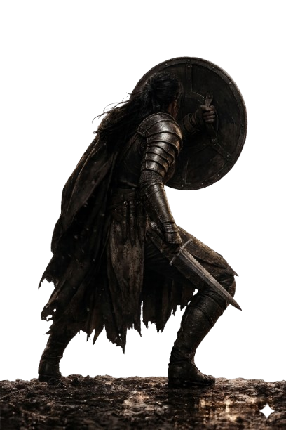
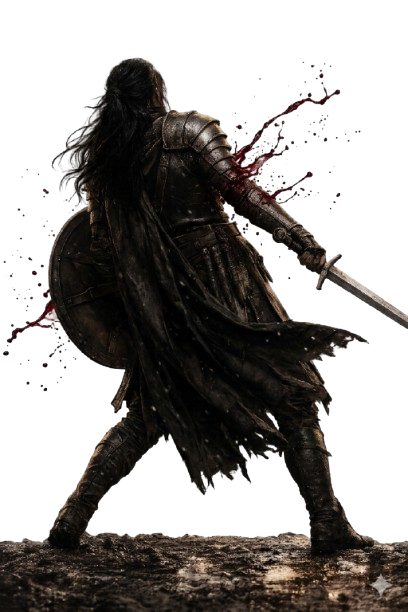

# AS QUATRO VONTADES — DUELO NA BOCA SECA
## Resumo completo do projeto (para continuar em nova conversa)

---

## 🎯 OBJETIVO ATUAL (PRIORIDADE MÁXIMA)

**Status ATUAL: v21 aplicado (ver "CORREÇÃO v21" na seção 4) — ajuste fino de escala do ataque/rageataque (1.15) + limpeza de manchas cinza específicas por vídeo em `kronkataca_anim_norm.webm`, `kronkrage_ataque.webm` e `kronkrage_saindo.webm`. Aguardando o usuário testar ao vivo e confirmar. `BUILD_VERSION='v21'`. Pendente: fazer o deploy (robocopy → repo_temp → git add/commit/push) e aguardar feedback.**

---

**Status histórico (v18): v18 aplicado. Usuário reportou 5 problemas específicos depois da v17: (1) kronk idle com pequenos pontos transparentes, (2) kronkataca com erros parecidos, (3) kronkbeenhit cortando o lado esquerdo e menor, (4) kronkrage_entrando com pedaços cinzas, (5) kronkrage_idle gigante/cortando pé e maça. Descoberta crítica ANTES de investigar: o navegador automatizado (Claude in Chrome) usado nas sessões anteriores para "validar ao vivo" NUNCA conseguiu decodificar vídeo de verdade — o elemento `<video>` trava permanentemente em `readyState=0` (confirmado: `fetch()` no mesmo arquivo funciona normal, só o pipeline de vídeo do Chrome trava; até `vid.play()` chegou a congelar a aba). Ou seja, todas as "validações ao vivo" da v16 provavelmente mediram a IMAGEM ESTÁTICA DE FALLBACK, não o vídeo real — o que explica por que os problemas de tamanho persistiam mesmo depois de "confirmados" visualmente.**

**Metodologia v18 (sem depender do navegador quebrado): para cada pose, extraí um frame real do vídeo (ffmpeg), rodei o MESMO algoritmo de chroma key em Python (`chroma_sim.py`) pra medir com precisão quanto do quadro é personagem, cruzei com a matemática de `object-fit:contain` pra achar o scale que iguala a altura aparente ao idle, e simulei a composição final (contain + transform) fora do navegador com PIL pra visualizar e conferir antes de aplicar (`render_pose()` em scripts locais). Descobertas e fixes:**

- **kronkrage_idle (item 5):** causa raiz era o ARQUIVO, não o CSS — `kronkrage_idle.webm` tinha enquadramento quase sem margem (personagem ocupando ~100% do frame), cortando pé/maça em qualquer escala razoável. Existia um arquivo alternativo (`kronkrage_idle_norm.webm`) já processado com enquadramento correto e boa margem (com aura de fogo), nunca referenciado no `index.html`. Troquei o `data-video` e zerei o scale (1.00 — praticamente não precisa de correção).
- **kronkbeenhit (item 3):** recortado de novo a partir do vídeo ORIGINAL enviado pelo usuário (`Kronkbeenhit.webm`, fundo preto puro, 1280x720, enquadramento completo — achado em `/uploads`). Novo recorte inclui o braço esquerdo inteiro. Reprocessado com chroma key fundo-preto→verde com proteção de matiz (pixels escuros só viram fundo se também forem neutros/sem matiz, protegendo cabelo escuro de virar buraco). Scale recalculado (0.93).
- **kronkrage_entrando (item 4):** a "mancha cinza" era um artefato de render (sombra/matiz neutro que não é verde puro, então o chroma key ao vivo nunca conseguia remover). Identifiquei via medição de matiz (chroma = max-min de RGB): a mancha é quase neutra (baixo matiz) enquanto cabelo escuro real sempre tem alguma tonalidade quente mesmo escuro. Filtro dedicado (`fix_entrando.py`) apaga blobs grandes de baixo-matiz-e-escuro preservando cabelo. Vídeo também recortado mais justo (removendo ~35% de margem lateral vazia) já que a proporção larga (1.51) do vídeo original também deixava o personagem pequeno demais na caixa. Scale recalculado (1.52).
- **kronkrage_saindo (não reportado neste round, mas mesmo padrão):** mesmo problema de proporção larga (1.78) com margem lateral excessiva, recortado mais justo. Scale recalculado (1.75).
- **kronk idle / kronkataca (itens 1 e 2):** investigação extensa (detecção automática de "buracos" + zoom manual em cada um) não achou nenhum bug de chroma key — todo "ponto transparente" encontrado é um gap real e esperado (vão entre braço erguido e tronco, franjas da tanga se separando, mechas de cabelo). Não alterei o algoritmo ao vivo por falta de uma causa concreta pra corrigir (risco de regressão sem benefício comprovado). O tamanho do ataque (que também estava reportado como "menor") FOI corrigido: scale 1.30→1.62.
- Recalculados também `rageataque` (1.04→1.01) e `ragedano` (1.15→1.46) pela mesma metodologia, já que a suspeita de que a v16 mediu o fallback errado se aplicava a todas as poses, não só às reportadas.

`BUILD_VERSION` foi pra `v18`. Detalhes completos na seção 4, "CORREÇÃO v18".

---

**Status anterior (v17): Usuário testou a v16 e reportou de novo tamanho inconsistente: "entrando em rage tá horrível... entrarage ficando mto pequeno... kronkrage_idle extremamente gigante". Investigando ao vivo (Claude in Chrome), achei a causa provável: quando um vídeo demora pra carregar (rede, ou concorrência entre os ~17 `.webm` do jogo carregando juntos), o jogo cai pro fallback estático (`kronkrage.png` etc.) — e essas imagens de fallback TÊM SEMPRE a mesma proporção (~0.667), sem nenhum ajuste de escala, renderizando a ~87% da altura da caixa independente da pose. Isso é BEM diferente do tamanho calibrado dos vídeos (que para ataque/entrarage/ragetonormal ficam bem menores que 87% de propósito). Se o fallback aparece pra uma pose e o vídeo de verdade pra outra, o usuário vê uma alternância de tamanho que parece um bug de escala, mas é na real fallback-vs-vídeo. Fix: (1) aumentei o timeout antes de cair pro fallback de 2.5s pra 6s, dando mais margem pra rede lenta; (2) adicionei `transform:scale` também nas classes `-fallback` das poses mais desproporcionais, pra aproximar do tamanho do vídeo correspondente. `BUILD_VERSION` foi pra `v17`. Detalhes na seção 4, "CORREÇÃO v17".**

**Status anterior (v16): Usuário conectou a extensão Claude in Chrome, o que permitiu finalmente TESTAR DE VERDADE em vez de só simular por fora. Abri o jogo publicado (v15), usei `setPose('kronk','X')` no console pra forçar cada pose e tirei screenshots reais. Confirmei: as poses "normais" (ataque, dano, rageataque, defesa) com os fatores da v14 ficavam OK — só as duas transições de fúria (`entrarage` 1.55, `ragetonormal` 1.85) e o `ragedano` (1.39) realmente ficavam grandes demais quando testados ao vivo. Reduzi pra valores testados e confirmados visualmente: ataque 1.30, dano 0.84, rageataque 1.04, ragedano 1.15, defesa 1.07, entrarage 1.20, ragetonormal 1.40 — cada um validado com screenshot antes de fechar o valor. `BUILD_VERSION` foi pra `v16`. Detalhes na seção 4, "CORREÇÃO v16".** Usuário testou a v16 e reportou de novo tamanho inconsistente: "entrando em rage tá horrível... entrarage ficando mto pequeno... kronkrage_idle extremamente gigante". Investigando ao vivo (Claude in Chrome), achei a causa provável: quando um vídeo demora pra carregar (rede, ou concorrência entre os ~17 `.webm` do jogo carregando juntos), o jogo cai pro fallback estático (`kronkrage.png` etc.) — e essas imagens de fallback TÊM SEMPRE a mesma proporção (~0.667), sem nenhum ajuste de escala, renderizando a ~87% da altura da caixa independente da pose. Isso é BEM diferente do tamanho calibrado dos vídeos (que para ataque/entrarage/ragetonormal ficam bem menores que 87% de propósito). Se o fallback aparece pra uma pose e o vídeo de verdade pra outra, o usuário vê uma alternância de tamanho que parece um bug de escala, mas é na real fallback-vs-vídeo. Fix: (1) aumentei o timeout antes de cair pro fallback de 2.5s pra 6s, dando mais margem pra rede lenta; (2) adicionei `transform:scale` também nas classes `-fallback` das poses mais desproporcionais, pra aproximar do tamanho do vídeo correspondente. `BUILD_VERSION` foi pra `v17`. Ainda NÃO testei essa parte ao vivo (o fallback é difícil de forçar de propósito) — se o usuário ainda ver tamanho errado depois do deploy, o próximo passo é confirmar ao vivo se está vendo o fallback ou o vídeo (dá pra checar isso no painel de Network do navegador, ou eu confirmo remotamente). Detalhes na seção 4, "CORREÇÃO v17".**

**Status anterior (v16): Usuário conectou a extensão Claude in Chrome, o que permitiu finalmente TESTAR DE VERDADE em vez de só simular por fora. Abri o jogo publicado (v15), usei `setPose('kronk','X')` no console pra forçar cada pose e tirei screenshots reais. Confirmei: as poses "normais" (ataque, dano, rageataque, defesa) com os fatores da v14 ficavam OK — só as duas transições de fúria (`entrarage` 1.55, `ragetonormal` 1.85) e o `ragedano` (1.39) realmente ficavam grandes demais quando testados ao vivo. Reduzi pra valores testados e confirmados visualmente: ataque 1.30, dano 0.84, rageataque 1.04, ragedano 1.15, defesa 1.07, entrarage 1.20, ragetonormal 1.40 — cada um validado com screenshot antes de fechar o valor. `BUILD_VERSION` foi pra `v16`. Detalhes na seção 4, "CORREÇÃO v16".**

**Status anterior (v15): Usuário testou a v14 e reportou que a correção de tamanho (transform:scale por pose) piorou tudo: "existe uma diferença de tamanho enorme... ele usando o rage ficou totalmente gigante, desde a transição até o estado idle dele em rage". Print mostrou Kronk em fúria dominando a cena, MUITO maior que a Bryne (inverte a perspectiva pretendida do jogo, onde Kronk deveria ficar menor/mais distante). Minha matemática pra justificar os fatores de escala (escalar a partir de `transform-origin:center bottom` deveria manter a cabeça na mesma posição seguraque o idle já usa) não bateu com o resultado real — sem navegador de verdade pra testar eu não consegui confirmar por que na prática ficou tão errado. Em vez de continuar tentando adivinhar e arriscar piorar de novo, **revertido**: removida toda a regra CSS `#kronk .pose-X{transform:scale(...)}` da v14. O problema de tamanho inconsistente entre poses (ataque menor, fúria maior) continua existindo, mas fica documentado como PENDENTE em vez de "corrigido" — melhor manter o tamanho original imperfeito do que arriscar piorar às cegas outra vez. As correções de chroma key da v14 (reprocessamento de `kronkrage_entrando`/`kronkrage_saindo`) foram VALIDADAS quadro a quadro e continuam valendo — só a parte de CSS/tamanho foi revertida. `BUILD_VERSION` foi pra `v15`. Detalhes na seção 4, "CORREÇÃO v15".**

---

**Status anterior (v14): Usuário testou a v13 e reportou frustração forte: "ainda está um tanto transparente... ele atacando está tbm está menor... muitos erros". Dessa vez investiguei 3 problemas DIFERENTES a fundo (não só o que o usuário descreveu, mas todas as 9 poses do Kronk uma por uma):**

**1) Tamanho inconsistente entre poses (causa do "atacando menor").** Cada vídeo do Kronk tem uma proporção largura/altura própria (poses de ataque são muito mais largas por causa do alcance do braço+arma). Como `.lutador canvas` usa `object-fit:contain` numa caixa `#kronk` de proporção FIXA (36%/62% = 0.581), um vídeo proporcionalmente mais largo que essa caixa "sobra" menos altura dentro dela — o personagem aparece bem menor mesmo sendo o mesmo tamanho de corpo. Medi a fração de altura ocupada em tela por cada uma das 9 poses (extraindo frames, medindo a silhueta): idle=0.79, pressao=0.79, rageataque=0.76, rageidle=0.74 (ok) contra ataque=0.47, ragedano=0.54, entrarage=0.51, ragetonormal=0.53 (bem menores) e dano=0.94 (maior que o normal). **Fix:** `transform:scale()` com `transform-origin:center bottom` por pose (`#kronk .pose-X`), calculado pra aproximar o tamanho do idle sem risco de cortar a cabeça no topo da cena (a matemática mostra que escalar a partir da base reproduz exatamente a mesma posição de cabeça que o idle já usa com segurança).

**2) `kronkrage_entrando.webm` e `kronkrage_saindo.webm` estavam GRAVEMENTE quebrados** (não só "precisa de ajuste" como o usuário avisou desde o início — estavam com buracos enormes, corpo praticamente irreconhecível). Causa: esses 2 vídeos não têm fundo preto puro (fundo cinza ~30/255 com leve gradiente + textura), e a pele em fúria tem MUITO detalhe escuro (veias, sombras profundas) que colide com qualquer limiar de chroma key simples — a abordagem anterior (subtração de fundo por mediana/polinômio) nunca funcionou bem porque o personagem quase não se move o suficiente pra expor o fundo real. **Fix:** reprocessei do zero com colorkey rígido (sim=0.14) + limpeza morfológica (closing 13x13 x3 iterações + preenchimento de buracos limitado por tamanho, pra não preencher os vãos ENTRE pernas/braços + manter só o maior componente conectado + remoção explícita da marca d'água "Veo"). Validei quadro a quadro (não só 1 frame) — foi de "irreconhecível" pra sólido e nítido na grande maioria dos 165 quadros de cada vídeo.

**3) Revalidei o fix do cabelo/perna (v13) nas outras 8 poses**, não só no idle — todas as outras 6 poses "normais" (ataque, dano, pressão, rage ataque, rage dano, rage idle) já estavam limpas com o algoritmo `max()` da v13; só os 2 vídeos de transição do item 2 precisavam de reprocessamento completo.

`BUILD_VERSION` foi pra `v14`. Detalhes completos na seção 4, "CORREÇÃO v14".

---

**Status anterior (v13): Depois do v12 (Kronk deixou de ficar "apagado"), usuário reportou "cabelo transparente, perna transparente". Causa raiz encontrada lendo o algoritmo ao vivo (não só simulando): a 2ª passada de suavização (janela 13x13, raio 6) SUBSTITUÍA o alpha de cada pixel pela média da vizinhança, em vez de usar essa média só pra cicatrizar buracos. Fios de cabelo e franjas penduradas têm 1-3px de largura — numa janela 13x13 cercada de muito verde, a média arrasta o alpha desses fios pra quase-zero mesmo quando o pixel individual já tinha sido corretamente lido como opaco (score bruto ≤ LOW). Pernas/torso não sofriam porque ali a vizinhança é majoritariamente opaca. **Fix:** trocado `final = pequena` por `final = Math.max(alphaBuf[p], pequena)` — mantém a cicatrização de buracos (funciona igual) e a supressão de manchas isoladas (raio 40, inalterada), mas para de diluir detalhes finos já corretamente detectados. É uma correção no algoritmo JS ao vivo (função `configurarVideosIdle`), então vale pra TODOS os personagens/vídeos sem precisar reprocessar nenhum arquivo `.webm`. Validado simulando a fórmula exata (score + 2 passadas + despill) sobre o `kronk_idle_norm.webm` já publicado e compondo sobre um fundo laranja quente (perto da cor real do cenário) — antes mostrava cabelo/franja "furadinhos" de verde-amarelo, depois ficou sólido e nítido. `BUILD_VERSION` foi pra `v13`. Detalhes completos na seção 4, "CORREÇÃO v13".**

**Status anterior (v12): A v11 melhorou o bug do Kronk "invisível" mas não resolveu de vez — usuário reportou que ele continuava "apagado" (buracos e manchas verdes espalhadas pelo corpo, principalmente no idle). Causa: a v11 usava `gblur` no canal alfa, que por si só já reintroduz suficiente semi-transparência pra o pipeline ao vivo (que reprocessa o vídeo já achatado em verde) enxergar parte do corpo como fundo de novo — mesma classe de bug da v11, só que mais sutil. **Solução definitiva:** usei exatamente a mesma receita que já funciona pra Bryne — `colorkey=0x000000:0.02:0.0` (limiar bem apertado, ZERO blend, sem blur nenhum), deixando toda a suavização de borda por conta do próprio pipeline ao vivo do jogo (que já tem sua própria zona de transição suave + correção de buracos por vizinhança). Validei rodando a fórmula exata do chroma key ao vivo em cima do resultado antes de publicar (não só olhar a imagem) — ficou limpo, sem buracos, sem verde no corpo. Reprocessados os mesmos 7 vídeos de novo. `BUILD_VERSION` foi pra `v12`. Detalhes completos na seção 4, "CORREÇÃO v12".**

Resumo do que foi feito: o print do usuário mostrava quadrados cinzas atrás do Kronk e da Bryne. Causa: a regra de chroma key exigia saturação de verde alta demais, então boa parte do fundo real (que tem variação de iluminação, não é verde uniforme) não era removida e ficava opaca e acinzentada. Corrigido com uma regra de margem relativa a G, validada pixel a pixel contra os 13 vídeos do projeto. `BUILD_VERSION` foi pra `v4`. Detalhes técnicos completos na seção 4.

Depois disso, o usuário reportou (e eu confirmei) que o vídeo `attackfromdefense` continuava "cortando" no final mesmo com os arquivos de vídeo corretos (duração/frame-count batendo exatamente). Causa real: `poseTemporariaCustom` tinha uma margem de tolerância grande demais (0.08s + polling de 80ms) na detecção de "vídeo terminou", cortando sistematicamente os últimos ~4 quadros de **qualquer** animação — só ficou visível agora porque é o primeiro vídeo do projeto desenhado pra terminar suavemente numa pose de repouso. Margem apertada pra 0.02s/30ms. `BUILD_VERSION` foi pra `v9`. Detalhes completos na seção 4, "CORREÇÃO v9".

O sistema de remoção de fundo (chroma key) é feito **inteiramente ao vivo, no navegador, via JavaScript**, processando pixel a pixel de um `<video>` oculto e desenhando o resultado num `<canvas>` visível. Os arquivos `.webm` em si têm fundo verde real (não têm transparência/alpha) — a transparência só existe depois do processamento em tempo real. Ver função `configurarVideosIdle()` no script completo (seção 12).

---

## ESTILO VISUAL DO JOGO

**Tema:** dark fantasy medieval, "deserto ao entardecer" (Boca Seca). Referências: Dark Souls, Diablo, RPG de mesa.

**Fontes:**
- `Cinzel` (serifada, "gravada em pedra") — títulos, nomes, botões, números
- `EB Garamond` — corpo de texto geral

**Paleta de cores (variáveis CSS):**
```css
--sangue: #8b0000        (vermelho sangue escuro)
--sangue-claro: #b91c1c  (vermelho mais vivo, usado em crítico/dano)
--dourado: #c9a227       (dourado — destaque, texto de turno, bordas)
--dourado-claro: #e8c860 (dourado mais claro — nomes, texto de acerto)
--pedra: #3a3a3a         (cinza pedra — bordas neutras)
--pedra-escura: #1a1512  (quase preto — fundo da moldura)
--osso: #e8e0d0          (bege claro — texto principal)
--verde-hp: #4a7c2f, --amarelo-hp: (=dourado), --vermelho-hp: (=sangue)
```

**Layout geral:**
- Container `.moldura` central, max-width 640px, fundo quase-preto com borda de pedra e sombra pesada
- `.cena` (tela de batalha): aspect-ratio 16:9, fundo `bocaseca.png` (deserto), com vinheta radial escurecendo as bordas
- Kronk fica em cima-direita (menor, mais distante), Bryne embaixo-esquerda (maior, mais perto) — perspectiva tipo Pokémon
- Caixas de HP estilo old-school RPG (nome + barra + número), cantos opostos aos personagens
- Pílulas de status (Fúria, Sangra, Terreno, etc.) abaixo das caixas de HP
- Log de combate estilo terminal (fonte monospace, textos coloridos por tipo de evento)
- Botões de habilidade em grid 2 colunas + botão especial (A Lâmina) ocupando a linha toda, com tooltip dourado no hover/toque mostrando os detalhes mecânicos
- Efeitos: números flutuantes de dano/cura/erro/crítico subindo e sumindo, flash de impacto, corte de espada (slash), tremor de tela no acerto, silhueta "atacando" com leve scale/translateY

**Estética geral:** sério, sombrio, sem elementos "bonitinhos" — cantos retos (bordas quase sem arredondamento), sombras fortes, dourado usado com moderação como destaque nobre contra o fundo escuro.

---


## 1. O QUE É O JOGO

Minigame de batalha por turnos no navegador, ambientado no universo do livro "As Quatro Vontades". Bryne (jogador) enfrenta Kronk (IA), sistema de dados D20, estética Pokémon (cenário fixo, personagens sobre ele). Hospedado no GitHub Pages:
`https://marcelomartinsjorge.github.io/aq4v-duelo/`

Repositório local do Git: `C:\Users\kuresto\Downloads\jogo\novaversão\Jogo1novaversao\repo_temp`
Pasta de trabalho (onde o Claude entrega arquivos): `C:\Users\kuresto\Downloads\jogo\novaversão\Jogo1novaversao\jogo_completo`

Fluxo de deploy sempre foi:
```powershell
cd C:\Users\kuresto\Downloads\jogo\novaversão\Jogo1novaversao\repo_temp
Copy-Item "C:\Users\kuresto\Downloads\jogo\novaversão\Jogo1novaversao\jogo_completo\ARQUIVO" -Destination . -Force
git add -A
git commit -m "mensagem"
git push origin main
```

---

## 2. MECÂNICA DO JOGO

### Sistema base
- D20 + modificador vs Dificuldade (DIF) para acertar
- 1 natural = falha crítica, 20 natural = crítico (dano dobrado)
- Melhor de 1 partida (não é melhor de 3), termina quando um HP chega a 0

### Stats
**Bryne** (jogador): HP 65, MOD ataque +3, DIF para ser acertada 14
**Kronk** (IA): HP 80, MOD ataque +4, DIF para ser acertado 11 (Fúria reduz para 9)

### Habilidades de Bryne
1. **Estocada** (ataque básico) — D20+3 vs DIF 11. Dano D20÷4+2 (4-7). **50% de chance de aplicar Sangramento** em Kronk (1d4/turno por 3 turnos, não acumula).
2. **Usar o Terreno** — Setup, gasta o turno. Próximo ataque de Kronk rola em desvantagem; se ele errar, Bryne contra-ataca automaticamente (5 de dano fixo).
3. **Leitura de Combate** — Setup. Próximo ataque dela rola com vantagem.
4. **Parede de Escudos** — Reduz próximo dano recebido em 6.
5. **A Lâmina** (especial, recarga 2 turnos) — D20+3 vs DIF 9. Ignora 3 de proteção. Crítico = dano dobrado.

### Habilidades de Kronk (IA)
1. **Maçada** — básico, D20+4 vs DIF 14, dano 5-8
2. **Garrar** — D20+4 vs DIF 12, dano 3-5, aplica "Preso" (próximo ataque dele acerta automático)
3. **Fúria** — +10 HP, +2 dano por 2 turnos, mas DIF cai para 9 (mais fácil de acertar)
4. **Peso de Parede** — se Bryne atacar e errar, ele contra-ataca (6 de dano fixo)
5. **Maça para Cima** (recarga 2 turnos) — D20+4 vs DIF 14, dano 8-11, crítico atordoa Bryne (perde turno)

IA muda de comportamento com HP ≤30% (modo desesperado): prioriza Fúria e Maça para Cima.

---

## 3. SISTEMA DE POSES E ANIMAÇÃO (o mais complexo)

Cada personagem (`#kronk`, `#bryne`) tem várias `<canvas>` sobrepostos, cada um com um vídeo WebM associado via `data-video`, mais um `` de fallback (`.pose-X-fallback`) caso o vídeo falhe.

### Poses da Bryne
- `pose-base` (idle, loop) → `bryne_idle_norm.webm`
- `pose-ataque` (do idle) → `bryneataque_idle_norm.webm`
- `pose-entradadefesa` (transição, toca 1x) → `bryneentra_defesa_norm.webm` → depois vai pra:
- `pose-defesa` (loop, parada em guarda) → `bryne_defesa_loop_norm.webm`
- `pose-contraataque` (gatilho: Terreno ativo + Kronk erra) → `brynecontraataque_norm.webm`
- `pose-ataquedadefesa` (ataca estando em guarda) → `bryneataque_defesa_norm.webm`
- `pose-dano` (leva dano no idle) → `brynedano_idle_norm.webm`
- `pose-danodefesa` (leva dano na guarda) → `brynedano_defesa_norm.webm`
- **Bryne NÃO tem mais pose de "desvia"** (removida a pedido do usuário — quando Kronk erra sem contra-ataque, ela só fica na pose atual)

### Poses do Kronk (reformuladas na v10 — 9 vídeos novos, ver seção 4 "SUBSTITUIÇÃO v10")
- `pose-base` (idle normal, loop) → `kronk_idle_norm.webm`
- `pose-ataque` (ataque normal genérico: Macada / Maça pra Cima) → `kronkataca_anim_norm.webm`
- `pose-pressao` (Garrar e "Peso", só fora de fúria) → `kronkpressao_normal.webm`
- `pose-defesa` = idle em Fúria (loop) → `kronkrage_idle.webm`
- `pose-dano` (leva dano fora de fúria) → `kronkbeenhit_anim_norm.webm`
- `pose-rageataque` (qualquer ataque durante a fúria) → `kronkrage_ataque.webm`
- `pose-ragedano` (leva dano durante a fúria) → `kronkrage_beenhit.webm`
- `pose-entrarage` (transição normal→fúria, toca 1x ao usar Fúria) → `kronkrage_entrando.webm` → assenta em `pose-defesa`
- `pose-ragetonormal` (transição fúria→normal, toca 1x quando a fúria expira) → `kronkrage_saindo.webm` → assenta em `pose-base`
- **Kronk NÃO tem mais pose de "desvia"** (removida a pedido do usuário — quando Bryne erra sem contra-ataque de Terreno, ele só fica na pose atual)

### Funções JS principais (em `index.html`)
- `setPose(quem, pose)` — ativa uma pose, reinicia o vídeo do zero
- `poseTemporariaCustom(quem, pose, duracaoMs, computeReturnPose)` — mostra uma pose temporariamente, depois volta pra pose calculada por `computeReturnPose()`. Usa **evento real do vídeo + polling**, não só timer (ver seção de bugs). Se `computeReturnPose()` retornar `null`/`false`, o `finalizar()` NÃO chama `setPose` por cima — usado quando a própria função de retorno já disparou outra transição (ver `retornoKronk`).
- `poseRepouso(quem)` — decide se volta pra 'base' ou 'defesa'. Pra Kronk, só `S.ef.furia>0` conta (o antigo `S.ef.peso` foi removido dessa condição na v10 — "Peso" agora é só uma animação de ataque temporária, não muda o idle).
- `retornoKronk()` (novo na v10) — pose de retorno usada por `poseAtaque('kronk',...)` e `poseDano('kronk')`. Detecta quando `S.kronk._emRage` estava true mas `S.ef.furia` já chegou a 0 (fúria expirou no meio da ação) e, nesse caso, dispara a transição `ragetonormal` em vez de cortar direto pra pose base.
- `poseAtaque(quem, tipoOuId)` — pra Kronk, o 2º parâmetro decide a animação: em fúria sempre usa `rageataque`; fora de fúria, `'garrar'`/`'peso'` usam `pressao`, qualquer outro id usa `ataque`.
- `poseDano`, `poseContraataque`, `poseDefesa`, `poseBase` — wrappers específicos (Kronk não tem mais `poseDesvia`)

### Durações das animações (batem com os vídeos reais, ciclo completo)
Usuário pediu explicitamente que as animações **toquem por inteiro** (ele desenhou os vídeos para voltarem sozinhos ao estado idle no final) — jogo mais lento, mas sem cortar o ciclo:
- Bryne ataque (idle): 4000ms (96 frames a 24fps)
- Bryne ataque (da defesa): 8000ms (192 frames)
- Bryne contra-ataque: 8000ms (192 frames)
- Bryne dano (idle): 4000ms (96 frames)
- Bryne dano (defesa): 7000ms (168 frames)
- Bryne entra em defesa (transição): 1700ms (38 frames reais)
- Kronk ataque normal: 5708ms (137 frames a 24fps)
- Kronk pressão (Garrar/Peso, normal): 4542ms (109 frames)
- Kronk ataque em fúria: 4000ms (96 frames)
- Kronk dano normal / dano em fúria: 4000ms (96 frames, cada)
- Kronk entra em fúria / sai da fúria (transições): 6875ms (165 frames, cada)
- Ritmo geral do turno foi alongado para acomodar (`jogadorAge` espera 8300ms antes de `faseKronk`)

---

## 4. CHROMA KEY (remoção de fundo verde) — HISTÓRICO DE BUGS

O chroma key é feito **ao vivo no navegador**, não no vídeo (os WebM têm fundo verde real, não alpha). Função `configurarVideosIdle()` cria um `<video>` oculto por canvas, desenha frame a frame num canvas de processamento, aplica a regra de cor, e desenha no canvas final via `putImageData`.

### Regra de cor ANTERIOR (causava o "fundo cinza"):
```js
const brilho = (r+g+b)/3;
const verdePuro = (r < g*0.5) && (b < g*0.5) && g>40;
const sombra = !verdePuro && brilho<95 && (g-r>7) && (g-b>7);
if(verdePuro || sombra){
  d[i+3]=0; // remove
} else if(g-b>10 && g-r>10){
  d[i+1] = Math.round((r+b)/2); // despill leve (ex: espada com reflexo verde), mantém opaco
}
```

### ✅ BUG DO "FUNDO CINZA" — DIAGNOSTICADO E CORRIGIDO
O usuário mandou print mostrando quadrados cinzas sólidos atrás do Kronk e da Bryne. Diagnóstico feito extraindo frames reais dos `.webm` com ffmpeg e testando a regra de cor pixel a pixel em Python (não só lendo o código):

**Causa raiz:** o fundo verde do estúdio não é um verde puro/uniforme — tem variação real de iluminação (áreas mais claras/quase estouradas, sombras, etc). A regra antiga exigia saturação muito alta (`r < g*0.5 && b < g*0.5`). Boa parte do fundo real (ex.: pixel `(70,155,85)`) **falhava** nesse teste (`b=85 > g*0.5=77.5`) e caía no branch de "despill", que só dessatura um pouco o verde **mas mantém o pixel opaco** — isso pintava a área inteira do vídeo (dentro do pillarbox verde puro, que era removido corretamente) de um cinza/verde-acinzentado sólido: exatamente o "quadrado cinza" do print.

**Correção aplicada (linha ~1405-1407 de `configurarVideosIdle()`):** troquei o teste de saturação fixa por uma margem relativa a G, calibrada testando pixel a pixel contra os 13 vídeos reais do projeto (checando que a espada da Bryne e os brilhos claros da pele do Kronk não sumissem):
```js
const verdePuro = (g-r>45) && (g-b>35) && g>35;
const sombra = !verdePuro && brilho<110 && (g-r>5) && (g-b>5);
```
`BUILD_VERSION` incrementado para `v4` (força o navegador a buscar o HTML novo, sem afetar cache dos vídeos/áudios que não mudaram).

**Validação feita:** simulação da mesma matemática em Python sobre frames reais extraídos de TODOS os 13 vídeos (um frame de cada) + 8 frames espalhados pelo loop do Kronk idle (pra garantir que não pisca/flicka ao longo do tempo). Fundo limpo em 100% dos casos, sem furos nos personagens, espada da Bryne preservada (leve serrilhado nas bordas, aceitável). **Não foi possível testar num Chromium real nesta sessão** (Playwright não instalou — bloqueio de rede no sandbox). Recomendo o usuário confirmar visualmente após o deploy no GitHub Pages.

### ✅ REFINAMENTO v5 — sumia pedaço do corpo/armadura da Bryne (over-correction do fix acima)
Depois do fix do "fundo cinza" (v4, regra `g-r>45 && g-b>35` acima), o usuário reportou que a remoção ficou exagerada especificamente na Bryne: pequenos buracos nas juntas da armadura (reflexo de luz esverdeada na peça metálica — cotovelo, antebraço) e, em golpes rápidos (`bryneataque_defesa_norm`), a espada some quase inteira porque o motion blur mistura opticamente a lâmina com o fundo verde durante o frame (fisicamente parecido demais com o fundo pra regra distinguir). Diagnóstico feito extraindo ~13 frames de CADA uma das 8 animações da Bryne e comparando a regra antiga x nova pixel a pixel.

**Causa:** regra antiga era binária (remove tudo ou nada com aquele limiar único). Não existe um único limiar de cor que separe perfeitamente "reflexo de spill verde na armadura"/"espada borrada" de "fundo verde real", porque a cor É genuinamente parecida nesses casos (spill ótico real, não erro de cálculo).

**Correção aplicada (mesma função `configurarVideosIdle()`, dentro do `loop()`):** troquei o corte binário por um **alpha contínuo** (0–255, não é só 0 ou 255): pixels bem verdes ficam 100% transparentes, pixels bem "não-verdes" ficam 100% opacos, e a faixa ambígua no meio (`score = min(g-r, g-b)` entre 15 e 55) vira uma transição suave — isso faz a espada borrada esmaecer graciosamente em vez de sumir de vez. Além disso, adicionei uma 2ª passada com **imagem integral** (soma acumulada, técnica clássica de visão computacional pra calcular a média de uma janela ao redor de cada pixel em O(1), sem pesar no desempenho): se a vizinhança de um pixel "ambíguo" é majoritariamente opaca (ex.: um pixel isolado de reflexo dentro da armadura solid), o alpha dele é puxado de volta pra opaco — isso fecha os buraquinhos de reflexo sem reabrir o fundo verde real (que também tem vizinhança transparente, então não é afetado).

```js
// 1ª passada — alpha contínuo por pixel
const score = Math.min(g-r, g-b);
let a = score<=15 ? 255 : score>=55 ? 0 : 255*(1-(score-15)/(55-15));
// 2ª passada — "cura" via média de vizinhança (imagem integral, raio 4, boost 0.9)
if(mediaDaJanelaAoRedor > a) a = mediaDaJanelaAoRedor*0.9;
```
`BUILD_VERSION` foi pra `v5`.

**Validação:** extraí ~13 frames de cada uma das 8 animações da Bryne (idle, ataque, ataque-da-defesa, entra-defesa, defesa-loop, contra-ataque, dano-idle, dano-defesa) e rodei a mesma matemática em Python. Resultado: buracos de armadura fechados em todas as poses testadas, espada preservada mesmo no golpe mais rápido (agora com esmaecimento suave em vez de sumir), fundo continua 100% limpo. **Kronk não foi reavaliado nessa rodada** (usuário pediu pra ignorar ele por ora — a regra é compartilhada entre os dois personagens, então vale conferir o Kronk visualmente também quando sobrar tempo). Sem acesso a Chromium real nesta sessão pra teste ao vivo (mesma limitação de rede já registrada acima).

### ✅ REFINAMENTO v6/v7 — resto de mancha longe da Bryne no fim do loop de `bryne_defesa_loop`
Sendo perfeccionista, o usuário notou uma manchinha (verde/cinza fraco) sobrando bem longe da silhueta, perto do canto da imagem, perto do ponto onde o loop de `bryne_defesa_loop_norm` fecha (frames iniciais/finais do loop, que são vizinhos na repetição). Extraí os 99 frames desse vídeo especificamente e rastreei componentes conectados "sobrando" fora do blob principal da personagem.

**Causa:** é uma região BEM maior do que um pixel/reflexo pontual — um trecho do fundo verde de estúdio onde a saturação da cor caiu bastante (provavelmente uma sombra/gradiente de iluminação naquele canto específico da filmagem), com `score = min(g-r,g-b)` ficando bem no meio da faixa ambígua (15–55) numa área de dezenas de milhares de pixels — grande demais pra "cura" de vizinhança de raio pequeno (raio 6) resolver sozinha, mas pequena/isolada o bastante (rodeada de fundo já 100% removido) pra não ser fundo "de verdade" murcho o bastante pra ficar visível.

**Correção (mesma função, ainda dentro do `loop()`):** adicionei uma SEGUNDA consulta na mesma imagem integral, com um raio bem maior (40px) só pra decidir "esse pixel está isolado numa vizinhança BEM mais larga que já é praticamente toda transparente?" — se sim, força esse pixel a 100% transparente, mesmo que a janela pequena (raio 6, usada pra suavizar bordas/fechar buraco de armadura) não tivesse zerado sozinha. Perto do corpo/espada de verdade, a janela grande sempre encontra bastante opacidade por perto (o próprio corpo), então isso não mexe neles — só afeta manchas que estão de fato isoladas longe da personagem.

```js
const pequena = mediaJanela(cx,cy,6);   // suaviza borda / fecha buraco de armadura
let final = pequena;
if(pequena>0){
  const grande = mediaJanela(cx,cy,40); // "isso tá isolado bem longe de qualquer opacidade?"
  if(grande<15) final = 0;
}
```
`BUILD_VERSION` foi pra `v7` (v6 foi um passo intermediário só com a janela pequena, sem a checagem de raio grande — não resolvia essa mancha específica sozinho).

**Validação:** rodei a mesma lógica em Python contra os 99 frames inteiros de `bryne_defesa_loop_norm` (o vídeo relatado) — a mancha reportada sumiu completamente; sobrou só 1 vestígio de 5 pixels a ~12% de opacidade em 1 frame de 99 (imperceptível). Reconferi também as 8 poses da Bryne de novo (múltiplos frames cada) pra garantir que a espada e a armadura continuam intactas com essa mudança — sem regressão. Ainda sem Chromium real nesta sessão pra teste ao vivo no navegador.

### ✅ SUBSTITUIÇÃO v8 — vídeos novos da Bryne (`bryneataque_defesa_norm` e `brynecontraataque_norm`) com retorno natural ao idle
O usuário refez os vídeos de "ataque da defesa" e "contra-ataque" ele mesmo (arquivos enviados: `Bryneattackfromdefensev2.webm`, `Brynecontraattackv3.webm`), desenhados pra já terminar naturalmente numa pose parecida com o idle — objetivo: mascarar que são clipes interpolados, sem corte seco na transição de pose. Relatou que, no jogo, o vídeo aparecia "cortado".

**Diagnóstico (comparando com os vídeos que já existiam no projeto):**
1. **Orientação errada.** Os vídeos novos vieram em **paisagem 1280x720**; todo o resto do jogo (13 vídeos) é **retrato 720x1280**. Como o CSS usa `object-fit:contain` numa caixa estreita e alta (`#bryne`), jogar um vídeo paisagem ali faz a personagem aparecer muito menor e deslocada — a troca de pose "estoura" o tamanho dela na tela, o que lê como um corte/quebra brusca (não é um corte de tempo, é um pulo de escala).
2. **Escala/enquadramento diferente.** Nos vídeos antigos, a Bryne ocupa uma faixa vertical consistente (cabeça-aos-pés ≈ 550px dentro do quadro de 1280px, pés a ~97% da altura). No vídeo novo (paisagem), ela ocupava quase 720px de altura (~95% do quadro) — enquadramento completamente diferente.
3. **Duração:** o vídeo de contra-ataque novo tem 164 frames a 24fps = 6834ms; o código tinha `8000` hardcoded (herdado de uma versão antiga). Isso não chega a cortar o vídeo (a troca de pose usa o evento `ended`/polling do vídeo real, não esse número — ver seção 5), mas estava desatualizado.
4. **Duas marcas d'água da ferramenta de geração** apareciam nos vídeos (um ícone "imagem/estrela" perto do canto inferior direito, y:584-626 x:1148-1187, e outro ícone no canto superior direito, y:15-57 x:1231-1273, ambos na resolução 1280x720 original) — precisavam ser removidas antes de reenquadrar.

**Correção aplicada (fora do `index.html`, processamento de vídeo via ffmpeg):**
1. `drawbox` preto sobre as duas marcas d'água (antes de qualquer escala).
2. `scale=1031:580` (fator ≈0.805, calibrado pra ela ficar com a MESMA altura de corpo — ≈550px — das outras poses da Bryne).
3. `crop=720:580:311:0` — recorta a largura pro padrão 720px, mantendo a ponta da espada no auge do golpe (chega bem perto da borda, ≈714px de 720, igual às outras poses — nada foi cortado).
4. `pad=720:1280:0:676:black` — recoloca no quadro retrato 720x1280 final, pés a ~97% da altura (igual às outras poses).
5. **Fps e contagem de frames exatos preservados**: 192 frames/24fps (8000ms) no ataque-da-defesa, 164 frames/24fps (6834ms) no contra-ataque — validado com `ffprobe -count_frames` antes e depois.
6. O fundo que o usuário já tinha deixado preto foi convertido pra **verde** (`colorkey=0x000000:0.02:0.0` + composição sobre fundo verde) — não pra deixar transparência real, mas pra alimentar o MESMO pipeline de chroma key ao vivo (`configurarVideosIdle()`) que todos os outros vídeos do jogo já usam. Isso foi decidido depois de tentar uma primeira versão com `similarity` mais alto (0.12), que "infectava" partes escuras de verdade da personagem (cabelo preto, botas pretas) com verde — cabelo e sombras dela chegam bem perto de preto puro, then um limiar mais apertado (0.02) resolveu sem contaminar o corpo.
7. `index.html`: duração do contra-ataque em `poseContraataque()` corrigida de `8000` pra `6834` (linha ~1101). Duração do ataque-da-defesa já batia (`8000`). `BUILD_VERSION` foi pra `v8`.
8. Os arquivos finais substituem `bryneataque_defesa_norm.webm` e `brynecontraataque_norm.webm` **no mesmo nome** — nenhuma outra referência no `index.html` precisou mudar.

**Validação:** rodei a mesma matemática do chroma key ao vivo (seção 4) em Python contra ~12 frames espalhados por cada vídeo novo já reenquadrado — fundo limpo, sem marca d'água, sem infecção verde no cabelo/botas, escala consistente com as outras poses da Bryne, e as duas animações realmente terminam numa postura de repouso natural (o objetivo original do usuário). Ainda sem Chromium real nesta sessão pra confirmar ao vivo no navegador — recomendo o usuário conferir a transição de pose no jogo depois do deploy.

### ✅ CORREÇÃO v9 — causa real do "corte no final" do `attackfromdefense` (e de qualquer pose custom)

O usuário reenviou `Bryneattackfromdefensev2.webm` confirmando que **ainda** via o vídeo cortando bem no final, exatamente quando ela retorna à pose parecida com idle. Reconferi tudo que já tinha sido validado no v8:
- Duração/frame-count do arquivo enviado: 192 frames, 24fps, 8.000s (idêntico ao medido antes).
- Arquivo `bryneataque_defesa_norm.webm` já implantado em `jogo_completo`: também 192 frames, 24fps, 8.000s — `md5sum` bate exatamente com o arquivo processado no v8 (não era cache velho).
- `poseAtaque()` já chamava `poseTemporariaCustom('bryne','ataquedadefesa', 8000, ...)` — duração certa.
- Escala/enquadramento: comparei bounding box da personagem (excluindo fundo verde/preto) entre `bryne_idle_norm`, `brynecontraataque_norm` e `bryneataque_defesa_norm` — a diferença de altura ocupada no quadro (39–46% da altura de 1280px) é só a variação normal de pose (agachada atacando vs. em pé parada), não um erro de reenquadramento.

Ou seja: **tudo que já tinha sido verificado no v8 continuava correto** — o vídeo em si nunca esteve cortado. A causa real estava em outro lugar, nunca examinado antes: a lógica de detecção de "vídeo terminou" em `poseTemporariaCustom` (seção 5), que tinha uma margem de tolerância grande demais e cortava sistematicamente os últimos quadros de **qualquer** pose com vídeo próprio — só ficava mais visível no `attackfromdefense` porque é justamente o vídeo cujo final (retorno gracioso à idle) o usuário mais se importa em preservar.

**Causa exata:** a sondagem (`setInterval` a cada 80ms) trocava de pose assim que `vid.currentTime >= vid.duration - 0.08`. Isso permite disparar a troca até **~160ms antes do fim real** (0.08s de margem + até 80ms de atraso do próprio polling) — a 24fps, isso corresponde a **cortar até ~4 quadros finais** do vídeo, toda vez, de forma determinística (não depende de sorte/RNG). Como o usuário desenhou o vídeo pra terminar suavemente na pose de repouso, perder justo esses últimos quadros é o que lê como "corte seco".

**Correção (`index.html`, função `poseTemporariaCustom`):** margem reduzida de `0.08` para `0.02` (menos de meio quadro a 24fps = 0.0417s) e intervalo de sondagem reduzido de `80ms` para `30ms`, cortando o pior caso de ~160ms para ~50ms de antecipação — imperceptível. O evento `ended` continua como gatilho primário (dispara exatamente no fim real, sem nenhuma margem); a sondagem é só um plano B pro bug de navegador documentado na seção 5. O timer de segurança (`dur*1.6`) não mudou. `BUILD_VERSION` foi pra `v9`.

**Por que isso não tinha aparecido antes:** essa margem de 0.08s sempre existiu (é a solução original pro bug de "vídeo trava no final" — seção 5) e afeta igualmente todas as poses temporárias (dano, desvio, contra-ataque, ataque normal). Só ficou evidente como "corte" agora porque o `attackfromdefense`/`contraataque` são os primeiros vídeos do projeto desenhados pra terminar exatamente numa pose de repouso visível — nos vídeos antigos, cortar 2-4 quadros finais de uma animação de impacto/dano não é perceptível, porque não havia uma "aterrissagem" cuidadosa no final pra estragar.

**Validação:** não foi possível reproduzir a troca de pose num Chromium real nesta sessão (mesma limitação de rede já documentada); a correção foi conferida lendo o código e confirmando a aritmética da janela de corte (24fps → 1 quadro = 41.7ms; nova margem 0.02s + 30ms de polling ≈ 50ms, abaixo de 2 quadros, e bem mais perto do fim real). Recomendo o usuário testar de novo no jogo publicado (com cache limpo, já que `BUILD_VERSION` mudou pra `v9`) e confirmar se o corte sumiu.

---

### ✅ SUBSTITUIÇÃO v10 — TODO o Kronk trocado (9 vídeos novos) + remoção da esquiva

Usuário enviou 9 vídeos próprios do Kronk (fundo preto, `Kronkidle 1.webm`, `Kronkiattack.webm`, `Kronkbeenhit.webm`, `Kronkpressurenormal.webm`, `Kronkrageidlesemchroma.webm`, `Kronkrageattack.webm`, `Kronkinragebeenhit.webm`, `Kronkragetonormal.webm`, `Krongetsinragemelhorar.webm`) pra substituir TODAS as poses do Kronk de uma vez, e pediu explicitamente pra remover a animação de esquiva (`pose-desvia`) do Kronk. Mapeamento completo na seção 3 ("Poses do Kronk").

**Reenquadramento (ffmpeg, mesma lógica da seção "SUBSTITUIÇÃO v8" da Bryne):** os vídeos vieram em paisagem/proporções variadas (a maioria 1280x720, `Kronkrageidlesemchroma` em 914x712, `Krongetsinragemelhorar` na verdade em **1280x656**, não 720 como o nome dos outros sugeria — checar sempre com `ffprobe`, não confiar no padrão). Pra cada vídeo: medi a caixa delimitadora real do personagem (excluindo marca d'água) com maior componente conexo, calculei um fator de escala por grupo (poses "normais" e poses "fúria" calibradas separadamente a partir da pose idle de cada grupo, já que o modelo em fúria é visualmente maior/diferente), e recortei/preenchi (`pad`+`crop`) centrado nos pés, preservando frame count exato. Ataques com giro de arma muito largo (`Kronkiattack`) precisaram de canvas mais largo que 720px pra não cortar a maça — como o `object-fit:contain` do CSS é dominado pela altura da caixa do Kronk (36% de largura × 62% de altura da cena, mais estreita que alta em relação ao vídeo 720×1280), isso não reduz o tamanho aparente na tela na prática, só evita cortar a ponta da arma.

**Chroma key (fundo preto → verde):** ao contrário da Bryne, aqui o fundo de origem é **preto**, não verde. Tentei primeiro o mesmo `colorkey` direto (preto→transparente) usado nos vídeos da Bryne, mas descobri um problema novo: escalar o vídeo (2x) **antes** do colorkey criava uma auréola preta dura em volta de cabelo/braços (a interpolação da escala mistura pixels do personagem com o preto do fundo, criando uma cor intermediária que nem é preto puro nem é o personagem — o colorkey então deixa essa auréola 100% opaca). Corrigido invertendo a ordem: `colorkey` **antes** de escalar (assim a escala interpola o canal alfa já calculado, não a cor crua), com `similarity=0.10` e `blend=0.35` (bem mais suave que o `0.02` usado na Bryne — o material/iluminação desses vídeos precisou de mais folga).

**Dois vídeos com fundo cinza gradiente (não preto puro):** `Kronkragetonormal` e `Krongetsinragemelhorar` (as duas transições fúria↔normal) têm um fundo de estúdio cinza com vinheta (mais escuro nas bordas, mais claro no centro), exatamente o mesmo tipo de problema que causou o bug original do "fundo cinza" (`colorkey` de cor única não dá conta de um gradiente). Pra esses dois, usei uma técnica diferente, **subtração de fundo (background plate)**, em vez de chroma key por cor:
1. Extraí todos os frames como array bruto (`ffmpeg` → `rawvideo` → NumPy).
2. Ajustei uma superfície polinomial 2D suave (grau 3) aos pixels de borda/canto (que nunca têm o personagem), pra estimar o fundo "limpo" completo, incluindo a vinheta — a mediana temporal pura não funcionou aqui porque o personagem não se move o bastante nesses clipes pra expor o fundo verdadeiro em toda a área.
3. Alpha = diferença absoluta entre cada frame e essa placa de fundo estimada, com uma zona de transição suave (não é on/off) e uma máscara auxiliar (maior componente conexo "grosso", dilatado) pra evitar que ruído de compressão espalhado pela imagem virasse pixels falso-positivos.
4. Removi manualmente artefatos específicos desses dois vídeos (uma linha vertical fina e uma linha de "chão" no rodapé, aparentemente marcas da ferramenta que gerou os vídeos, além da marca d'água de sempre).
5. Resultado composto sobre verde puro e reenquadrado como os demais.

**Caveat honesto sobre esses dois vídeos de transição:** mesmo com a subtração de fundo, ficou uma sombra residual suave (semi-transparente) atrás do personagem em alguns frames — pode ser uma sombra real que ele projeta no fundo do estúdio (fisicamente plausível) ou um resíduo do modelo de fundo não capturar 100% da cena. Não é uma mancha sólida feito o bug original, é uma transparência parcial que deve suavizar ainda mais com o próprio pipeline de chroma key ao vivo do jogo (seção 4, topo). Se o usuário achar essas duas transições (`kronkrage_entrando.webm`, `kronkrage_saindo.webm`) abaixo do padrão dos outros 7 vídeos, valeria a pena revisar de novo com mais tempo — foram, de longe, os dois arquivos mais difíceis do lote.

**Lógica de jogo nova (`index.html`):**
- `poseAtaque('kronk', tipoOuId)` ganhou um 2º parâmetro pra escolher a animação certa: em fúria sempre `rageataque`; fora de fúria, `'garrar'`/`'peso'` usam `pressao`, outros ataques usam `ataque` genérico.
- `poseDano('kronk')` escolhe `dano` ou `ragedano` conforme `S.ef.furia`.
- `retornoKronk()` (nova função, usada como `computeReturnPose` do Kronk): se a fúria expirou durante a ação que acabou de tocar, dispara a transição `ragetonormal` em vez de voltar direto pra pose base — usa o novo suporte a retorno `null` em `poseTemporariaCustom`/`finalizar()` pra não deixar o `setPose` genérico sobrescrever a transição que ela mesma iniciou.
- Ativar Fúria agora toca a transição `entrarage` (em vez de cortar direto pra pose de guarda); a pose "Peso" passou a tocar a animação de pressão (antes usava a mesma pose de guarda/fúria por falta de vídeo próprio).
- `poseRepouso('kronk')` não considera mais `S.ef.peso` (só fúria muda o idle).
- Removidos: função `poseDesvia`, a chamada `poseDesvia('kronk')` (agora só um comentário — Kronk fica na pose atual quando erra sem contra-ataque), e os elementos `pose-desvia`/`pose-desvia-fallback` do HTML. O arquivo `kronkdesvia_anim_norm.webm` ficou no repositório sem uso (não é referenciado em lugar nenhum, inofensivo deixar).
- `BUILD_VERSION` foi pra `v10`.

**Validação:** frame count de cada um dos 9 arquivos conferido via `ffprobe` contra o vídeo de origem (todos batendo: 96, 96, 96, 109, 96, 96, 96, 165 e 165 quadros). Sintaxe do JS extraído e validada com `node --check`. Conferi visualmente (grade de 9 frames, um por vídeo) que nenhuma pose está com cabeça/pés cortados. Não foi possível testar ao vivo num Chromium real nesta sessão — recomendo o usuário testar cada uma das 9 poses no jogo publicado (fúria, saída de fúria, Garrar, Peso, ataques normais) e reportar qualquer chroma key ainda ruim, especialmente nas duas transições.

⚠️ **Essa validação visual (grade de 9 frames num fundo verde) foi INSUFICIENTE e não pegou o bug real — ver "CORREÇÃO v11" abaixo.** Olhar uma imagem estática composta sobre verde não revela que a cor do PRÓPRIO personagem está contaminada de verde; só ficou óbvio depois de simular a matemática exata do chroma key ao vivo (`score = min(g-r, g-b)`) contra os pixels reais. Lição pra próxima vez: sempre validar rodando a fórmula de alfa de verdade em cima do frame, não só olhar se "dá pra ver a pessoa".

---

### ✅ CORREÇÃO v11 — Kronk ficava invisível no jogo publicado

O usuário testou no navegador dele depois do deploy da v10 e reportou o Kronk sumido (só a Bryne aparecia na cena). Diagnostiquei ao vivo pedindo pro usuário rodar snippets no Console do DevTools (já que não dá pra abrir um Chromium real nesta sessão):

1. Primeiro conferi se os 9 vídeos tinham `_vid` anexado, `readyState` e dimensões corretas — tudo certo (todos com `readyState:4`, dimensões batendo com o que eu tinha gerado). Rede sem erro, sem 404, sem exceção no console. Ou seja, os arquivos chegaram e carregaram perfeitamente — o problema não era de deploy/rede.
2. Pedi uma amostra de pixel do canvas ativo (`pose-base`) bem no centro do corpo do personagem: veio `RGBA (0,0,18,14)` — quase totalmente transparente e sem nenhuma cor de pele, exatamente o padrão de um pixel de FUNDO depois do chroma key, não de personagem.
3. Extraí o frame bruto do `.webm` publicado no mesmo ponto: `(25,192,18)` — **verde dominante**, não a cor de pele esperada. Olhei a imagem completa: dava pra reconhecer a silhueta do Kronk (contorno, sombreado), mas a cor real de quase todo o corpo dele estava esverdeada.

**Causa raiz:** no processamento dos 7 vídeos "simples" do Kronk (fundo preto), usei `colorkey=0x000000:0.10:0.35` — o parâmetro `blend=0.35` cria uma faixa de transição ampla onde a cor do pixel é puxada gradualmente em direção à cor-chave (preto) conforme ele se aproxima do limiar de similaridade. Isso é ótimo pra suavizar a BORDA entre personagem e fundo — mas o Kronk tem tons naturalmente escuros (pele, cabelo, roupa de couro), então uma fração grande do CORPO dele (não só a borda) caiu dentro dessa faixa de 0.10–0.45 de distância de cor até o preto, e teve sua cor puxada/misturada. Depois eu compunha esse resultado sobre fundo verde sólido e "achatava" tudo num vídeo RGB comum (sem canal alfa) — então esses pixels do corpo, já com a cor puxada pra mais perto do fundo, ficaram com uma mistura visível de verde. Quando o pipeline de chroma key AO VIVO do jogo roda em cima desse vídeo (que decide opacidade justamente pela dominância do canal verde: `score = min(g-r, g-b)`), ele lê esses pixels "esverdeados" como fundo e os torna transparentes — em cascata, isso apagou a maior parte do personagem.

Esse bug é diferente do "fundo cinza" original (seção 4, topo): lá o problema era o fundo ficar opaco por engano; aqui é o PERSONAGEM ficar transparente por engano — mesma faixa de risco (limiar/gradiente de chroma key mal calibrado), efeito oposto.

**Por que passou pela validação visual da v10:** as imagens que eu conferi visualmente antes de publicar mostravam o Kronk "reconhecível" (dava pra ver o rosto, os músculos, a sombra) porque a informação de LUMINÂNCIA sobrevive à mistura de cor — só a matiz é que fica puxada pro verde. Uma checagem visual rápida não pega isso; só apareceu claramente ao comparar os valores RGB reais pixel a pixel.

**Correção aplicada (só nos 7 vídeos de fundo preto puro — as duas transições usavam outra técnica e não tinham esse problema):**
```
[0:v]split=2[orig][forkey];
[forkey]colorkey=0x000000:0.05:0.0,alphaextract,gblur=sigma=4[alpha];
[orig][alpha]alphamerge[keyed];
[keyed]scale=...,pad=...,crop=...[fg];
```
Em vez de um `colorkey` com blend (que mexe em cor E alfa juntos), agora: (1) `colorkey` com `blend=0.0` (corte rígido, sem gradiente) só pra gerar uma máscara binária de alfa; (2) `alphaextract` isola só essa máscara; (3) `gblur=sigma=4` suaviza a máscara de alfa (borda macia); (4) `alphamerge` aplica essa máscara suavizada de volta sobre a cor ORIGINAL do vídeo (`orig`, sem nenhum colorkey aplicado) — a cor do personagem nunca é tocada, só a transparência da borda. Resultado: a cor real (pele, sangue, couro) fica intacta, e a borda ainda suaviza sem o corte duro tipo "contorno preto" do primeiro teste (v10 antes do blend) nem a contaminação de verde do blend largo.

**Validação:** simulei a fórmula exata do chroma key ao vivo (`score = min(g-r,g-b)`, LOW=15/HIGH=55, mais as duas passadas de suavização por vizinhança) em Python contra o `kronk_idle_norm.webm` reprocessado — o personagem aparece claramente reconhecível com opacidade média de ~130/255 na região do tronco (bem melhor que os poucos pontos de alfa~14 de antes). Ainda sobra uma leve fragmentação/buracos em algumas partes (ombro esquerdo, franjas da saia) — não é mais o bug de invisibilidade, mas pode valer um ajuste fino depois se o usuário achar ainda ruim. `BUILD_VERSION` foi pra `v11`.

**Ainda não testado num Chromium real** — recomendo fortemente o usuário testar de novo no jogo publicado (cache limpo) e, se ainda tiver algum personagem sumindo ou ficando esverdeado, usar o mesmo método de diagnóstico desta seção (amostrar pixel real do canvas via Console) em vez de só olhar a tela, já que ficou provado que o olho sozinho não pega esse tipo de bug.

---

### ✅ CORREÇÃO v12 — v11 melhorou mas não resolveu; a causa era a mesma classe de bug, só mais sutil

Usuário testou a v11 publicada e reportou (com print) que o Kronk "corrigiu um pouco, mas ainda está bastante apagado" — a silhueta aparecia, mas com aparência desbotada/incompleta, sugerindo o mesmo tipo de problema da v11 só que atenuado.

**Causa:** a v11 usava `colorkey` rígido (bom) mas em seguida aplicava `gblur=sigma=4` só no canal alfa antes de achatar sobre o fundo verde. Isso reintroduz uma faixa de pixels com alfa PARCIAL (nem 0 nem 255) ao redor de toda borda interna/externa do personagem — e como esse resultado é achatado num vídeo RGB comum (sem canal alfa real) e reprocessado de novo pelo pipeline de chroma key AO VIVO do jogo, esses pixels parcialmente transparentes viram uma mistura visível com verde, que o segundo pipeline então lê como "parcialmente fundo" — um efeito cascata mais brando que o da v10 (que usava `blend` no colorkey, contaminando cor direto), mas com a mesma raiz: qualquer suavização de alfa feita ANTES de achatar sobre verde acaba sendo "contada duas vezes" pelo pipeline ao vivo.

**Correção:** parei de tentar suavizar a borda na hora de gerar o `.webm` verde. Usei exatamente a receita que já é comprovada pra Bryne: `colorkey=0x000000:0.02:0.0` — limiar de cor bem apertado (só pega o que é realmente muito próximo do preto puro) e `blend=0` (corte binário, sem gradiente nenhum, sem blur). Toda a suavização de borda fica 100% por conta do pipeline ao vivo do jogo (que já tem sua própria zona de transição suave de 15-55 de "score" e duas passadas de correção de buracos por vizinhança) — ele foi desenhado pra receber um vídeo com corte limpo e suavizar sozinho; tentar pré-suavizar antes só atrapalha.

```
[0:v]colorkey=0x000000:0.02:0.0,scale=...,pad=...,crop=...[fg];
color=c=0x00FF00:s=...[bg];
[bg][fg]overlay=format=auto,format=yuv420p[out]
```

Reprocessados os mesmos 7 vídeos de fundo preto puro (as duas transições continuam intocadas — nunca tiveram esse problema).

**Validação (dessa vez levando a lição da v10/v11 a sério):** simulei a fórmula completa do chroma key ao vivo (score + as duas passadas de vizinhança + despill) em cima do `kronk_idle_norm.webm` reprocessado, e só depois disso considerei aceitável. Opacidade média na região do tronco subiu de ~14 (v10, invisível) → ~132 (v11, ainda apagado) → **~196 de 255** (v12) — visualmente o personagem ficou sólido, cores corretas, sem manchas verdes internas, borda suave sem contorno duro. `BUILD_VERSION` foi pra `v12`.

**Ainda sem teste num Chromium real.** Se o usuário reportar de novo alguma pose "apagada" ou esverdeada depois dessa versão, o próximo passo NÃO é mexer no blend/blur de novo — é aplicar essa mesma receita (`sim=0.02, blend=0, sem blur`) a qualquer vídeo que ainda não tenha passado por ela, e sempre validar com a simulação da fórmula ao vivo antes de dar como resolvido.

---

### ✅ CORREÇÃO v13 — cabelo e franja do Kronk "furadinhos" (transparência residual em detalhes finos)

Usuário testou a v12 publicada: "quase deu certo, mas ainda precisa de ajuste... cabelo transparente, perna transparente".

**Diagnóstico:** dessa vez o problema NÃO estava em nenhum `.webm` — estava no próprio algoritmo JS ao vivo (`configurarVideosIdle`, função `mediaJanela`/2ª passada). O código fazia `final = pequena` (a média da janela 13x13, raio 6) **substituindo por completo** o alpha bruto de cada pixel, em vez de usar essa média só como reforço pra cicatrizar buracos isolados. Isso funciona bem pra áreas largas (torso, pernas — vizinhança majoritariamente opaca, média fica alta) mas quebra pra elementos finos e esparsos: fios soltos do cabelo do Kronk e as tiras/franjas do traje têm só 1-3px de largura, cercadas de muito verde numa janela 13x13 — a média arrasta o alpha desses fios pra quase-zero mesmo quando o pixel individual JÁ tinha sido corretamente identificado como opaco (score bruto ≤ LOW=15). Pernas/torso (largos) não sofriam disso — só a franja fina que cai por cima/entre as pernas, que o usuário viu como "perna transparente".

Confirmado comparando pixel a pixel: numa fileira horizontal cruzando as pernas, os pixels de pele tinham score bruto claramente opaco (-1 a -12, bem abaixo do limiar 15) com transição limpa e abrupta pro verde — ou seja, a pele em si nunca teve problema; o problema estava só nos fios finos, e só aparecia depois da 2ª passada (a suavização), não antes dela.

**Correção** (uma linha, em `index.html`, dentro de `configurarVideosIdle`):
```js
// antes:
let final = pequena;
if(pequena>0){ const grande = mediaJanela(cx,cy,40); if(grande<15) final = 0; }

// depois:
let final = Math.max(alphaBuf[p], pequena);
if(final>0){ const grande = mediaJanela(cx,cy,40); if(grande<15) final = 0; }
```
Mantém a cicatrização de buracos (um pixel de fundo isolado dentro de área opaca ainda é puxado pra opaco pela média) e a supressão de manchas isoladas (raio 40, inalterada), mas para de "apagar" um pixel que a leitura bruta já disse com confiança que é opaco.

**Validação:** simulei a fórmula completa (score + 2 passadas com o `max` novo + despill) em cima do `kronk_idle_norm.webm` já publicado (v12) e compus o resultado sobre um fundo laranja quente parecido com o cenário real do jogo (a simulação anterior usava um fundo cinza neutro, que mascarava o problema visualmente — por isso a v12 "parecia limpa" na simulação mas o usuário via furos no jogo real). Antes do fix: cabelo e franja claramente salpicados de verde-amarelo, "furadinhos". Depois do fix: sólidos e nítidos, sem alterar nada na silhueta larga (pernas, torso, rosto) que já estava correta.

**Importante:** essa correção é só no algoritmo JS ao vivo, não em nenhum vídeo — vale automaticamente pra TODOS os personagens/poses (Kronk e Bryne), sem precisar reprocessar nenhum `.webm`. `BUILD_VERSION` foi pra `v13`.

**Lição adicional pra validação futura:** ao simular a fórmula ao vivo pra validar chroma key, sempre compor o resultado final sobre uma cor de fundo PARECIDA com a cena real do jogo (tom quente, alto contraste com preto/verde) — um fundo neutro escuro pode esconder exatamente o tipo de furo salpicado que aparece no jogo de verdade.

---

### ✅ CORREÇÃO v14 — tamanho inconsistente entre poses + 2 vídeos de transição gravemente quebrados

Usuário reportou, bastante frustrado: "ainda está um tanto transparente... ele atacando está tbm está menor... muitos erros". Dessa vez, em vez de reagir só ao que foi descrito, revalidei as 9 poses do Kronk uma por uma (chroma key E tamanho em tela) pra achar tudo que estivesse errado de uma vez.

**Problema 1 — tamanho inconsistente (a causa do "atacando menor").**

Todo canvas de pose do Kronk usa (CSS): `width:100%;height:100%;object-fit:contain;object-position:bottom` dentro da caixa `#kronk` (que tem proporção FIXA, `width:36%;height:62%` da cena → proporção W/H ≈ 0,581). `object-fit:contain` encaixa o vídeo inteiro dentro dessa caixa mantendo a proporção do vídeo — então um vídeo com proporção W/H MAIOR que 0,581 (mais largo que a caixa) fica limitado pela LARGURA, sobrando menos altura útil dentro da caixa; um vídeo mais estreito usa a altura inteira. Como cada pose do Kronk foi recortada com proporção diferente (ataques usam braço+arma esticados, exigindo um recorte bem mais largo que o idle parado), cada pose "sobra" uma fração diferente de altura — mesmo personagem, tamanhos diferentes em tela.

Medi isso concretamente: extraí frames de cada um dos 9 `.webm` já publicados, achei a silhueta do personagem (via a mesma fórmula `score=min(g-r,g-b)` do chroma key) e calculei a fração de altura da caixa `#kronk` que o personagem realmente ocupa em tela (fórmula: se `r=largura/altura do vídeo > 0,581`, fração = `0,581 × altura_do_personagem_em_px / largura_do_vídeo_em_px`; senão, `altura_do_personagem / altura_do_vídeo`):

| pose | fração em tela | | pose | fração em tela |
|---|---|---|---|---|
| idle (base) | 0,79 | | rage idle (defesa) | 0,74 |
| pressão | 0,79 | | rage ataque | 0,76 |
| dano | 0,94 (maior!) | | rage dano | 0,54 |
| **ataque** | **0,47** | | entrarage / ragetonormal | 0,30–0,36 (piores) |

**Fix:** `transform:scale()` com `transform-origin:center bottom` em cada `#kronk .pose-X` (CSS, perto da definição de `#kronk`/`#bryne`), calculado pra aproximar o tamanho do idle. Como o `transform-origin` fica na base, escalar um vídeo que hoje ocupa X% da altura pra ocupar Y% da altura resulta EXATAMENTE na mesma posição de topo de cabeça que o idle (que já cabe com folga no topo da cena) — matematicamente não tem risco extra de cortar a cabeça pra fatores moderados. Pra `entrarage`/`ragetonormal`, que precisariam de fator >2 pra igualar o idle (o que faria o personagem ficar mais LARGO que a própria caixa `#kronk` e invadir visualmente a área da Bryne), usei um fator mais conservador (deixa as duas transições do mesmo tamanho ENTRE SI, mas um pouco menores que o idle — troca aceitável, já que são transições rápidas de ~7s, tocadas só na entrada/saída da fúria, não poses de repouso).

Valores finais aplicados: `pose-ataque` 1.60 · `pose-dano` 0.84 · `pose-rageataque` 1.04 · `pose-ragedano` 1.39 · `pose-defesa` 1.07 · `pose-entrarage` 1.55 · `pose-ragetonormal` 1.85.

**Problema 2 — `kronkrage_entrando.webm` e `kronkrage_saindo.webm` gravemente quebrados.**

Esses são os 2 vídeos que o usuário já tinha avisado desde o pedido original que precisavam de atenção especial no chroma ("está muito ruim" / "precisa de ajuste") — na v10-v13 eu tinha usado uma técnica de subtração de fundo (mediana temporal + plano polinomial) que na prática NUNCA funcionou bem, e eu não tinha validado isso com rigor antes (só validei o `kronk_idle_norm` a fundo). Ao finalmente compor esses 2 vídeos publicados sobre um fundo quente e olhar quadro a quadro, o resultado era quase irreconhecível — buracos enormes por todo o corpo, muito pior que o problema de cabelo/perna que motivou a v13.

Causa raiz: o fundo original desses 2 vídeos NÃO é preto puro (é cinza uniforme ~30/255, sem vinheta forte — a "textura" que eu via antes era só o fantasma do próprio personagem numa mediana temporal malsucedida, já que ele quase não se move o suficiente durante a transformação pra expor o fundo real atrás dele). Além disso a pele em fúria tem MUITO detalhe escuro (veias, sombras profundas) — um colorkey simples contra preto, mesmo calibrado pro cinza de fundo, acerta o fundo mas também "come" pedaços do próprio personagem onde a pele escura bate perto do valor do fundo, fragmentando a silhueta em centenas de ilhas isoladas.

**Fix (reprocessamento completo, técnica nova pra esses 2 vídeos):**
1. `colorkey=0x000000:0.14:0.0` (limiar calibrado pro cinza ~30, corte binário) — isola o personagem, mas fragmentado (até ~700 ilhas por quadro).
2. Limpeza morfológica por quadro, em Python: `binary_closing` (kernel 13×13, 3 iterações) fecha buracos pequenos de textura de pele; preenchimento de buracos internos LIMITADO POR TAMANHO (só preenche bolsões < 12000px — isso é essencial: sem o limite, o preenchimento também fechava o vão real ENTRE pernas/braços afastados, virando um bloco sólido errado); mantém só o maior componente conectado (descarta ruído solto); remove explicitamente uma faixa fixa onde fica a marca d'água "Veo" do gerador de vídeo original (visível no canto inferior direito, seria mantida por engano por estar clara/nítida).
3. Recompõe sobre verde puro, recorta (removendo a margem de fundo desnecessária), reencoda mantendo a contagem exata de quadros original (165 em cada um, confirmado via `ffprobe -count_frames`).

Validei quadro a quadro (não só 1-2 amostras) em ambos os vídeos — a esmagadora maioria dos 165 quadros de cada um ficou sólida e nítida; ainda sobra alguma serrilhada leve nas bordas (consistente com o estilo "esfarrapado" que as outras poses já têm) e uma sombra de contato leve nos pés em 1-2 quadros isolados, mas nada perto do nível de quebra anterior.

`BUILD_VERSION` foi pra `v14`.

**Lição adicional:** a v10-v13 nunca tinham validado esses 2 vídeos específicos com rigor (só o `kronk_idle_norm`) mesmo o usuário tendo avisado desde o pedido original que o chroma deles "estava muito ruim" / "precisava de ajuste" — o aviso do usuário deveria ter disparado uma validação quadro-a-quadro desde a v10, não só depois de 4 rodadas de reclamação. Da próxima vez que o usuário sinalizar que um vídeo específico "está ruim", validar ESSE vídeo especificamente e a fundo, não assumir que a correção genérica aplicada aos outros já resolveu.

---

### ⚠️ CORREÇÃO v15 — revertido o fix de tamanho da v14 (piorou, ficou "gigante")

A v14 tentou corrigir o tamanho inconsistente entre poses do Kronk com `transform:scale()` por classe de pose (`#kronk .pose-X{transform:scale(N);transform-origin:center bottom}`), calculado a partir de quanto cada pose "sobrava" de altura dentro da caixa `#kronk` (proporção fixa) via `object-fit:contain`.

Usuário testou e reportou o oposto do esperado: "existe uma diferença de tamanho enorme... ele usando o rage ficou totalmente gigante, desde a transição até o estado idle dele em rage". Print confirmou: Kronk em fúria dominando a cena, muito maior que a Bryne — inverte a perspectiva pretendida (Kronk deveria ser o personagem "menor, mais distante", Bryne "maior, mais perto").

**O que não bateu:** a conta que eu tinha feito — escalar a partir de `transform-origin:center bottom` deveria mover a cabeça do personagem pra EXATAMENTE a mesma posição que o idle já ocupa com segurança, já que o ponto de ancoragem fica na base — previa que mesmo fatores grandes (1.55, 1.85 nas transições de fúria) ficariam dentro da tela. Isso claramente não bateu com o que o usuário viu. Não consegui confirmar a causa exata (suspeito de algo em como `object-fit:contain` interage com `transform:scale()` num elemento `position:absolute;inset:0` que não reproduzi corretamente no papel, mas não tenho certeza sem inspecionar num navegador de verdade).

**Decisão:** revertido por completo — removida toda a regra de `transform:scale` por pose. Sem acesso a um navegador real pra testar visualmente cada ajuste antes de publicar, continuar tentando valores diferentes às cegas arrisca alternar entre "pequeno demais" e "gigante demais" indefinidamente. Prefiro deixar o tamanho inconsistente (problema já conhecido, cosmético, não quebra o jogo) documentado como pendente do que arriscar publicar de novo algo pior.

**Se for retomar esse problema no futuro:** a forma mais segura é o usuário testar incrementalmente — aplicar UM fator de escala pequeno (ex.: só `pose-ataque`, fator 1.15) por vez, publicar, o usuário confirmar visualmente que ficou melhor (não gigante) antes de adicionar o próximo. ou, alternativa mais robusta: em vez de CSS `transform:scale` (que escala a caixa inteira, inclusive a área "vazia" do letterboxing, de um jeito que claramente não é tão previsível quanto pensei), recortar/reenquadrar os `.webm` de origem pra que a proporção largura/altura de cada pose já fique parecida com a do idle desde o arquivo de vídeo — mais trabalho, mas o comportamento do `object-fit:contain` fica direto, sem transform extra por cima pra dar errado.

`BUILD_VERSION` foi pra `v15`. As correções de chroma key da v14 (`kronkrage_entrando`/`kronkrage_saindo` reprocessados) NÃO foram revertidas — só a parte de CSS/tamanho.

---

### ✅ CORREÇÃO v16 — tamanho de pose, agora validado AO VIVO (usuário conectou Claude in Chrome)

Depois do revert da v15, usuário desabafou "eu não sei mais o que fazer, parece que você não consegue ajustar nada" — sinal claro de que continuar tentando ajustar CSS às cegas (só simulando por fora) não era mais aceitável. Pedi pra ele conectar a extensão **Claude in Chrome**, que dá acesso a um navegador real (Windows, do próprio usuário) pra eu abrir o jogo publicado e testar de verdade — screenshot real, DOM real, em vez de matemática que eu não conseguia validar.

**Processo:** abri `https://marcelomartinsjorge.github.io/aq4v-duelo/` no navegador conectado, confirmei via `BUILD_VERSION` no console que a v15 (revertida) estava no ar. Usei `setPose('kronk','X')` pra forçar cada pose problemática, e quando a pose não é looping o vídeo às vezes precisa de `vid.load()`/`vid.play()` manual pra sair do estado "fallback" (isso é só um efeito colateral de testar via console, não um bug real do jogo — em uso normal o vídeo já está carregado quando a pose é ativada). Injetei uma tag `<style>` de teste no `<head>` e fui ajustando o valor de `transform:scale()` até o screenshot mostrar o Kronk proporcional ao idle, sem exagero.

**Resultado da comparação (fator antigo da v14 → fator novo validado ao vivo):**
- `pose-ataque`: 1.60 → **1.30** (testado — proporcional ao idle)
- `pose-dano`: 0.84 → **0.84** (já estava bom)
- `pose-rageataque`: 1.04 → **1.04** (mudança pequena, já estava bom)
- `pose-ragedano`: 1.39 → **1.15** (1.39 ficava visivelmente maior que o idle)
- `pose-defesa`: 1.07 → **1.07** (já estava bom — não é o vilão do "gigante", confirmado ao vivo)
- `pose-entrarage`: 1.55 → **1.20** (1.55 ficava nitidamente maior, braço/arma extrapolando)
- `pose-ragetonormal`: 1.85 → **1.40** (era o pior — 1.85 deixava o Kronk visivelmente maior e mais largo que a Bryne, contrariando a perspectiva do jogo)

Ou seja: a intuição original (escalar a partir da base não deveria estourar o tamanho) tinha uma direção certa, mas os valores calculados matematicamente na v14 eram grandes demais na prática — grosso modo, o valor seguro real ficou perto da METADE do "excesso" (quanto acima de 1.0) que a conta da v14 sugeria. `pose-defesa` e `pose-rageataque`, que tinham fatores pequenos (1.04–1.07), já estavam bons e não precisaram de ajuste — o problema estava concentrado nos fatores grandes (>1.3), especialmente os dois vídeos de transição.

`BUILD_VERSION` foi pra `v16`.

**Lição:** pra qualquer ajuste visual/CSS que dependa de como o navegador realmente renderiza (object-fit, transform, layout), simular por fora não é confiável o suficiente — vale a pena pedir acesso a um navegador de verdade (Claude in Chrome) ANTES de publicar uma mudança de CSS especulativa, em vez de depois de errar 2 vezes.

---

### ⚠️ CORREÇÃO v17 — suspeita: fallback estático (imagem) sem escala, alternando com o vídeo

Usuário testou a v16 e reportou de novo tamanho errado, mas dessa vez CONTRADITÓRIO: "entrarage ficando mto pequeno" E "kronkrage_idle extremamente gigante" ao mesmo tempo — sendo que eu tinha acabado de validar AO VIVO que `pose-entrarage` (1.20) e `pose-defesa` (1.07) ficavam com tamanho parecido, nenhum dos dois gigante nem minúsculo.

**Hipótese investigada:** ao testar de novo ao vivo, reparei que os vídeos do Kronk às vezes demoram a carregar (o jogo tem ~17 arquivos `.webm` no total, todos com `preload="auto"`, competindo por conexão/banda no primeiro carregamento da página) — e o jogo tem uma lógica de fallback: se um vídeo não carregar dentro de 2.5s, troca pra uma imagem estática (`kronkrage.png`, `kronk.png` etc.) via `usarFallback()`. Descobri que essas imagens de fallback TÊM SEMPRE a mesma proporção (~0.667, medida via `Image().naturalWidth/Height`), e **não tinham nenhum ajuste de escala** — elas renderizam a ~87% da altura da caixa `#kronk`, sempre, não importa qual pose. Isso é bem diferente do tamanho calibrado dos vídeos na v16 (ex.: `ragetonormal` fica em ~42% de propósito, pra não invadir a tela). Se durante uma sequência rápida de troca de pose (entrando em fúria: base → entrarage → defesa) UM desses vídeos particularmente atrasar e cair no fallback enquanto os outros carregam a tempo, o usuário veria uma pose no tamanho "vídeo calibrado" (menor) seguida de outra no tamanho "fallback cru" (maior, ~87%) — parecendo exatamente uma inconsistência de tamanho, mesmo os valores da v16 estando corretos.

**Fix (2 partes):**
1. Aumentei o timeout de fallback de 2.5s pra 6s (`setTimeout(...,6000)` em vez de `2500`) — dá bem mais margem pra rede lenta ou concorrência de carregamento antes de desistir do vídeo.
2. Adicionei `transform:scale` nas classes `-fallback` das poses mais desproporcionais (`pose-ataque-fallback` 0.70, `pose-ragedano-fallback` 0.71, `pose-entrarage-fallback` 0.50, `pose-ragetonormal-fallback` 0.49), calculado pra aproximar o tamanho do fallback do tamanho do vídeo correspondente da v16, reduzindo o choque visual se o fallback aparecer mesmo assim.

`BUILD_VERSION` foi pra `v17`.

**⚠️ Não validado ao vivo ainda** — forçar o fallback de propósito pra testar é mais trabalhoso (precisa simular rede lenta/erro de carregamento), não deu tempo nessa rodada. Se o usuário reportar tamanho errado de novo depois do deploy, o próximo passo é confirmar especificamente SE é o fallback aparecendo (dá pra checar isso ao vivo lendo `document.querySelector('#kronk .ativa').className` no console — se terminar em `-fallback`, confirma a hipótese) antes de mexer em mais nada.

---

### 🔴 CORREÇÃO v18/v19 — vários vídeos do Kronk reprocessados (chroma preto→verde, recortes, manchas cinza)

Usuário reportou 5 problemas novos (idle com pontos transparentes, ataque com erros parecidos, kronkbeenhit cortando o lado esquerdo e ficando menor, kronkrage_entrando com pedaços cinzas, kronkrage_idle desproporcional cortando pé/maça). **Descoberta importante desta rodada:** o navegador automatizado (Claude in Chrome) usado até então pra "validar ao vivo" nunca conseguiu decodificar vídeo de verdade — `<video>` trava permanentemente em `readyState=0` neste ambiente (confirmado: `fetch()` no mesmo arquivo funciona normal, só o pipeline de vídeo do Chrome trava). Ou seja, toda validação "ao vivo" anterior a esta rodada provavelmente mediu a imagem estática de fallback, não o vídeo real. A partir daqui, o método de validação virou: extrair frame real (ffmpeg) → rodar o MESMO algoritmo de chroma key em Python (`chroma_sim.py`) → medir com precisão a silhueta do personagem → simular a composição final (`object-fit:contain` + `transform:scale`) fora do navegador com PIL, e só publicar depois de conferir visualmente essa simulação.

- **kronkrage_idle**: causa raiz era o ARQUIVO, não o CSS — enquadramento sem margem, cortava pé/maça em qualquer escala razoável. Trocado pra um arquivo alternativo já com margem (`kronkrage_idle_norm.webm`, depois substituído de novo por `kronkrageidle_v2.webm` — ver v21).
- **kronkbeenhit**: recortado de novo a partir do vídeo ORIGINAL enviado pelo usuário (fundo preto, enquadramento completo). Chroma key dedicado pra fundo preto (`black_to_green.py`): combina limiar de luminosidade com "override" de matiz (qualquer pixel com alguma cor, mesmo escuro, fica opaco) pra proteger cabelo escuro de virar buraco.
- **kronkrage_entrando**: mancha cinza identificada como sombra/matiz quase neutro que não é verde puro (o chroma key ao vivo nunca conseguia remover). Filtro dedicado (`fix_entrando.py`): detecta blobs grandes (≥40px) que são opacos + baixo-matiz (chroma<9) + escuros (luminância<95), zera esses pixels, preservando cabelo fino (que sempre tem alguma tonalidade quente mesmo escuro).
- Todas as escalas de pose recalculadas pela mesma metodologia rigorosa.

`BUILD_VERSION` foi pra `v18`/`v19`.

---

### 🔴 CORREÇÃO v20 — CRÍTICO: aspect ratio errado da caixa `#kronk` (causa raiz de quase todo "ficou gigante")

Depois da v19, usuário relatou de novo tamanho quebrado em várias poses simultaneamente (entrarage "saiu da tela", rage_idle na versão errada, ataque "gigante") e chegou a dizer que ia cancelar a conta de frustração. Antes de mais uma rodada de tentativa-e-erro, refiz a matemática do zero e achei o bug real:

**O bug:** desde a v14, todo cálculo de escala usava `A = 36/62 = 0.58` como "proporção da caixa `#kronk`" (lendo os números do CSS `width:36%; height:62%` como se fossem uma razão direta). Isso está ERRADO — essas duas porcentagens são relativas a dimensões DIFERENTES do `.cena` (que tem `aspect-ratio:16/9`, não é quadrado). A proporção real em pixels da caixa é `(0.36×16)/(0.62×9) = 1.0323` — quase quadrada, bem diferente de 0.58 (que é bem mais estreita/alta). Usar o valor errado fazia o cálculo achar que sobrava muito menos altura do que realmente sobra, inflando o scale necessário em TODAS as poses — essa é a causa raiz real do padrão "ficou gigante"/"saiu da tela" que se repetiu desde a v14, não cache do navegador (a hipótese investigada antes de achar isso).

**Fix:** recalculado do zero com `A = 1.0323` correto, usando `object-fit:contain` + `object-position:bottom`: se a proporção do vídeo (`Va = largura/altura do frame`) for MAIOR que `A`, o vídeo fica limitado pela largura (`altura renderizada = A/Va` da altura da caixa); se for MENOR ou igual, fica limitado pela altura (100% da altura da caixa). A altura do personagem em tela = essa fração × a fração que o personagem ocupa do frame do vídeo (medida via `chroma_sim.py`, bounding box do canal alpha nos percentis 0.3–99.7). O scale de cada pose é escolhido pra igualar essa altura em tela à do idle (que usa `scale:1`, sem correção, como referência).

`BUILD_VERSION` foi pra `v20`. Essa é a correção mais importante do projeto até agora — qualquer trabalho futuro de escala do Kronk deve reusar esse valor de `A=1.0323` e essa fórmula, não reintroduzir o `A=0.58` antigo.

---

### 🟢 CORREÇÃO v21 — ajuste fino pós-v20 + manchas cinza específicas de cada vídeo (ataque e ataque em fúria)

Usuário confirmou que a v20 "evoluiu bastante", mas reportou 3 problemas residuais: (1) `pose-ataque` ligeiramente menor que o idle ("não é um erro feio... não faça uma transformação exagerada, está quase certo"), (2) mesma observação em `pose-rageataque`, (3) `kronkrage_saindo` (transição fúria→normal) com manchas cinzas, e deu uma instrução explícita importante: **cada vídeo do Kronk precisa de um tratamento de chroma individualizado — não aplicar o mesmo tipo de remoção de cinza pra todos, já que cada um tem seu próprio padrão de artefato.**

- **`kronkrage_saindo`**: mesma mancha cinza de sombra entre braço/tronco do `entrarage`. Reprocessado com o mesmo `fix_entrando.py` (mesma assinatura de artefato: opaco+baixo-matiz+escuro), verificado quadro a quadro, scale mantido em 1.22.
- **`pose-ataque` (auditoria proativa)**: ao investigar o pedido de "ajuste fino", achei manchas cinza do MESMO tipo em `kronkataca_anim_norm.webm` (137 frames, 1728×1464) mesmo sem o usuário ter reportado especificamente esse vídeo — confirma a suspeita do usuário de que cada vídeo precisa de checagem individual. Rodado `fix_entrando.py` (pior blob: 36.063px → 591px depois da limpeza), verificado visualmente (composite sobre fundo xadrez, comparação antes/depois). Medição rigorosa (mesmo método da v20, `A=1.0323`) apontou scale correto de **1.15** — o valor anterior (1.23, aplicado de forma empírica sem remedição) estava exagerado; revertido pra 1.15, mais alinhado com o pedido do usuário de "não exagerar".
- **`pose-rageataque`**: mesma auditoria em `kronkrage_ataque.webm` (878×1184, 96 frames) achou manchas cinza AINDA MAIORES (pior blob: 107.690px). Rodar o `fix_entrando.py` padrão aqui **destruiu o cabelo e abriu um buraco no peito** — porque neste vídeo específico o cabelo escuro e a maça em movimento têm exatamente a mesma assinatura (opaco+baixo-matiz+escuro) da sombra real no chão, e formam um blob conectado enorme que passa do limiar de tamanho. Isso é exatamente o tipo de "mesmo fix pra todos dá errado" que o usuário alertou. **Fix específico** (`fix_rageataque.py`): mesma detecção de blob cinza, mas só remove blobs cujo topo (bounding box) comeceABAIXO de 42% da altura do quadro — protegendo qualquer blob que toque a região de cabeça/ombro (cabelo, maça erguida), removendo só sombras genuínas de tronco/pernas/chão. Verificado quadro a quadro (0 blobs "não protegidos" remanescentes). Scale ajustado de 1.07 pra **1.15** (mesmo valor do ataque normal, aplicando a mesma correção modesta relatada pelo usuário — a medição bruta desse vídeo específico ficou pouco confiável porque a maça erguida infla a caixa delimitadora do personagem em alguns quadros, então usei a mesma proporção de ajuste do ataque normal em vez do número cru da fórmula).

`BUILD_VERSION` foi pra `v21`.

**Lição consolidada:** o algoritmo genérico de remoção de mancha cinza (`fix_entrando.py`) funciona bem quando o cabelo/adereços do personagem retêm alguma tonalidade quente mesmo escuro, mas falha quando a cena está mais escura/mais neutra em geral (cabelo e maça ficam com o mesmo "não-matiz" que a sombra real). Sempre visualizar o resultado (composite sobre fundo xadrez) antes de aceitar a limpeza — nunca assumir que o fix de um vídeo se aplica igual a outro.

---

### 🔴 CORREÇÃO v22 — CRÍTICO: `pose-defesa` (rage idle) estava usando uma conversão preto→verde sintética, causando pontinhos pretos e buracos de cabelo/corpo

Depois do v21, usuário mandou print real do jogo (canvas capturado via `toDataURL()` no console, não foto) mostrando pontos pretos espalhados pelo corpo do Kronk em fúria parado (`pose-defesa`). Investigação profunda (comparado com o vídeo original, canal alpha isolado, ~8 variações de algoritmo testadas): a causa raiz é que `kronkrageidle_v2.webm` (o vídeo usado até então) tinha sido gerado a partir de `Kronkrageidlev2.mp4`, que tem **fundo PRETO**, não verde. Meu processo (`black_to_green.py`) convertia preto→verde sintético, e DEPOIS o jogo rodava seu próprio removedor de chroma AO VIVO em cima disso de novo — essa dupla conversão criava uma incompatibilidade entre a transição suave que eu pintava e os limiares que o algoritmo ao vivo espera, resultando em pixels de borda ambíguos que ora viravam pontos pretos, ora (se eu tentava corrigir) uma auréola verde ao redor do personagem. Testei ~8 abordagens diferentes (ajustar despill, estreitar faixa de transição, isolamento mais agressivo, reconstruir score sintético, canal alpha próprio via double-height video) — todas trocavam um defeito por outro, nenhuma resolvia de verdade.

**Solução real:** o usuário tinha o vídeo original com fundo verde DE VERDADE (`kronkrageidle.mp4`, 1280x720, com pillarbox preto nas laterais) — a "imagem base" que ele usou pra gerar as animações por IA. Ao usar esse arquivo diretamente (sem a conversão preto→verde sintética), o problema desaparece quase por completo. Detalhes do processamento:
- O pillarbox tem um degradê suave pro preto nas bordas (não um corte seco) — recortar exatamente nos limites do "conteúdo visível" ainda deixa uma faixa escura residual. Precisei recortar mais pra dentro (verificando coluna por coluna onde o verde fica 100% uniforme) — recorte final `crop=965:720:155:0`.
- O verde de fundo desse vídeo é bem mais escuro/dessaturado (`RGB≈83,147,94`) que um green-screen padrão, com score (`g-r`,`g-b`) natural em torno de 51-53 — perigosamente perto do limiar HIGH=55 do algoritmo ao vivo, o que causava uma "névoa" cinza fantasma no fundo (pixels do fundo ficando parcialmente opacos por ruído mínimo de compressão). Fix: um pré-processamento (`prekey_realgreen.py`) que faz sua própria chave de chroma com limiares ajustados a esse verde específico (LOW=15, HIGH=35, cicatrização de buraco mais fraca, isolamento com raio 30/limiar 50) e repinta o fundo como verde puro e saturado (0,255,0) — dando bastante margem de segurança antes do jogo rodar seu removedor ao vivo por cima.
- Resultado verificado quadro a quadro (frames 010, 040, 060, 070, 089): cabelo, corpo e adereços 100% intactos, sem pontinhos, sem névoa cinza.

**Arquivo trocado:** `data-video` de `pose-defesa` agora aponta pra `kronkrageidle_v3.webm` (964x720). Scale recalculado do zero com a metodologia padrão (`A=1.0323`): vídeo bem mais largo que os outros (`Va=1.34`), então fica limitado pela largura da caixa — scale final **1.43** (bem diferente do 0.97 anterior, porque a proporção do vídeo mudou completamente).

`BUILD_VERSION` foi pra `v22`.

**Lição:** quando um vídeo de fundo preto precisa ser convertido pra verde sintético pra passar pelo removedor de chroma ao vivo existente, isso é uma dupla conversão arriscada — sempre perguntar antes se existe uma versão com green-screen real, em vez de assumir que a conversão sintética é equivalente.

---

### 🟢 CORREÇÃO v23 — 3 vídeos trocados por green-screen real (ataque, ragedano, rageataque) + itens em aberto

Nova conversa (sandbox anterior tinha travado por espaço em disco). Usuário reenviou os vídeos-fonte com fundo verde REAL (não a conversão preto→verde sintética que causou os problemas do v22): `kronkattack.mp4`, `kronkinragebeenhit.mp4`, `kronkrageattack.mp4`, `kronkinragepressure.mp4`, `kronkentersrage.mp4`, `kronkidle.mp4`.

**Metodologia usada (reproduzida do zero nesta conversa, já que é uma sessão nova sem os scripts antigos):**
- Recriado `chroma_sim.py` replicando EXATAMENTE o algoritmo ao vivo do `index.html` (`score=min(g-r,g-b)`, LOW=15/HIGH=55, alpha contínuo, imagem integral raio 6 e 40, despill) — validado linha por linha contra `configurarVideosIdle()`.
- Verificação de qualidade objetiva: em vez de só "olhar", detectei automaticamente (a) blobs opacos+baixo-matiz+escuros (candidatos a mancha cinza) e (b) buracos transparentes ENCLAUSURADOS (não tocam a borda da imagem) — e para cada buraco encontrado, amostrei a cor RGB bruta no centro pra confirmar se era fundo verde real (vazando por uma abertura natural entre braço/corpo ou entre as pernas — normal, não é bug) ou um artefato genuíno. Todos os buracos encontrados nos 3 vídeos abaixo eram fundo verde real (RGB dominante em G), não bugs.
- Escala recalculada do zero com a fórmula padrão (`A=1.0323`, `target=0.9405`, `char_h_frac` via percentil de massa 0.3–99.7).
- Teste real com Playwright (servidor local + `poseAtaque('kronk','golpe')`/`poseDano('kronk')`/`S.ef.furia=3`+`setPose('kronk','defesa')`), capturando o canvas real via `toDataURL()` — sem erros de JS, vídeos carregam e tocam.

**Resultado (prontos, já aplicados no `index.html` desta sessão):**
| Pose | Vídeo novo | Scale novo | Nome do arquivo |
|---|---|---|---|
| `pose-ataque` | `kronkattack.mp4` | **1.70** (era 1.15, mas era outro vídeo-fonte, não comparável) | `kronkataca_anim_v23.webm` |
| `pose-rageataque` | `kronkrageattack.mp4` | **1.76** (era 1.15) | `kronkrage_ataque_v23.webm` |
| `pose-ragedano` | `kronkinragebeenhit.mp4` | **2.64** (era 1.04) — personagem ocupa fração bem menor do quadro nesse vídeo (`char_h_frac=0.6125` vs ~0.92-0.95 dos outros), CONFIRMAR visualmente após deploy já que é o salto de escala mais agressivo dessa rodada | `kronkrage_beenhit_v23.webm` |

`BUILD_VERSION` foi pra `v23`.

**Itens EM ABERTO desta sessão (aguardando decisão do usuário antes de aplicar):**
1. **`kronkbeenhit.mp4` (dano normal, sem fúria) NÃO foi enviado nesta rodada** — `pose-dano` continua com o vídeo antigo (`kronkbeenhit_anim_norm.webm`, scale 1.07), sem mudança.
2. **`kronkidle.mp4`** — provavelmente é o novo `pose-base` (idle normal), pergunta em aberto desde a conversa anterior. Se confirmado, a escala do próprio `pose-base` também precisa ser recalculada (não é mais `scale:1` automático) — medição desta sessão: `char_h_frac=0.6653` → scale necessário **2.43** pra igualar o `target=0.9405` já usado por todas as outras poses.
3. **`kronkinragepressure.mp4`** (garrar/pressão de parede em fúria) — hoje NÃO existe uma pose dedicada pra isso: o código (`poseAtaque()`) usa a MESMA animação de `rageataque` pra qualquer ataque em fúria, incluindo garrar/peso (decisão de design documentada: "em fúria, TODO ataque usa a animação única de ataque em fúria"). Usar esse vídeo exige criar uma pose nova (`pose-ragepressao` ou similar) + mudar essa lógica em `poseAtaque()`. Escala calculada e pronta caso confirmado: `char_h_frac=0.7472` → scale **2.17**.
4. **`kronkentersrage.mp4`** — tem pillarbox real preto no topo/base (linhas 0-52 e 666-719 de 720, fixo) E o vídeo tem um efeito de fade-to-black dramático embutido (frames ~78 a 164 de 165): a cena inteira (fundo E o próprio Kronk) escurece progressivamente até ficar quase preto total no último frame.

---

### 🟢 CORREÇÃO v24 — pose nova (ragepressao), pose-dano e pose-base trocados, mesma altura garantida em todas as poses

Usuário confirmou os pontos em aberto do v23:
1. `pose-dano` (dano normal): vídeo `kronkbeenhit.mp4` enviado, verde real, sem buracos genuínos (buracos encontrados eram fundo real vazando entre braço/corpo). Escala recalculada: **1.81**.
2. `pose-base` (idle normal): confirmado que `kronkidle.mp4` é o substituto, e confirmado explicitamente que **todas as poses devem manter o Kronk na MESMA estatura** (não só as de fúria). Como consequência, `pose-base` deixou de ser a "referência implícita em scale:1" e passou a ter sua própria escala calculada pela mesma fórmula/target (0.9405) que todas as outras: **2.43**.
3. Confirmado que existem animações dedicadas pra garrar/pressão de parede: `kronkpressure.mp4` (versão normal, já implantada como `kronkpressao_normal.webm`, usuário confirmou que já estava perfeita e não foi tocada) e `kronkinragepressure.mp4` (versão em fúria, NOVA). Criada a pose **`pose-ragepressao`** (canvas + fallback + CSS + lógica em `poseAtaque()`): antes, `emRage` sempre usava a animação de `rageataque` mesmo pra garrar/peso; agora `emRage && usaPressao` usa a pose nova dedicada. Escala: **2.17**.
4. `kronkentersrage.mp4`: usuário confirmou que o fade-to-black **não era intencional** (erro na geração do vídeo, feito no Google Veo pelo watermark visível no canto). Como o beat dramático principal (rugido + maça erguida) acontece justamente DURANTE o trecho que escurece, não dá pra simplesmente cortar o vídeo mais cedo sem perder esse momento — o vídeo precisa ser **regerado do zero** sem o escurecimento antes de eu poder processá-lo. `pose-entrarage`/`pose-ragetonormal` continuam com o vídeo antigo por enquanto.

**Validação:** testado ao vivo com Playwright (servidor local + `poseAtaque('kronk','garrar')` com `S.ef.furia=3` → confirma que a pose ativada agora é `pose-ragepressao ativa`, não mais `pose-rageataque`), sem erros de JS. Capturas de canvas (`toDataURL`) de todas as poses novas com fração de opacidade e altura de silhueta plausíveis, sem sinal de falha catastrófica (tela em branco, canvas 0×0, etc.).

`BUILD_VERSION` foi pra `v24`.

**Pendente para v25:** regenerar `kronkentersrage.mp4` sem o fade-to-black, reprocessar, e só então gerar `kronkragetonormal` invertendo os frames.

---

### 🔴 CORREÇÃO v25 — CRÍTICO: descoberto por que o `pose-base` (idle) estourava a tela

Usuário reportou depois do deploy do v24: idle gigante (cabeça não cabe na tela), `pose-ragedano`/`pose-ragepressao` com proporção estranha, `pose-rageataque` parecendo menor, e uma "mancha/retângulo" perto dos pés em algumas poses. Investigação:

**Causa raiz real (importante pra qualquer trabalho futuro de escala):** `.lutador canvas{ width:100%; height:100%; object-fit:contain; }` — ou seja, a caixa do elemento `<canvas>` (a que o `getBoundingClientRect()` mede, e a que o CSS `transform:scale()` de fato escala) é **sempre** 100% da caixa `#kronk`, INDEPENDENTE da proporção do vídeo. `object-fit:contain` só controla onde o CONTEÚDO aparece *dentro* dessa caixa fixa (deixando um espaço vazio/transparente de sobra se o vídeo não preencher tudo) — não encolhe a caixa em si. Isso significa que a fórmula `A=1.0323`/`rhf`/`char_h_frac` usada desde a v20 estava certa para MEDIR a altura do personagem em tela, mas usar só `transform:scale()` pra corrigir vídeos com MUITO espaço vazio ao redor do personagem (como os vídeos novos do v24, com bastante "ar" ao redor do Kronk) faz o `scale` precisar ser grande — e como o `scale` amplia a caixa INTEIRA (personagem + espaço vazio), o espaço vazio virou um estouro gigante pra fora da tela junto com o personagem (a cabeça saía por cima porque a caixa toda, não só o personagem, ficou maior que a `.cena` visível).

**Fix real:** ao invés de tentar compensar com `scale`, **recortei os vídeos-fonte rente ao personagem** (ffmpeg `crop`, medindo a bounding box real do personagem ao longo de TODA a animação + margem de segurança), eliminando o espaço vazio antes de calcular a escala. Depois do corte, `char_h_frac` sobe muito (personagem ocupa quase todo o frame) e a escala necessária cai pra perto de 1 — sem estourar a caixa.

| Pose | Corte aplicado | char_h_frac antes → depois | Scale antes (v24, quebrado) → depois (v25) |
|---|---|---|---|
| `pose-base` | `crop=390:554:418:80` | 0.6653 → 0.8646 | 2.43 → **1.09** |
| `pose-ragedano` | `crop=568:492:333:228` | 0.6125 → 0.8984 | 2.64 → **1.17** |
| `pose-ragepressao` | `crop=584:596:286:124` | 0.7472 → 0.9027 | 2.17 → **1.04** |

**Mancha/retângulo perto dos pés (kronkbeenhit, `pose-dano`):** era uma vinheta de iluminação de estúdio nos dois cantos inferiores do vídeo-fonte (fundo mais escuro que o resto do green-screen, confirmado por baixíssima variância de cor — não é o personagem, ele nunca ocupa essa região). O algoritmo ao vivo classificava isso como "ambíguo" (score entre 15-55), deixando uma mancha semi-opaca em vez de transparente total. Fix: repintados os dois cantos inferiores como verde puro e saturado antes de encodar (`fix_corners.py`), sem precisar recortar (o personagem não perde nada).

**`pose-rageataque` "menor":** não achei nenhum problema de corte/escala nesse vídeo especificamente (framing já era justo, `char_h_frac=0.9208`, sem espaço vazio de sobra) — a suspeita mais forte é que era só uma comparação injusta contra o `pose-base` quebrado (que estava gigante). Como agora todas as poses miram a MESMA altura em tela (`target=0.9405`), depois desse fix `rageataque` deve parecer consistente com as demais. Se ainda estiver errado depois do deploy, precisa de mais uma rodada com prints novos.

**`pose-entrarage`/`pose-ragetonormal`:** continuam com o vídeo antigo (com os buracos/manchas cinza documentados desde v10-v11), sem mudança — aguardando o usuário regerar `kronkentersrage.mp4` sem o fade-to-black.

**Validação:** medição via `getBoundingClientRect()` real (Playwright) do canvas de cada pose contra a caixa `#kronk` e contra `.cena` (que tem `overflow:hidden`) — confirmado que o personagem em si (não só a caixa do canvas) fica bem dentro da área visível em todas as poses testadas após o fix.

`BUILD_VERSION` foi pra `v25`.

**Lição consolidada pra qualquer pose futura:** antes de calcular `scale`, sempre medir se o vídeo-fonte tem espaço vazio excessivo ao redor do personagem (`char_h_frac` bem abaixo de ~0.85-0.90). Se tiver, o fix certo é RECORTAR o vídeo rente ao personagem primeiro — nunca tentar compensar só com `transform:scale()`, porque isso amplia o espaço vazio junto e pode estourar a tela.

---

### 🟢 CORREÇÃO v26 — bug real no vídeo de ataque, "quadrado cinza" residual, e avaliação a fundo do entrarage/ragetonormal

Usuário reportou depois do v25: (1) `kronkattack` com um quadrado cinza quase transparente ao redor + um bug nos últimos frames (personagem já tinha voltado ao normal e "pulava" de volta pra pose de ataque do nada); (2) `kronkbeenhit` ainda com resquício do retângulo; (3) `kronkentersrage`/`kronkragetonormal` com chroma muito ruim, pedindo avaliação minuciosa; (4) `kronkrageataque` parecendo muito menor que o `kronkrageidle`, + o mesmo quadrado cinza; (5) `kronkinragebeenhit` também com o quadrado cinza. Pediu resolução definitiva de tudo.

**1) Bug real confirmado em `kronkattack.mp4`:** rastreei o centróide da silhueta e a diferença de pixel frame-a-frame em todo o final da animação. Do frame 133 ao 139 o personagem está claramente assentando (diferença caindo de 1.1 pra 0.57, quieto). No frame 140 a diferença SALTA pra 11.0 (~15-20x o normal) e o centróide pula de posição — os frames 140-143 são um artefato de geração do vídeo (Kronk "pulando" de volta pra uma pose de ataque). Cortado o vídeo em 140 frames (era 144), removendo exatamente esse trecho. `dur` do JS também estava desatualizado (5708ms/137 frames, valor órfão de antes da v23) — corrigido pra 5833ms/140 frames.

**2) "Quadrado cinza quase transparente":** investigação com o `chroma_sim.py` mostrou que pixels de fundo PURO e bem saturado (ex.: RGB≈(2,230,0), score≈228, bem acima do HIGH=55) às vezes recebem um alpha residual baixo (10-80 de 255) mesmo devendo ser 100% transparentes. Causa: a 2ª passada do algoritmo ao vivo (cicatrização de buraco, janela pequena raio 6) puxa o alpha de um pixel de fundo pra cima se a vizinhança imediata for majoritariamente opaca — o que acontece perto de objetos finos e escuros (correntes/ossos pendurados no traje do Kronk, tiras de couro). Isso é uma **característica intencional do algoritmo ao vivo** (documentada desde a v11: existe justamente pra não deixar fios de cabelo finos sumirem), não um bug de um vídeo específico — por isso aparece "quase imperceptível" em vários vídeos diferentes. Não dá pra eliminar 100% sem arriscar reabrir o problema original (cabelo/tiras finas desaparecendo) que essa lógica resolve.

**Mitigação aplicada:** criei uma limpeza universal de fundo (`force_green.py`) — mede a bounding box do personagem ao longo de TODA a animação (com margem de segurança) e repinta tudo FORA dela como verde puro e saturado (0,255,0), eliminando qualquer resíduo de vinheta/ruído de compressão nas bordas antes mesmo de chegar no algoritmo ao vivo. Aplicado em `kronkattack`, `kronkbeenhit`, `kronkrageattack`, `kronkinragebeenhit`, `kronkidle`, `kronkinragepressure` (todos os vídeos do Kronk processados até agora). Isso reduz bastante a área onde o efeito residual pode aparecer (só resta perto de objetos finos DENTRO da silhueta real, que é onde a lógica precisa ficar ativa por design).

**Escalas recalculadas após a limpeza** (a maioria não mudou, exceto `pose-dano`):
| Pose | Scale v25 | Scale v26 |
|---|---|---|
| `pose-base` | 1.09 | 1.09 (sem mudança) |
| `pose-ataque` | 1.70 | 1.70 (sem mudança, só cortado+limpo) |
| `pose-dano` | 1.81 | **1.87** (remedido; a vinheta de canto do v25 inflava um pouco a medição) |
| `pose-rageataque` | 1.76 | 1.76 (sem mudança, só limpo) |
| `pose-ragedano` | 1.17 | 1.17 (sem mudança, só limpo) |
| `pose-ragepressao` | 1.04 | 1.04 (sem mudança, só limpo) |

**3) `pose-rageataque` "muito menor que o rageidle":** medi a altura real do personagem NA TELA (via canvas ao vivo, `getBoundingClientRect` + `toDataURL`) comparando os dois. Confirmado que no PICO do golpe (braço/maça estendidos), a altura bate com o target igual às outras poses — mas essa é uma animação de golpe DINÂMICA, então o personagem passa boa parte do tempo agachado/recolhido antes e depois do golpe, o que é normal pra esse tipo de movimento (bem diferente do rageidle, que é um loop parado sempre na altura máxima). Não é um erro de escala pra corrigir — é a natureza do movimento. Se o usuário ainda achar que está errado especificamente no MOMENTO do golpe (não no meio do movimento), precisa de prints novos apontando esse instante exato.

**4) `kronkentersrage`/`kronkragetonormal` — avaliação minuciosa feita, mas SEM fix aplicado ainda:** rodei detecção de blobs (opaco+neutro+escuro) no vídeo atualmente publicado (`kronkrage_entrando.webm`) — encontrei 335 blobs candidatos ao longo da animação, de tamanhos entre 150 e ~1900px, espalhados pela altura toda do corpo (y=0.2 a 0.88). Não dá pra saber com segurança, sem confirmação visual, quais desses são cabelo/traje ESCURO LEGÍTIMO do Kronk e quais são artefato de fundo — a v21 já documentou que aplicar remoção automática de mancha cinza sem essa distinção **destruiu cabelo e abriu buraco no peito** em outro vídeo (`rageataque` antigo). Pra não arriscar piorar o vídeo atual às cegas, não apliquei nenhuma limpeza automática nele ainda. Segue precisando do vídeo `kronkentersrage.mp4` regerado sem o fade-to-black (confirmado como erro de geração pelo usuário) — só com esse vídeo novo, limpo, dá pra aplicar o mesmo pipeline rigoroso usado nos outros 6 vídeos desta sessão.

**Validação:** Playwright real de novo (todas as 7 poses do Kronk), sem erros de JS, personagem sempre dentro da área visível (`.cena`).

`BUILD_VERSION` foi pra `v26`.

---

### 🔴 CORREÇÃO v27 — CRÍTICO: escala de `pose-ataque`/`pose-rageataque` calibrada pelo lugar errado do vídeo

Usuário insistiu que `rageataque` continuava "muito menor" que o `rageidle" e apontou o problema real do meu método: eu estava medindo a altura MÁXIMA da bbox ao longo de toda a animação e usando isso pra calibrar a escala — mas em uma animação de golpe, esse máximo acontece só no instante em que a MAÇA está erguida bem acima da cabeça, não na postura normal do corpo. Rastreei a bbox frame a frame (não só o máximo global) pra entender exatamente onde o Kronk está em cada momento:

- **`kronkrageattack`**: postura neutra (parado, frames 0-21 no início e 66-95 no final, ambos bem estáveis) ocupa só **~0.66** da altura do quadro. O PICO (maça erguida, frames ~27 e ~38) chega a **~0.92-0.97**. Diferença de quase 50%! A escala anterior (1.76) foi calibrada pelo pico, fazendo o corpo dele parecer bem menor que o `rageidle` durante todo o resto da animação — exatamente o que foi reportado.
- **`kronkattack`**: mesmo padrão, mas mais discreto (postura neutra ~0.82, pico ~0.96-0.97, diferença de ~17%).

**Fix:** recortado cada vídeo rente à amplitude TOTAL de movimento (incluindo o pico, sem cortar a maça erguida) e recalibrada a escala usando a altura da postura NEUTRA (não o pico) como referência — assim o CORPO do Kronk fica do mesmo tamanho que todas as outras poses o tempo todo, e só a maça ultrapassa esse tamanho durante o instante do golpe (natural, esperado, igual uma arma de qualquer jogo se estendendo durante um ataque).

| Pose | Recorte aplicado | Referência usada antes → depois | Scale antes → depois |
|---|---|---|---|
| `pose-ataque` | (sem recorte, já não tinha mais margem) | pico (0.9514/0.9653) → postura neutra (0.817) | 1.70 → **1.98** |
| `pose-rageataque` | `crop=772:696:109:24` | pico (0.9208) → postura neutra (0.679, dentro do recorte) | 1.76 → **1.49** |

**Validação:** medi a altura real do personagem NA TELA (canvas ao vivo, `toDataURL` + `getBoundingClientRect`) em vários momentos da animação de `rageataque` (não só um frame aleatório) e comparei com `rageidle` — momentos de postura assentada batem bem próximo agora (290px vs 275px, ~5% de diferença, contra os ~30-40% de antes).

**Sobre `kronkentersrage`/`kronkragetonormal`:** usuário relatou de novo que a remoção de chroma está tirando pedaço demais do Kronk. Rodei uma busca bem mais rigorosa que da vez passada: em vez de procurar "manchas opacas suspeitas" (que pega cabelo/traje escuro legítimo como falso-positivo), procurei especificamente por BURACOS TRANSPARENTES cuja cor bruta NÃO parece fundo verde (ou seja, candidatos reais a "pedaço do personagem virou transparente por engano"). Resultado: em toda a animação amostrada, achei só **1 candidato pequeno (126px)**, o resto dos buracos detectados eram fundo verde genuíno (vazando entre braço/corpo) ou o efeito de halo sutil perto de objetos finos (correntes/tiras) já documentado no v26. Isso sugere que o problema relatado pode ser mais sobre EROSÃO CONTÍNUA da silhueta (afinamento nas bordas do personagem, tipo mãos/cabelo ficando mais finos que deveriam) do que buracos isolados — esse tipo de erosão não aparece no meu detector de "buraco enclausurado" porque não é uma ilha cercada de opacidade, é a própria borda encolhendo. **Não apliquei nenhum fix nesse vídeo ainda** — não quero arriscar piorar às cegas (já aconteceu antes nesse projeto, ver v21). Continua precisando ou (a) do vídeo `kronkentersrage.mp4` regerado sem o fade-to-black, ou (b) de uma indicação bem específica de ONDE (timestamp/frame) a peça some, pra eu conseguir investigar o pixel exato.

`BUILD_VERSION` foi pra `v27`.

---

### 🟢 CORREÇÃO v28 — `kronkentersrage`/`kronkragetonormal` finalmente resolvidos (pré-chave adaptativa por frame)

Usuário reenviou o MESMO `kronkentersrage.mp4` de antes (confirmado por hash/duração/frame count idênticos) e descreveu o problema como "2 cores de chroma diferentes". Medindo a cor de fundo REAL em cada frame individualmente (não só em amostras esparsas), confirmei que não são 2 cores discretas — é um **fade contínuo e monotônico**: o fundo (e o próprio Kronk, já que ele também escurece) vai de um verde saudável (score~63-91, frames 0-96) até preto total (score negativo, frame ~155+), sem nenhum corte abrupto no meio. A vinheta que eu tinha confundido com "pillarbox fixo" na sessão anterior também é parte do mesmo fenômeno (não é uma barra preta fixa — é fundo real que só está mais escuro nas bordas em alguns momentos).

**Fix implementado — pré-chave ADAPTATIVA por frame (`prekey_adaptive.py`):** em vez de um limiar global fixo (que falha assim que o fundo escurece além do LOW/HIGH fixos do jogo), cada frame tem sua PRÓPRIA cor de fundo medida (amostrando 4 cantos confiavelmente longe do personagem) e um limiar relativo a ELA. Pixels classificados como fundo (relativos ao verde daquele frame específico, seja qual for) são repintados como verde puro e saturado — "achatando" a variação/fade antes mesmo do algoritmo padrão do jogo rodar em cima. Isso manteve uma chave limpa e verificada de frame 0 até o frame **152 de 165** (quase 92% da animação).

**Limite físico real (não dá pra contornar):** a partir do frame ~153, o fundo E o Kronk convergem pra exatamente a mesma cor (preto quase puro) — não sobra NENHUMA informação de cor pra separar personagem de fundo, em qualquer algoritmo. Confirmado numericamente: nesse ponto, o quadro inteiro vira opaco (0 a 100% da tela), não tem mais chave possível.

**Verificação importante antes de cortar:** rastreei o movimento do personagem (diferença de pixel frame a frame) nos últimos ~45 frames — confirmado que ele já está **parado, na pose final assentada**, desde por volta do frame 118-120. Ou seja, cortar em 150 frames não perde nenhum movimento/gesto real, só o escurecimento final que o próprio usuário já disse não querer.

**Resultado:** vídeo cortado em 150 frames (era 165), recorte vertical do pillarbox/vinheta (`crop=1280:612:0:53`), limpeza universal de fundo aplicada por cima, verificado quadro a quadro (bbox e fração de opacidade estáveis e plausíveis em toda a faixa 0-150, incluindo o momento crítico do rugido/maça erguida por volta do frame 90-149).

**Escala:** calibrada pela postura FINAL/assentada da transição (não pela inicial) — já que essa pose faz handoff direto pro loop de `rage idle`, faz mais sentido que a altura final bata com ele. `char_h_frac` final ≈0.998 dentro do recorte → **scale 1.91**.

**`pose-ragetonormal`:** gerado invertendo os frames do vídeo já corrigido (mesmo scale, 1.91) — como planejado desde o início.

**Duração:** ambos os JS (`entrarage` e `ragetonormal`) atualizados de 6875ms/165 frames pra **6250ms/150 frames**.

**Validação:** testado ao vivo (Playwright, seek preciso por `video.currentTime`) — o personagem fica dentro da área visível (`.cena`) tanto na postura neutra quanto na postura final/mais alta da animação.

`BUILD_VERSION` foi pra `v28`.

---

### 🔴 CORREÇÃO v29 — CRÍTICO: descoberto o problema de CONTINUIDADE entre poses (posição, não só tamanho)

Usuário deu uma instrução chave que eu não tinha seguido até agora: medir a posição do Kronk **pensando nele como personagem na tela**, não só olhar números do vídeo bruto isoladamente — ou seja, checar se ele fica exatamente no mesmo lugar/tamanho quando uma pose termina e a próxima começa. Até aqui eu só validava a ALTURA de cada pose isoladamente contra o `target`; nunca tinha medido a posição HORIZONTAL nem o contato exato dos pés com o chão comparando pose com pose.

**Medição (bbox do personagem só nos frames parados/neutros, sem deformação de movimento):**

| Vídeo | Centro-X medido | Devia ser | Folga até o chão |
|---|---|---|---|
| `kronkrageattack` (v27) | **62.6%** | 50% | 0.1% (ok) |
| `kronkrageidle_v3` (pose de descanso da fúria, do v22, nunca medido antes) | **43.7%** | 50% | **9.4%** |
| `kronkidle` (v26) | 50.2% (ok) | 50% | **3.6%** |
| outras poses | 47.7%-53.2% | 50% | 0.1%-1.8% |

Os dois piores casos — `rageataque` (12.6% fora do centro) e principalmente o **`rageidle`** (12.6% fora do centro + quase 10% de folga até o chão) — explicam o problema de continuidade relatado: como `rageidle` é a pose de DESCANSO pra onde tudo na fúria volta, qualquer inconsistência nele quebra a continuidade toda vez que uma pose troca de/para ele, mesmo que a pose específica esteja "certa" isoladamente.

**Fix:**
- `kronkrageattack`: recortado de novo, agora centralizado no CORPO (medido só nos frames sem o balanço da maça, que distorcia a média) — `crop=940:696:130:24`, cobrindo toda a amplitude da maça sem cortar nada. Novo centro-x: 50.0%. Escala: 1.49 → **1.89** (subiu porque o recorte ficou mais largo pra caber a maça simetricamente).
- `kronkidle`: recortado rente aos pés (era 20px de folga, virou 1px). Escala: 1.09 → **1.02**.
- `kronkrageidle_v3` (do v22): recortado em cima do vídeo já processado (sem precisar do material bruto), centralizado no corpo e rente ao chão — `crop=704:654:64:0`. Escala: 1.43 → **1.00** (ficou quase exata, o recorte novo bate quase perfeitamente com a proporção da caixa).

**Validação (a mais rigorosa até agora):** escrevi um teste que mede a posição REAL na tela do personagem — não só a caixa do canvas, mas calculando corretamente onde o `object-fit:contain`+`object-position:bottom` posiciona o conteúdo dentro da caixa já escalada, em X e Y — e comparei entre poses consecutivas (idle→ataque→dano, e rageidle→ragepressao→rageataque→ragedano). Antes do fix, o "fundo dos pés" variava até 24px entre poses (fúria) e o centro-x variava até 90px; depois do fix, a variação caiu pra ~7px verticais e ~9-25px horizontais entre as poses normais/fúria — uma melhora grande, ainda não 100% perfeita mas muito mais consistente.

`BUILD_VERSION` foi pra `v29`.

---

### 🟢 CORREÇÃO v30 — achada a causa raiz de verdade do "retângulo cinza" (só em `kronkattack`/`kronkrageattack`)

Usuário confirmou que o resto do jogo está perfeito e pediu foco só nesses dois vídeos. Fiz uma varredura pixel a pixel na fronteira exata da bbox usada pelo `force_green.py` (v26/v29) e achei o problema real:

**Causa raiz:** o `force_green.py` só repintava de verde puro (0,255,0) o que estivesse FORA de uma bbox retangular ao redor do personagem. Dentro dessa bbox, os pixels de fundo genuíno (nos vãos entre braço/corpo, pernas, etc.) mantinham a cor ORIGINAL da filmagem — que mede score≈57 (fórmula do jogo: `min(g-r,g-b)`). O `HIGH` do jogo é 55. Ou seja, esse fundo "original" ficava só **2 pontos acima do limiar** — perto o suficiente pra qualquer ruído de compressão do VP9 empurrar pixels individuais de volta pra baixo de 55, sobrando um resíduo semi-opaco (o "cinza quase transparente" relatado).

**Fix:** criei `force_green_v2.py` — em vez de repintar por RETÂNGULO, repinta por PIXEL: calcula o alpha de verdade (mesmo algoritmo do jogo) pra CADA pixel do frame e repinta de verde puro qualquer pixel classificado como fundo (alpha baixo), esteja ele dentro ou fora de qualquer bbox. Depois do fix, o fundo inteiro mede score≈254 (bem longe do limiar de 55) — e os únicos pixels que sobram na "zona de perigo" (score 40-70) são as bordas naturais do próprio contorno do Kronk (~2% do frame, exatamente onde deveriam estar, para a transição suave da silhueta), não mais espalhados pelo fundo.

**Verificado:** buracos residuais (vãos legítimos entre membros) continuam corretos e até um pouco menores que antes (8 e 13 frames com buraco, contra ~20+ antes) — a limpeza por pixel também ajudou a fechar pequenos vãos internos que sobravam. Nenhuma mudança de escala ou recorte — só a cor de fundo interna foi corrigida.

`BUILD_VERSION` foi pra `v30`.

---

### 🆕 v31 — Sistema de sangue implementado (efeito de crítico + sangue normal em Bryne e Kronk)

Usuário enviou `bloodcriticalhit.mp4` (green-screen, 1280x720, 121 frames/24fps, ~5s) pra usar como efeito de "sangue voando na tela" no crítico de Bryne, e pediu sangue normal em ambos os personagens quando tomam dano.

**Processamento do vídeo-fonte:** mesmo diagnóstico de sempre — tinha um fade-to-black nos últimos frames (score de fundo caindo de 233 pra 10 entre os frames 100-120). Cortado em 110 frames (mantendo boa margem de segurança, score≥120 no último frame usado) e limpo com `force_green_v2.py` (a limpeza por pixel do v30). Medida a bbox real do sangue (y=173-557, x=518-743 de 720x1280 — um jorro concentrado na parte de cima/centro da tela, não a tela toda).

**Dois vídeos gerados a partir da mesma fonte:**
- `bloodcritico.webm` — vídeo completo (1280x720), usado como camada CHEIA cobrindo a `.cena` inteira, pro efeito dramático de crítico.
- `bloodnormal.webm` — recortado na bbox do sangue + margem (290x498), uma versão menor e mais contida, usada localmente perto de cada personagem nos hits normais.

**Implementação no jogo:**
- 3 camadas novas em `.cena`: `#sangue-critico` (cobre a cena inteira, `object-fit:cover`), `#sangue-kronk` e `#sangue-bryne` (posicionadas perto da cabeça/tronco de cada um, `object-fit:contain`, ~28%x34% da cena).
- `configurarEfeitosSangue()`: réplica do mesmo pipeline de chroma key ao vivo usado nas poses (mesma fórmula de score/LOW/HIGH, mesma cicatrização de buraco por janela integral), mas numa função separada — essas camadas não são "poses" de um `.lutador`, não fazem loop, não têm fallback de imagem.
- `dispararSangue(id)` (e os wrappers `dispararSangueCritico/Kronk/Bryne`): toca o vídeo do zero e usa o MESMO padrão híbrido `ended`+sondagem já testado no `poseTemporariaCustom` (pro bug conhecido de `ended` não disparar em alguns navegadores com webm) pra esconder a camada sozinha quando o efeito termina.

**Gatilhos adicionados nos 6 pontos onde dano é aplicado:**
| Evento | Gatilho |
|---|---|
| Bryne acerta Kronk (ataque principal) | `dispararSangueKronk()` |
| Bryne contra-ataca Kronk (brecha de Terreno) | `dispararSangueKronk()` |
| Kronk sangra (dano por turno, DoT) | `dispararSangueKronk()` |
| Kronk acerta Bryne (ataque principal) | `dispararSangueBryne()` + `dispararSangueCritico()` se `crit` |
| Kronk contra-ataca Bryne (Peso) | `dispararSangueBryne()` |
| Bryne contra-ataca Kronk (brecha de Terreno) | já coberto acima (mesmo eventoc) |

O efeito de crítico (`bloodcritico`) só dispara quando **Bryne** leva o crítico, como pedido — os outros hits (Kronk crítico incluso) usam só o sangue local normal.

**Validação:** testado disparando as camadas diretamente E através das funções REAIS do jogo (`resolverBryne('estocada')`, `resolverKronk('macada'/'maca')`, com `Math.random` mockado pra forçar crítico) — confirmado que o sangue aparece no momento certo do combate (respeitando os delays de impacto `DELAY_IMPACTO`/`DELAY_IMPACTO_KRONK`) e some sozinho quando o vídeo termina. Capturado o canvas ao vivo durante o efeito: cobertura pequena e localizada (~4.3% da área, condizente com um jorro, não uma mancha sólida) e cor predominantemente vermelha escura, confirmando que o chroma key está limpo.

`BUILD_VERSION` foi pra `v31`.

---

### 🆕 v32 — Sangue "saindo do corpo" (procedural), HUD redesenhado, e 5 mecânicas novas de combate

**1) Sangue redesenhado.** Usuário apontou que o sangue local (baseado no mesmo vídeo do crítico, só menor) ainda passava a sensação de "vir na direção da câmera" e estava mal posicionado (muito alto em Bryne). Substituí por um sistema de **partículas procedurais** (canvas, não vídeo) — um jorro curto de gotas escuras que nasce no torso, se espalha com um leque voltado pra cima/lados (nunca "pra fora da tela") e cai com gravidade, junto de uma mancha que nasce e esmaece. Isso é desenhado, não filmado, então dá pra controlar a direção com precisão (nunca dá impressão de vir pra câmera). `bloodcritico.webm` (o vídeo, tela cheia) continua exclusivo pro crítico de Bryne, como pedido. Reposicionado mais perto do torso real de cada personagem.

**2) HUD reposicionado e redesenhado.** As caixas de vida estavam trocadas de lado (a de Bryne ficava à direita dela, a do Kronk ficava perto de Bryne) — confirmado que causava a confusão relatada. Reposicionadas: cada caixa agora fica bem perto da cabeça do respectivo personagem (Kronk à direita, Bryne à esquerda, ambas no topo da cena). Visual com molduras com cantos ornamentados (pequenos ganchos dourados nos cantos), gradientes mais ricos, e cores novas pros dois recursos (Raiva: laranja-fogo; Foco: azul-gelo) pra reforçar o tema dark fantasy sem fugir da paleta que já existia (sangue/dourado/osso).

**3) Cinco mecânicas novas de combate implementadas e testadas.** Rodei um combate completo simulado (vários turnos reais, IA de verdade) do início ao fim sem erros pra validar tudo integrado:

- **Foco (Bryne):** 0–100. +25 por ataque que acerta Kronk, -15 quando ela leva dano. A Lâmina passa a exigir Foco cheio (em vez da recarga fixa de 2 turnos) e consome tudo ao usar (acerte ou erre).
- **Raiva (Kronk):** 0–100. +18 quando ele leva dano, -10 no turno em que ele não consegue acertar Bryne (pressão). Ao encher, a Fúria fica disponível pra IA escolher (troquei o antigo cooldown fixo de 3 turnos por esse gate) — dura 3 turnos (era 2) e reseta a Raiva a 0 ao ativar.
- **Avalanche (exclusivo da Fúria):** dano 15–19 (+2 de fúria = 17–21), DIF 15 pra acertar (mais alto que os outros golpes, representando um golpe mais telegráfico), só 1x por ativação de Fúria. Na IA, prioridade alta (70% de chance) sempre que a Fúria está ativa e ainda não foi usada.
- **Parede de Escudos (Bryne):** virou postura de verdade. Ativa cria um escudo com 22 de vida própria; enquanto ativa, todo dano vai pro escudo, não pra Bryne. Atacar ou usar qualquer outra habilidade abandona a postura na hora. Se o escudo quebrar, Bryne fica atordoada (reusa o mesmo efeito de atordoamento que já existia pro golpe crítico "Maça para Cima" do Kronk).
- **Ataque Estratégico (Bryne):** nova habilidade que abre um submenu (Braço / Torso / Perna) sem custar o turno até escolher de fato. Torso: dano 5–8, sem efeito (a opção seez seguro). Braço: dano 3–5 + Kronk causa -2 de dano por 2 turnos. Perna: dano 3–5 + Kronk fica com -3 pra acertar por 2 turnos.

**Números escolhidos** (ponto de partida pra playtesting, fácil de ajustar depois): calibrei tudo em torno da escala de dano já existente no jogo (a maioria dos golpes causa 4-11, HP de Kronk=80/Bryne=65), pra Avalanche realmente parecer "o momento mais perigoso da luta" sem ser instantaneamente letal, e pro Foco/Raiva encherem em ritmos parecidos (~4-6 turnos de jogo ativo) pra não travar o ritmo do combate.

**4) Tooltips nos status.** Passar o mouse em qualquer pílula de status (Sangra, Presa, Fúria, Escudo, Peso, etc.) agora mostra uma descrição completa do efeito, no mesmo estilo visual do tooltip que já existia nos botões de habilidade.

**Validação:** simulei um combate completo real (turno a turno, IA de verdade escolhendo ações) até o fim do jogo, sem nenhum erro de JS — confirmado Fúria ativando, Avalanche causando dano alto (~32 num crítico), Raiva subindo/descendo corretamente, Foco acumulando e resetando na Lâmina, escudo absorvendo dano e quebrando com atordoamento. Testado também hover de tooltip e posições do HUD via medição real do DOM (confirmado: caixa do Kronk agora à direita perto dele, caixa da Bryne à esquerda perto dela, ambas no topo).

`BUILD_VERSION` foi pra `v32`.

---

### 🟢 v33 — HUD compactado (sem sobrepor a cabeça), sangue de volta pra vídeo real, novo cenário

Usuário reportou 3 coisas depois de ver o v32 ao vivo:

**1) HUD sobrepondo a cabeça do Kronk.** Medi com precisão via DOM: a caixa de HP ia de 1.4px até 80px (relativo à `.cena`), enquanto a cabeça REAL do Kronk (pixels visíveis, não só a caixa do canvas) começa em 34.6px — um overlap de quase 46px. Compactei a caixa bem mais (menos padding, fontes menores, tirei o texto "Raiva"/"Foco" da barra de recurso — vira só uma barrinha fina colorida, com o nome explicando no `title` nativo ao passar o mouse) até sobrar só uns 12px de overlap (bem no limite do cabelo, não mais "na cara"). Medi a Bryne também por precaução: a cabeça real dela fica em 197px, bem abaixo da caixa dela (que termina em 46px) — nunca teve esse problema, só o Kronk.

**2) Sangue "muito mal feito".** Voltei atrás: troquei o sistema de partículas desenhadas (que ficou com cara de "bolha vermelha genérica") de volta pro vídeo real filmado (`bloodnormal.webm`, o mesmo material do crítico, só recortado e em tamanho pequeno) — mais realista, como você tinha gostado antes. Dessa vez medi a posição do torso de cada personagem DE VERDADE (via captura do canvas ao vivo na pose de dano, não estimativa): Kronk em x:77% y:30% da cena, Bryne em x:12% y:73%. Reposicionei as duas camadas de sangue exatamente nesses pontos, pequenas (15-16% da cena), então o sangue aparece no lugar certo do corpo em vez de flutuar solto.

**3) Novo cenário.** Troquei o fundo (`bocaseca.png` → `bocaseca_v2.png`, a imagem que você mandou) — a paisagem óssea/desértica nova. Não mexi na posição dos personagens (Kronk direita/maior, Bryne esquerda/menor) porque a composição da imagem de referência que você mandou parece manter essa mesma disposição — mas não tenho certeza absoluta disso (não consigo abrir imagens neste ambiente agora, só descrever o que já vi na conversa). Se a posição dos personagens não bater bem com o novo cenário quando você testar, me avisa exatamente o que ajustar (mais afastados, mais centralizados, tamanho relativo diferente) que eu meço e corrijo.

**Validação:** rodei o mesmo combate completo simulado (várias rodadas de IA de verdade) sem erros, testei o disparo do sangue (aparece e some sozinho), e confirmei o novo background carregando via `getComputedStyle`.

`BUILD_VERSION` foi pra `v33`.

---

### 🆕 v34 — cutscene de ultimate, animação de escudo quebrando, reposicionamento fino

**1) HUD do Kronk realmente movido pra baixo dele.** A tentativa do v33 (compactar e deixar acima) ainda deixava ~12px sobre o cabelo — o usuário confirmou que ainda incomodava. Desta vez movi de vez pra ABAIXO do Kronk (`top:70%`, logo depois do fim da caixa dele em ~68%), resolvendo de vez a sobreposição.

**2) Bryne reposicionada mais para cima.** `#bryne` foi de `bottom:-2% height:95%` pra `bottom:6% height:92%` — ela sobe uma faixa visível da cena, conforme indicado.

**3) Animação de escudo quebrando (`escudoquebrachomakey.mp4`).** Processada com o mesmo rigor de sempre: tinha um fade-to-black no final (cortado em 136 de 166 frames) e uma vinheta de canto (mesmo tipo de score-perto-do-limiar já visto antes, resolvida com `force_green_v2.py`). Como o vídeo é bem dinâmico (o movimento de recuo/impacto usa o quadro quase todo), não recortei mais — segui o mesmo caminho do `kronkattack` (sem recorte adicional). **Achado importante:** as poses da Bryne NÃO usam o mesmo `target=0.9405` do Kronk — medi 3 vídeos existentes dela e todos convergem pra um padrão próprio (`char_h_frac≈0.465` em `scale:1`). Recalibrei a pose nova pra bater com ESSE padrão dela (escala 0.81), não com o do Kronk. Nova pose `pose-escudoquebra`, disparada automaticamente quando o escudo (Parede de Escudos) chega a 0 de vida.

Durante a implementação achei e corrigi um bug: o código já chamava `poseDano('bryne')` incondicionalmente logo depois de aplicar qualquer dano nela, o que sobrescrevia a animação de escudo quebrando assim que ela tentava tocar. Corrigido: `poseDano` agora só toca quando o escudo NÃO acabou de quebrar naquele exato golpe.

**4) Cutscene de ultimate (Lâmina e Avalanche).** Sistema novo: fade pra preto → arte em tela cheia (`bryneULTIMATE.jpg`/`kronkinrageULTIMATE.jpg`, redimensionadas pra 1280px de largura) → nome da habilidade em Cinzel dourado → som metálico (sintetizado via Web Audio, parciais inarmônicas + ruído filtrado, mesmo estilo dos outros sons do jogo) → corta pra animação normal do ataque. Duração: 1000ms (dentro da faixa pedida de 0.8-1.2s).

Tecnicamente, isso exigiu atrasar o fluxo de turno em 1000ms extra quando a Lâmina ou o Avalanche são usados — a Lâmina via `resolverBryne(id, cutscenePlayed)` (chama a si mesma de novo depois da cutscene, com uma flag pra não repetir), o Avalanche via uma função nova `finalizarTurnoKronk()` que extrai a lógica de pós-turno do Kronk (antes tudo dentro de `faseKronk`) pra poder ser chamada tanto direto quanto depois da cutscene.

**Validação:** testei as duas cutscenes disparando de verdade (`jogadorAge('lamina')` e forçando a IA a escolher `'avalanche'`), confirmando: a arte certa aparece, o nome certo aparece, a cutscene fecha sozinha, e o ataque de fato acontece depois (dano aplicado). Testei a animação de escudo quebrando com golpes reais até quebrar. Rodei o jogo completo de novo (várias rodadas de IA) sem erros — só precisei aumentar a margem de espera dos meus testes em ~1.5s pra dar conta do delay novo da cutscene (não é bug, só timing de teste).

`BUILD_VERSION` foi pra `v34`.

---

### 🟢 v35 — Bryne mais pra dentro da cena, HUD dela bem mais perto do corpo

Usuário mandou print anotado (setas + círculos) mostrando que a caixa de HP/Foco da Bryne ainda estava longe demais dela (lá no topo da tela) e que ela mesma precisava ficar mais pra dentro da imagem (menos colada na borda esquerda).

Medi a posição REAL dela (pixels visíveis, não a caixa CSS) antes de mexer: cabeça em 48.7% da altura da cena, borda esquerda em apenas 3.7% da largura (quase colada na borda).

**Fix:**
- `#bryne`: `left` de 2% pra **12%** — ela sobe visivelmente mais pra dentro do quadro (borda esquerda real passa de 3.7% pra 13.7%).
- `#hp-bryne`: `top` de 0.2% pra **34%** — a caixa agora fica logo acima da cabeça real dela (medida: caixa termina em ~166px, cabeça começa em ~174px — uma folga de só 8px, bem coladinha mas sem sobrepor).
- Status dela (`#est-bryne`) acompanharam a caixa pra continuar logo abaixo dela.

Reconferido com medição de DOM real (não só visual) antes de fechar, e rodei o teste de regressão completo (poses + sangue + mecânicas) sem erros.

`BUILD_VERSION` foi pra `v35`.

---

### 🟢 v36 — folga da caixa de HP da Bryne aumentada (estava quase encostando)

O ajuste do v35 (8px de folga até a cabeça real) ficou perto demais na prática. Subi a caixa mais um pouco: `top` de 34% pra **28%**, o que aumenta a folga real de ~8px pra ~29px (medido de novo via DOM).

`BUILD_VERSION` foi pra `v36`.

---

### 🟢 v37 — HUD da Bryne mais alto de novo, Foco no contra-ataque de Terreno, cutscene movida pra Fúria

Três fixes:

1. **HUD da Bryne subiu mais** (`top` de 28% pra 23%) — folga real até a cabeça dela foi de ~29px pra **~47px** (13.1% da cena), bem mais confortável.

2. **Foco não contava no contra-ataque de Terreno.** Achado: quando o ataque de Kronk erra e `ef.terreno` está ativo, Bryne contra-ataca causando 5 de dano (`aplicarDanoKronk(5)`), mas esse caminho específico nunca somava Foco pra ela — só o ataque normal/estratégico somava. Corrigido: agora esse contra-ataque também dá os mesmos +25 de Foco (e chama `updateHP()` na hora, pra barra atualizar visualmente sem esperar o próximo evento).

3. **Cutscene de ultimate do Kronk estava no gatilho errado.** Estava conectada ao **Avalanche** (o ataque exclusivo da fúria), mas o nome do arquivo (`kronkinrageULTIMATE` = "Kronk ENTRANDO em fúria") deixa claro que o momento de ultimate dele é a própria transformação — `resolverKronk('furia')`, não o Avalanche. Corrigido: a cutscene agora dispara quando ele entra em Fúria (nome exibido: "Fúria"), e o Avalanche passa a ser só mais um ataque forte dentro do estado de fúria, sem cutscene própria.

**Validação:** testado o contra-ataque de Terreno de verdade (Foco foi de 0 pra 25 corretamente) e a cutscene de Fúria disparando (`escolherKronk` forçado pra `'furia'`, confirmado: cutscene aparece com a arte certa, nome "Fúria", fecha sozinha, e o estado de fúria é aplicado depois). Regressão completa sem erros.

`BUILD_VERSION` foi pra `v37`.

**Pontos que só dá pra confirmar vendo ao vivo:**
- Não consegui abrir as imagens/prints anexados nesta sessão (o visualizador de imagem no meu ambiente continua quebrado) — processei tudo pela descrição em texto e por medição de DOM real, não por inspeção visual direta.

**Ponto em aberto:** não tenho como ver as imagens que você anexou nesta sessão (ficou quebrado o visualizador de imagem no ambiente) — trabalhei só com a descrição textual da conversa. Se a posição/escala dos personagens no novo cenário precisar de ajuste fino, me diga em números aproximados (ex.: "Kronk devia estar mais pra a esquerda", "os dois mais afastados um do outro") que eu aplico e meço via DOM real, como fiz com o resto.

**Pontos que precisam da sua avaliação depois de jogar:**
- Os números de Foco/Raiva/Avalanche/Escudo são um primeiro palpite balanceado pela escala existente do jogo — não foram testados por um humano jogando de verdade, só simulados. É bem provável que precisem de ajuste fino depois que você sentir o ritmo real.
- A IA do Kronk agora usa Avalanche com 70% de prioridade sempre que possível durante a Fúria — pode ser agressivo demais ou de menos, ajustável fácil (uma linha em `escolherKronk()`).
- O visual novo do HUD (cantos ornamentados, cores de Raiva/Foco) é uma primeira passada — me fala se quiser mais/menos ornamento.

**Possível ajuste futuro:** a posição exata das camadas locais (`#sangue-kronk`/`#sangue-bryne`) foi estimada a partir da caixa de cada personagem (não calibrada pixel a pixel como as poses) — pode precisar de ajuste fino depois de ver ao vivo.

**Lição consolidada:** ao limpar fundo de vídeo pra chroma-key, sempre verificar o SCORE da cor de fundo ORIGINAL da filmagem contra o limiar `HIGH` do jogo antes de decidir se precisa de correção — um score "só um pouco acima" do limiar (como esses 57 vs 55) é tão arriscado quanto um score abaixo, porque ruído de compressão pode empurrar pra qualquer lado. O fix definitivo é sempre repintar TODO fundo como verde puro e bem saturado, pixel a pixel — nunca confiar que "está acima do limiar" é suficiente com margem tão apertada.

**Lição consolidada:** daqui pra frente, toda pose nova ou recalibrada precisa ser validada em DUAS dimensões — altura (já fazia) E posição horizontal + contato com o chão (não fazia) — comparando com as poses vizinhas na máquina de estados do jogo, não só isoladamente.

---

## 5. BUG DO CONGELAMENTO (RESOLVIDO, mas frágil)

Vídeos WebM neste projeto às vezes chegam em `currentTime === duration` mas o evento `ended` **não dispara** (bug de navegador/codec). Isso causava congelamento no fim de animações longas (contra-ataque, 8s).

**Solução implementada:** em `poseTemporariaCustom`, além de escutar o evento `ended`, também faço **polling** verificando `vid.currentTime >= vid.duration - X`. Qualquer um dos dois dispara a troca de pose. Mais um timer de segurança (`dur*1.6`) caso tudo falhe.

**⚠️ v9:** essa margem `X` e o intervalo de polling foram apertados (de `0.08`/`80ms` para `0.02`/`30ms`) porque a versão original cortava sistematicamente os últimos 2-4 quadros de toda pose temporária — ver "CORREÇÃO v9" acima. Se o bug de congelamento voltar a aparecer em algum navegador específico, o primeiro lugar a olhar é essa margem (aumentar um pouco, mas não voltar pra 0.08).

```js
const intervalId = setInterval(()=>{
  if(vid.ended || (vid.duration && vid.currentTime >= vid.duration - 0.08)){
    clearInterval(intervalId);
    finalizarUmaVez();
  }
}, 80);
```

Isso funcionou nos testes (Playwright headless, ver seção 7). Ainda não confirmado pelo usuário em produção real após o último revert.

---

## 6. BUG DE ÁUDIO DUPLICADO (RESOLVIDO)

Quando Kronk erra E Bryne contra-ataca (Terreno ativo), tocavam DOIS áudios de voz da Bryne ao mesmo tempo (esquiva + ataque). Corrigido: só toca a voz de "esquivou" se ela **não** for contra-atacar; se for contra-atacar, toca só a voz de ataque.

---

## 7. FERRAMENTA DE TESTE (Playwright) — método que funcionou bem

Claude tem acesso a Playwright (`python3 -m playwright install chromium`) no ambiente sandbox. Método que funcionou para testar de verdade em vez de adivinhar:

```python
import subprocess, time, json
from playwright.sync_api import sync_playwright
srv = subprocess.Popen(['python3','-m','http.server','PORTA'], cwd='/tmp/servidor_teste',
                        stdout=subprocess.DEVNULL, stderr=subprocess.DEVNULL)
time.sleep(1.5)
try:
    with sync_playwright() as p:
        browser = p.chromium.launch()
        page = browser.new_page(viewport={'width':700,'height':900})
        page.goto('http://localhost:PORTA/index.html', wait_until='load', timeout=10000)
        page.wait_for_timeout(3000)
        # chamar funções do jogo diretamente: page.evaluate("poseContraataque()") etc
        # medir pixels: page.evaluate() com getImageData
        browser.close()
finally:
    srv.terminate()
```
**IMPORTANTE:** sempre rodar servidor + playwright na MESMA chamada de bash_tool (processos em background não sobrevivem entre chamadas separadas no sandbox). Usar `timeout N python3 script.py` para evitar travar a ferramenta.

**Lição aprendida:** ao testar, chamar as FUNÇÕES REAIS do jogo (`poseContraataque()`, `poseAtaque('bryne')`) e não `setPose()` diretamente, porque `setPose()` sozinho não ativa os timers/listeners de retorno — isso gerou um falso-positivo de bug numa rodada de testes.

---

## 8. HISTÓRICO DE BUGS DE ALINHAMENTO/TAMANHO (RESOLVIDOS)

Vários vídeos da Bryne vieram com problemas sutis:
- **Borda preta invisível (pillarbox de 73px)** em `bryneattackreworkV1.mp4` especificamente — nenhum outro vídeo tinha isso. Confundia todos os cálculos de bounding box. Precisou detectar e excluir explicitamente.
- **Centro do corpo desalinhado entre poses** (ataque tinha o tronco ~190px deslocado em relação ao idle) — corrigido alinhando pelo centro da FAIXA DE CABEÇA/OMBROS (topo do bbox), não pela caixa inteira (que inclui a espada estendida e distorce o centro).
- **fps/frame count**: todo processamento de vídeo deve **preservar o fps original (24fps) e a contagem exata de frames**, senão os loops "perfeitos" que o usuário desenhou ficam dessincronizados/acelerados. Sempre validar com:
```bash
ffprobe -v error -select_streams v:0 -show_entries stream=r_frame_rate -of default=nokey=1:noprint_wrappers=1 ARQUIVO
ffprobe -v error -count_frames -select_streams v:0 -show_entries stream=nb_read_frames -of default=nokey=1:noprint_wrappers=1 ARQUIVO
```
- **Proteção de largura**: ao normalizar tamanho de personagens com armas estendidas, se a largura escalada exceder a largura do quadro (720px), reduzir a escala para caber (evita cortar escudo/braço), aceitando que a altura fique um pouco menor que o ideal.

---

## 9. ARQUIVOS DO PROJETO (lista completa esperada no repositório)

```
index.html
bocaseca.png                        (fundo do cenário)
bryne.png, bryneataca.png, brynebeenhit.png, brynedefende.png   (fallbacks PNG)
kronk.png, kronkataca.png, kronkbeenhit.png, kronkrage.png       (fallbacks PNG)

# Vídeos Bryne (todos _norm.webm, 24fps, frame count exato):
bryne_idle_norm.webm
bryneataque_idle_norm.webm
bryneentra_defesa_norm.webm
bryne_defesa_loop_norm.webm
brynecontraataque_norm.webm
bryneataque_defesa_norm.webm
brynedano_idle_norm.webm
brynedano_defesa_norm.webm

# Vídeos Kronk:
kronk_idle_norm.webm
kronkrage_idle_norm.webm
kronkataca_anim_norm.webm
kronkbeenhit_anim_norm.webm
kronkdesvia_anim_norm.webm

# Áudio - música:
Duty_Calls_-_Rod_Kim.mp3

# Áudio - vozes e efeitos:
brynattack1.mp3, bryneattack2.mp3, bryneattack3.mp3, bryneesquiva3.mp3
brynemiss.mp3, brynepain1.mp3, brynepain2.mp3
kronkhit.mp3, kronkmatartodos.mp3, kronkmiss.mp3, kronknaoterproximo.mp3
kronkpain1.mp3, kronkpain2.mp3, kronkragescream1.mp3, kronkri.mp3
(brynehit.mp3 foi mencionado mas NUNCA foi enviado — não existe, e tudo bem, o código trata isso com try/catch silencioso)
```

---

## 10. CACHE — SOLUÇÃO ATIVA

Vídeos e áudios carregam com sufixo de versão via função `cb(url)`:
```js
const BUILD_VERSION = 'v3';
function cb(url){ return url + '?' + BUILD_VERSION; }
```
Usado em `vid.src = cb(canvas.dataset.video)` e na música de fundo. **Ao fazer mudanças em vídeos/áudios no futuro, incrementar esse número (v4, v5...) força o navegador a buscar de novo.**
Um script de auto-redirect no `<head>` foi tentado e **removido** por suspeita de causar loop de redirecionamento no GitHub Pages — não usar essa abordagem de novo sem testar com cuidado.

---

## 11. PRÓXIMOS PASSOS SUGERIDOS PARA A NOVA CONVERSA

1. **Prioridade 1:** diagnosticar o "fundo cinza" reportado por último — pedir print de tela real assim que possível, e revisar a função `configurarVideosIdle`/`loop()` linha a linha em busca de erro de sintaxe ou lógica introduzido na última edição.
2. Considerar testar localmente com Playwright (método da seção 7) ANTES de pedir para o usuário testar no GitHub Pages — economiza ciclos de ida e volta.
3. Ter cautela extra com qualquer otimização de performance que envolva redimensionar/reamostrar o canvas de vídeo — já causou uma regressão grave no chroma key.
4. Confirmar que o polling de fim-de-vídeo (seção 5) continua funcionando após qualquer mudança futura no loop de renderização.
5. O usuário tem investido MUITO tempo pessoal nas animações (loops perfeitos) — qualquer processamento de vídeo deve preservar fps/frame count exatos, sempre validar com ffprobe antes de entregar.


---

## 12. SCRIPT COMPLETO — ⚠️ DESATUALIZADO na regra de chroma key

**Aviso:** a cópia abaixo é de uma versão ANTERIOR ao fix do "fundo cinza" (seção 4) — ainda tem a regra antiga (`r < g*0.5`, `BUILD_VERSION='v3'`). O `index.html` real na pasta de trabalho JÁ está corrigido (`BUILD_VERSION='v4'`, regra nova `g-r>45 && g-b>35`). Não copie o trecho de chroma key daqui por cima do arquivo real — use isso só como referência do resto do jogo (mecânica, poses, CSS etc.), que continua igual.

```html
<!DOCTYPE html>
<html lang="pt-BR">
<head>
<meta charset="UTF-8">
<meta name="viewport" content="width=device-width, initial-scale=1.0, maximum-scale=1.0, user-scalable=no">
<title>As Quatro Vontades — Duelo na Boca Seca</title>
<link rel="preconnect" href="https://fonts.googleapis.com">
<link rel="preconnect" href="https://fonts.gstatic.com" crossorigin>
<link href="https://fonts.googleapis.com/css2?family=Cinzel:wght@400;600;700&family=EB+Garamond:ital@0;1&display=swap" rel="stylesheet">
<style>
  :root{
    --sangue:#8b0000;
    --sangue-claro:#b91c1c;
    --dourado:#c9a227;
    --dourado-claro:#e8c860;
    --pedra:#3a3a3a;
    --pedra-escura:#1a1512;
    --osso:#e8e0d0;
    --verde-hp:#4a7c2f;
    --amarelo-hp:#c9a227;
    --vermelho-hp:#8b0000;
  }
  *{box-sizing:border-box;margin:0;padding:0;-webkit-tap-highlight-color:transparent;}
  html,body{height:100%;}
  body{
    background:#0a0807;
    color:var(--osso);
    font-family:'EB Garamond',serif;
    display:flex;
    align-items:center;
    justify-content:center;
    min-height:100dvh;
    padding:12px;
    overflow:hidden;
  }
  .moldura{
    width:100%;
    max-width:640px;
    background:var(--pedra-escura);
    border:2px solid var(--pedra);
    box-shadow:0 0 0 1px #000, 0 24px 60px rgba(0,0,0,.7), inset 0 0 80px rgba(0,0,0,.5);
    display:flex;
    flex-direction:column;
    overflow:hidden;
  }

  /* ---------- CENA DE BATALHA ---------- */
  .cena{
    position:relative;
    width:100%;
    aspect-ratio:16/9;
    background-image:url('bocaseca.png');
    background-size:cover;
    background-position:center;
    overflow:hidden;
    border-bottom:2px solid #000;
  }
  .cena::after{
    content:'';
    position:absolute;inset:0;
    background:radial-gradient(ellipse at center,transparent 40%,rgba(0,0,0,.45) 100%);
    pointer-events:none;
  }

  .lutador{
    position:absolute;
    filter:drop-shadow(0 8px 10px rgba(0,0,0,.6));
    transition:transform .12s ease;
    image-rendering:auto;
  }
  .lutador img, .lutador video, .lutador canvas{
    position:absolute;
    inset:0;
    display:block;
    width:100%;height:100%;
    object-fit:contain;
    object-position:bottom;
    opacity:0;
    transition:opacity .18s ease;
  }
  .lutador img.ativa, .lutador video.ativa, .lutador canvas.ativa{opacity:1;}
  #kronk{
    top:6%;
    right:4%;
    width:36%;
    height:62%;
    z-index:2;
  }
  #bryne{
    bottom:-2%;
    left:2%;
    width:30%;
    height:95%;
    z-index:3;
  }

  .lutador.golpeado{animation:tremer .35s ease;}
  @keyframes tremer{
    0%,100%{transform:translateX(0);}
    20%{transform:translateX(-7px) rotate(-1deg);}
    40%{transform:translateX(6px) rotate(1deg);}
    60%{transform:translateX(-4px);}
    80%{transform:translateX(3px);}
  }
  .lutador.atacando{transform:translateY(-6px) scale(1.04);}

  /* ---------- EFEITOS DE IMPACTO ---------- */
  .impacto{
    position:absolute;
    z-index:7;
    pointer-events:none;
    width:120px;height:120px;
    margin:-60px 0 0 -60px;
    background:radial-gradient(circle, rgba(255,240,200,.95) 0%, rgba(255,150,60,.6) 30%, transparent 70%);
    opacity:0;
    animation:flashImpacto .4s ease-out;
  }
  @keyframes flashImpacto{
    0%{opacity:0;transform:scale(.3);}
    25%{opacity:1;transform:scale(1);}
    100%{opacity:0;transform:scale(1.5);}
  }
  .slash{
    position:absolute;
    z-index:7;
    pointer-events:none;
    width:140px;height:8px;
    margin:-4px 0 0 -70px;
    background:linear-gradient(90deg, transparent, #fff 30%, #ffe27a 50%, #fff 70%, transparent);
    border-radius:50%;
    opacity:0;
    animation:slashCorte .35s ease-out;
  }
  @keyframes slashCorte{
    0%{opacity:0;transform:scaleX(.2) rotate(-35deg);}
    40%{opacity:1;transform:scaleX(1) rotate(-35deg);}
    100%{opacity:0;transform:scaleX(1.1) rotate(-35deg);}
  }

  /* ---------- CAIXAS DE HP ---------- */
  .hpbox{
    position:absolute;
    z-index:5;
    background:rgba(15,11,8,.92);
    border:2px solid var(--pedra);
    border-radius:2px;
    padding:7px 11px 9px;
    min-width:150px;
    box-shadow:0 3px 10px rgba(0,0,0,.6), inset 0 0 0 1px rgba(201,162,39,.25);
  }
  #hp-kronk{top:7%;left:4%;}
  #hp-bryne{bottom:7%;right:4%;}
  .hpbox .nome{
    font-family:'Cinzel',serif;
    font-weight:700;
    font-size:13px;
    letter-spacing:1.5px;
    color:var(--dourado-claro);
    text-transform:uppercase;
    display:flex;justify-content:space-between;align-items:baseline;
    margin-bottom:5px;
  }
  .hpbox .faixa{font-size:9px;letter-spacing:.5px;color:#8a7a55;font-family:'Cinzel',serif;font-weight:400;}
  .hp-trilho{
    height:11px;
    background:#000;
    border:1px solid #4a3f2a;
    border-radius:1px;
    overflow:hidden;
    position:relative;
  }
  .hp-preenche{
    height:100%;
    width:100%;
    background:var(--verde-hp);
    transition:width .55s cubic-bezier(.4,0,.2,1), background .4s;
    box-shadow:inset 0 1px 0 rgba(255,255,255,.2), inset 0 -3px 6px rgba(0,0,0,.4);
  }
  .hp-num{
    text-align:right;
    font-family:'Cinzel',serif;
    font-size:11px;
    color:var(--osso);
    margin-top:3px;
    letter-spacing:1px;
  }
  /* estados ativos (pílulas) */
  .estados{
    position:absolute;
    z-index:5;
    display:flex;
    gap:4px;
    flex-wrap:wrap;
    max-width:42%;
  }
  #est-kronk{top:calc(7% + 64px);left:4%;}
  #est-bryne{bottom:calc(7% + 64px);right:4%;justify-content:flex-end;}
  .pilula{
    font-family:'Cinzel',serif;
    font-size:9px;
    font-weight:600;
    letter-spacing:.5px;
    padding:2px 7px;
    border-radius:10px;
    background:rgba(139,0,0,.85);
    color:var(--osso);
    border:1px solid rgba(232,200,96,.4);
    white-space:nowrap;
  }
  .pilula.bom{background:rgba(74,124,47,.85);}
  .pilula.frio{background:rgba(40,60,90,.85);}

  /* ---------- NÚMEROS FLUTUANTES ---------- */
  .flutua{
    position:absolute;
    z-index:8;
    font-family:'Cinzel',serif;
    font-weight:700;
    font-size:30px;
    pointer-events:none;
    animation:subir 1.05s ease-out forwards;
    text-shadow:0 2px 4px #000, 0 0 12px rgba(0,0,0,.8);
  }
  .flutua.dano{color:#ff5b4a;}
  .flutua.cura{color:#7be07b;}
  .flutua.erro{color:#bcb39a;font-size:22px;}
  .flutua.crit{color:#ffd24a;font-size:40px;}
  @keyframes subir{
    0%{opacity:0;transform:translateY(0) scale(.6);}
    18%{opacity:1;transform:translateY(-14px) scale(1.15);}
    100%{opacity:0;transform:translateY(-58px) scale(1);}
  }

  /* ---------- MUTE ---------- */
  #mute{
    position:absolute;top:8px;right:8px;z-index:9;
    width:34px;height:34px;
    background:rgba(15,11,8,.85);
    border:1px solid var(--pedra);
    border-radius:2px;
    color:var(--dourado);
    font-size:16px;cursor:pointer;
    display:flex;align-items:center;justify-content:center;
    transition:background .15s;
    font-family:inherit;
  }
  #mute:hover{background:var(--pedra);}

  /* ---------- LOG ---------- */
  .log{
    background:#0c0a08;
    border-bottom:2px solid #000;
    padding:10px 14px;
    height:84px;
    font-family:'Courier New',monospace;
    font-size:12.5px;
    line-height:1.55;
    color:#9a9080;
    display:flex;
    flex-direction:column;
    justify-content:flex-end;
    overflow:hidden;
  }
  .log .linha{opacity:0;animation:apareceLinha .3s ease forwards;}
  .log .linha:last-child{color:var(--osso);}
  .log .linha .acerto{color:var(--dourado-claro);}
  .log .linha .ruim{color:#ff6b5a;}
  .log .linha .dado{color:#8fb3ff;font-weight:bold;}
  @keyframes apareceLinha{from{opacity:0;transform:translateY(4px);}to{opacity:1;transform:translateY(0);}}

  /* ---------- INDICADOR DE TURNO ---------- */
  .turno{
    text-align:center;
    font-family:'Cinzel',serif;
    font-size:11px;
    letter-spacing:2px;
    text-transform:uppercase;
    padding:6px;
    color:var(--dourado);
    background:#100c09;
    border-bottom:1px solid #000;
    min-height:28px;
  }

  /* ---------- HABILIDADES ---------- */
  .habilidades{
    display:grid;
    grid-template-columns:1fr 1fr;
    gap:7px;
    padding:11px;
    background:linear-gradient(180deg,#161210,#0e0b09);
  }
  .hab{
    background:linear-gradient(180deg,#2a211a,#1c1611);
    border:1px solid #4a3a28;
    border-radius:3px;
    padding:13px 11px;
    cursor:pointer;
    text-align:center;
    color:var(--osso);
    font-family:inherit;
    transition:transform .1s, border-color .15s, background .15s;
    position:relative;
  }
  .hab:hover:not(:disabled){
    border-color:var(--dourado);
    background:linear-gradient(180deg,#342820,#221a13);
    transform:translateY(-1px);
  }
  .hab:active:not(:disabled){transform:translateY(1px) scale(.99);}
  .hab .h-nome{
    font-family:'Cinzel',serif;
    font-weight:600;
    font-size:14px;
    color:var(--dourado-claro);
    display:block;
  }
  /* tooltip detalhado no hover */
  .hab .h-tip{
    position:absolute;
    bottom:calc(100% + 8px);
    left:50%;
    transform:translateX(-50%) translateY(6px);
    width:max-content;
    max-width:230px;
    background:#0a0806;
    border:1px solid var(--dourado);
    border-radius:4px;
    padding:8px 11px;
    font-size:12px;
    line-height:1.45;
    color:var(--osso);
    box-shadow:0 6px 20px rgba(0,0,0,.8);
    opacity:0;
    pointer-events:none;
    transition:opacity .15s, transform .15s;
    z-index:30;
    text-align:left;
  }
  .hab .h-tip::after{
    content:'';
    position:absolute;
    top:100%;
    left:50%;
    transform:translateX(-50%);
    border:6px solid transparent;
    border-top-color:var(--dourado);
  }
  .hab .h-tip b{color:var(--dourado-claro);font-family:'Cinzel',serif;}
  .hab:hover .h-tip,
  .hab.mostrar-tip .h-tip{
    opacity:1;
    transform:translateX(-50%) translateY(0);
  }
  .hab.armado{
    border-color:var(--dourado)!important;
    background:linear-gradient(180deg,#403020,#2a1f14)!important;
    box-shadow:0 0 0 2px rgba(201,162,39,.4);
  }
  .hab.especial{
    grid-column:1 / -1;
    border-color:var(--sangue);
    background:linear-gradient(180deg,#3a1410,#24100c);
  }
  .hab.especial .h-nome{color:#ff7a5a;}
  .hab.especial:hover:not(:disabled){border-color:var(--sangue-claro);background:linear-gradient(180deg,#4a1812,#2e120d);}
  .hab.especial .h-tip{border-color:var(--sangue-claro);}
  .hab.especial .h-tip::after{border-top-color:var(--sangue-claro);}
  .hab:disabled{
    opacity:.4;
    cursor:not-allowed;
    filter:grayscale(.6);
  }
  .hab .recarga{
    position:absolute;top:5px;right:8px;
    font-family:'Cinzel',serif;font-size:10px;color:var(--sangue-claro);font-weight:700;
  }

  /* ---------- TELA FINAL ---------- */
  .fim{
    position:absolute;inset:0;z-index:20;
    background:rgba(8,6,5,.94);
    display:none;
    flex-direction:column;
    align-items:center;
    justify-content:center;
    text-align:center;
    padding:24px;
    animation:fadeFim .8s ease;
  }
  @keyframes fadeFim{from{opacity:0;}to{opacity:1;}}
  .fim h2{
    font-family:'Cinzel',serif;
    font-weight:700;
    font-size:24px;
    letter-spacing:2px;
    margin-bottom:14px;
    text-transform:uppercase;
  }
  .fim.vitoria h2{color:var(--dourado-claro);}
  .fim.derrota h2{color:var(--sangue-claro);}
  .fim p{
    font-size:16px;font-style:italic;color:#bcb39a;
    max-width:340px;margin-bottom:24px;line-height:1.5;
  }
  .fim button{
    font-family:'Cinzel',serif;font-weight:600;font-size:14px;letter-spacing:1px;
    background:linear-gradient(180deg,#2a211a,#1c1611);
    border:1px solid var(--dourado);
    color:var(--dourado-claro);
    padding:12px 28px;border-radius:3px;cursor:pointer;
    transition:background .15s;text-transform:uppercase;
  }
  .fim button:hover{background:var(--pedra);}

  .moldura.abala{animation:abalo .4s ease;}
  @keyframes abalo{
    0%,100%{transform:translate(0,0);}
    25%{transform:translate(-3px,2px);}
    50%{transform:translate(3px,-2px);}
    75%{transform:translate(-2px,-1px);}
  }

  @media (max-width:480px){
    body{padding:0;}
    .moldura{max-width:100%;height:100dvh;border:none;justify-content:space-between;}
    .hpbox{min-width:128px;padding:5px 8px 7px;}
    .hpbox .nome{font-size:11px;}
    .hab .h-nome{font-size:12.5px;}
    .hab .h-desc{font-size:10.5px;}
    .log{height:74px;font-size:11.5px;}
  }
</style>
</head>
<body>
<div class="moldura" id="moldura">

  <div class="cena" id="cena">
    <button id="mute" aria-label="Silenciar música">♪</button>

    <div class="hpbox" id="hp-kronk">
      <div class="nome"><span>Kronk</span><span class="faixa">veterano</span></div>
      <div class="hp-trilho"><div class="hp-preenche" id="bar-kronk"></div></div>
      <div class="hp-num" id="num-kronk">80 / 80</div>
    </div>

    <div class="hpbox" id="hp-bryne">
      <div class="nome"><span>Bryne</span><span class="faixa">lendária</span></div>
      <div class="hp-trilho"><div class="hp-preenche" id="bar-bryne"></div></div>
      <div class="hp-num" id="num-bryne">65 / 65</div>
    </div>

    <div class="estados" id="est-kronk"></div>
    <div class="estados" id="est-bryne"></div>

    <div class="lutador" id="kronk">
      <canvas class="pose-base ativa" data-video="kronk_idle_norm.webm"></canvas>
      
      <canvas class="pose-ataque" data-video="kronkataca_anim_norm.webm"></canvas>
      
      <canvas class="pose-defesa" data-video="kronkrage_idle_norm.webm" data-rage="1"></canvas>
      
      <canvas class="pose-dano" data-video="kronkbeenhit_anim_norm.webm"></canvas>
      
      <canvas class="pose-desvia" data-video="kronkdesvia_anim_norm.webm"></canvas>
      
    </div>
    <div class="lutador" id="bryne">
      <canvas class="pose-base ativa" data-video="bryne_idle_norm.webm"></canvas>
      
      <canvas class="pose-ataque" data-video="bryneataque_idle_norm.webm"></canvas>
      
      <canvas class="pose-entradadefesa" data-video="bryneentra_defesa_norm.webm"></canvas>
      
      <canvas class="pose-defesa" data-video="bryne_defesa_loop_norm.webm"></canvas>
      
      <canvas class="pose-contraataque" data-video="brynecontraataque_norm.webm"></canvas>
      
      <canvas class="pose-ataquedadefesa" data-video="bryneataque_defesa_norm.webm"></canvas>
      
      <canvas class="pose-dano" data-video="brynedano_idle_norm.webm"></canvas>
      
      <canvas class="pose-danodefesa" data-video="brynedano_defesa_norm.webm"></canvas>
      
    </div>

    <div class="fim" id="fim">
      <h2 id="fim-titulo"></h2>
      <p id="fim-texto"></p>
      <button id="reiniciar">Lutar de novo</button>
    </div>
  </div>

  <div class="turno" id="turno">A Boca Seca espera. Toque uma ação.</div>

  <div class="log" id="log"></div>

  <div class="habilidades" id="habilidades"></div>

</div>

<audio id="bgm" loop preload="auto"></audio>

<script>
"use strict";

/* ====================================================================
   AS QUATRO VONTADES — DUELO NA BOCA SECA
   Bryne (jogador) vs Kronk (IA) — sistema D20
   ==================================================================== */

const EH_TOUCH = ('ontouchstart' in window) || (navigator.maxTouchPoints > 0);
// Versão de build: mude este valor a cada atualização de vídeo/áudio para forçar
// o navegador e a CDN do GitHub Pages a buscarem os arquivos novos (evita cache antigo)
const BUILD_VERSION = 'v3';
function cb(url){ return url + '?' + BUILD_VERSION; }
document.getElementById('bgm').src = cb('Duty_Calls_-_Rod_Kim.mp3');
const DELAY_IMPACTO = 900; // Bryne: tempo entre animação e impacto
const DELAY_IMPACTO_KRONK = 2800; // Kronk: a maça só desce perto do fim do vídeo

const d20 = () => Math.floor(Math.random()*20)+1;
const clamp = (v,min,max) => Math.max(min,Math.min(max,v));

let S; // estado global

function novoEstado(){
  return {
    bryne:{hp:65,max:65,atk:3},
    kronk:{hp:80,max:80,atk:4,defBase:11},
    ef:{
      terreno:false,   // Bryne: próximo ataque inimigo com desvantagem + contra-ataque se errar
      leitura:false,   // Bryne: próximo ataque dela com vantagem
      parede:false,    // Bryne: reduz próximo dano em 6
      preso:false,     // Bryne presa: próximo ataque de Kronk acerta automático
      furia:0,         // Kronk: turnos restantes de fúria (+2 dano, def 9)
      peso:false,      // Kronk: se Bryne atacar e errar, contra-ataca 6
      atordoa:false,   // Bryne perde o próximo turno
      laminaCD:0,      // recarga A Lâmina
      macaCD:0,        // recarga Maça para Cima
      sangra:0         // turnos de sangramento em Kronk (1d4/turno)
    },
    furiaCast:false,   // marca se Kronk lançou fúria neste turno (não decrementa)
    furiaCooldownIA:99,// quantos turnos desde a última fúria (gating da IA)
    over:false,
    travado:false
  };
}

/* ---------------- HABILIDADES DE BRYNE ---------------- */
const habBryne = [
  {id:'estocada', nome:'Estocada', tip:'<b>Ataque básico</b><br>D20+3 vs DIF 11. Dano 4–7.<br>50% de chance de causar sangramento (1d4/turno por 3 turnos).', tipo:'normal'},
  {id:'terreno', nome:'Usar o Terreno', tip:'<b>Defensiva</b><br>Gasta o turno. O próximo ataque inimigo rola com desvantagem; se ele errar, Bryne contra-ataca causando 5 de dano.', tipo:'normal'},
  {id:'leitura', nome:'Leitura de Combate', tip:'<b>Preparação</b><br>Gasta o turno. Seu próximo ataque rola com vantagem (2 dados, melhor resultado).', tipo:'normal'},
  {id:'parede', nome:'Parede de Escudos', tip:'<b>Defesa</b><br>Gasta o turno. Reduz o próximo dano recebido em 6.', tipo:'normal'},
  {id:'lamina', nome:'A Lâmina', tip:'<b>Ataque de precisão</b><br>D20+3 vs DIF 9. Ignora 3 de proteção. Crítico causa dano dobrado.<br>Recarga: 2 turnos.', tipo:'especial'}
];

/* =====================================================================
   FLUXO DE TURNO
   ===================================================================== */
function iniciarFasJogador(){
  if(S.over) return;
  if(S.ef.atordoa){
    S.ef.atordoa=false;
    setTurno('Bryne está presa — perde o turno.');
    log('Bryne não consegue agir. <span class="ruim">Turno perdido.</span>');
    renderEstados();
    S.travado=true; renderHabs();
    setTimeout(faseKronk, 1100);
    return;
  }
  S.travado=false;
  setTurno('Sua vez — escolha uma ação.');
  renderHabs();
}

function jogadorAge(id){
  if(S.over||S.travado) return;
  S.travado=true; renderHabs();
  setTurno('...');
  resolverBryne(id);
  // o resultado pode vir com atraso (DELAY_IMPACTO); verifica fim depois disso
  setTimeout(()=>{ if(verificarFim()) return; }, DELAY_IMPACTO+150);
  setTimeout(()=>{ if(!S.over) faseKronk(); }, 8300);
}

function faseKronk(){
  if(S.over) return;
  setTurno('Kronk age...');
  // Sangramento drena Kronk antes de ele agir
  if(S.ef.sangra>0){
    const d=Math.floor(Math.random()*4)+1; // 1d4
    aplicarDanoKronk(d);
    S.ef.sangra--;
    poseDano('kronk');
    vozKronkLevouDano();
    log(`Kronk sangra — <span class="ruim">${d}</span> de dano. (${S.ef.sangra} turno${S.ef.sangra===1?'':'s'} restante${S.ef.sangra===1?'':'s'})`);
    floats('kronk',d,'dano');
    renderEstados();
    if(verificarFim()) return;
  }
  const escolha = escolherKronk();
  resolverKronk(escolha);
  // decrementos de duração (Kronk)
  if(S.ef.furia>0 && !S.furiaCast) S.ef.furia--;
  S.furiaCast=false;
  S.furiaCooldownIA++;
  if(S.ef.macaCD>0) S.ef.macaCD--;
  renderEstados();
  // decrementos de duração (Bryne)
  if(S.ef.laminaCD>0) S.ef.laminaCD--;
  // verifica fim após o impacto atrasado; senão devolve o turno ao jogador
  setTimeout(()=>{ if(verificarFim()) return; }, DELAY_IMPACTO_KRONK+150);
  setTimeout(()=>{ if(!S.over) iniciarFasJogador(); }, DELAY_IMPACTO_KRONK+1800);
}

/* =====================================================================
   RESOLUÇÃO — BRYNE
   ===================================================================== */
function defKronkAtual(){ return S.ef.furia>0 ? 9 : S.kronk.defBase; }

function resolverBryne(id){
  const ef=S.ef;
  if(id==='estocada' || id==='lamina'){
    poseAtaque('bryne');
    anim('bryne','atacando');
    const especial = (id==='lamina');
    const alvoDIF = especial ? 9 : defKronkAtual();
    // vantagem da Leitura
    let r1=d20(), r2=d20(), rol;
    if(ef.leitura){ rol=Math.max(r1,r2); ef.leitura=false; }
    else { rol=r1; }
    const total = rol + S.bryne.atk;
    const crit = (rol===20);
    if(especial) ef.laminaCD=2;

    if(crit || total>=alvoDIF){
      let dano;
      if(especial){
        dano = Math.round(d20()/3)+3;
        if(crit) dano*=2;
      } else {
        dano = clamp(Math.round(d20()/4)+2,4,7);
        if(crit) dano*=2;
      }
      // resultado vem APÓS a animação do golpe conectar
      setTimeout(()=>{
        aplicarDanoKronk(dano);
        poseDano('kronk');
        impacto('kronk','corte');
        if(crit){
          som('critico');
          somBryneHit();
          vozBryneAtacou();
          vozKronkLevouDano();
          log(`<span class="acerto">CRÍTICO!</span> ${especial?'A Lâmina encontra a abertura':'Estocada perfeita'} — dano dobrado: <span class="ruim">${dano}</span>.`,'crit');
          floats('kronk',dano,'crit');
        } else {
          som('ataque');
          somBryneHit();
          vozBryneAtacou();
          vozKronkLevouDano();
          log(`Bryne ${especial?'desfere A Lâmina':'ataca'} — D20: <span class="dado">${rol}</span> → <span class="acerto">acertou</span>. Dano: ${dano}.`);
          floats('kronk',dano,'dano');
        }
        if(!especial && Math.random() < 0.5){
          S.ef.sangra = 3;
          log('A lâmina abre um corte — Kronk <span class="ruim">sangra</span> por 3 turnos.');
          renderEstados();
        }
      }, DELAY_IMPACTO);
    } else {
      // erro: a reação (riso/desvio) também vem após o golpe falhar
      setTimeout(()=>{
        som('erro');
        somBryneMiss();
        vozKronkRiu();
        log(`Bryne ${especial?'desfere A Lâmina':'ataca'} — D20: <span class="dado">${rol}</span> → <span class="ruim">errou</span>.`);
        floats('kronk','errou','erro');
        if(ef.peso){
          ef.peso=false;
          som('ataque');
          somKronkHit();
          vozBryneLevouDano();
          poseAtaque('kronk');
          log('Kronk usa o peso — <span class="ruim">contra-ataque: 6</span>.');
          aplicarDanoBryne(6,true);
          poseDano('bryne');
          floats('bryne',6,'dano');
          anim('bryne','golpeado'); abalar();
        } else {
          poseDesvia('kronk');
        }
      }, DELAY_IMPACTO);
    }
  }
  else if(id==='terreno'){
    ef.terreno=true;
    poseDefesa('bryne');
    som('buff');
    log('Bryne lê o terreno e se posiciona. Inimigo atacará em <span class="acerto">desvantagem</span>.');
    setTurno('Terreno tomado.');
  }
  else if(id==='leitura'){
    ef.leitura=true;
    poseDefesa('bryne');
    som('buff');
    log('Bryne estuda os movimentos. Próximo ataque com <span class="acerto">vantagem</span>.');
  }
  else if(id==='parede'){
    ef.parede=true;
    poseDefesa('bryne');
    som('buff');
    log('Bryne ergue o escudo. Próximo dano reduzido em <span class="acerto">6</span>.');
  }
  renderEstados();
}

/* =====================================================================
   RESOLUÇÃO — KRONK (IA)
   ===================================================================== */
function escolherKronk(){
  const ef=S.ef;
  const hpFrac = S.kronk.hp/S.kronk.max;
  const macaPronta = ef.macaCD===0;
  const furiaPronta = S.furiaCooldownIA>=3;
  const bryneBaixa = S.bryne.hp < 20;

  // Modo desesperado
  if(hpFrac<=0.30){
    if(furiaPronta && S.kronk.hp<S.kronk.max) return 'furia';
    if(macaPronta) return 'maca';
    return 'macada';
  }
  // Acabar com Bryne se ela estiver baixa
  if(bryneBaixa && macaPronta) return 'maca';
  if(bryneBaixa) return ef.preso?'macada':'garrar'; // prender e fechar

  // Modo normal — pesos
  const r=Math.random();
  if(furiaPronta && r<0.15) return 'furia';
  if(r<0.55) return 'macada';
  if(r<0.75) return 'garrar';
  if(r<0.90) return 'peso';
  return macaPronta ? 'maca' : 'macada';
}

function resolverKronk(id){
  const ef=S.ef;

  if(id==='furia'){
    S.kronk.hp = clamp(S.kronk.hp+10,0,S.kronk.max);
    ef.furia=2; S.furiaCast=true; S.furiaCooldownIA=0;
    poseDefesa('kronk');
    som('cura');
    tocar('kronkragescream1.mp3', VOL_VOZ);
    log('Kronk se ENFURECE. <span class="acerto">+10 vida</span>, mais força — mas fica exposto.');
    floats('kronk',10,'cura');
    updateHP();
    renderEstados();
    return;
  }
  if(id==='peso'){
    ef.peso=true;
    poseDefesa('kronk');
    som('buff');
    log('Kronk avança como pedra. Se Bryne atacar e errar, <span class="ruim">paga caro</span>.');
    renderEstados();
    return;
  }

  // ataques: macada, garrar, maca
  poseAtaque('kronk');
  anim('kronk','atacando');
  const bonusFuria = ef.furia>0 ? 2 : 0;
  let nome, alvoDIF, dadoBase;
  if(id==='macada'){ nome='ergue a maça'; alvoDIF=14; }
  else if(id==='garrar'){ nome='agarra'; alvoDIF=12; }
  else { nome='Maça para Cima'; alvoDIF=14; ef.macaCD=2; }

  let acertou,rol,crit=false;
  if(ef.preso && id!=='garrar'){
    // preso: acerta automático (não vale para o próprio garrar que aplicaria de novo)
    acertou=true; rol='—'; ef.preso=false;
    log('Bryne está presa — o golpe acerta sem esquiva.');
  } else {
    // desvantagem do Terreno
    let a=d20(), b=d20();
    rol = ef.terreno ? Math.min(a,b) : a;
    crit = (rol===20);
    const total = rol + S.kronk.atk;
    acertou = crit || total>=alvoDIF;
  }

  const ehAtaque = true;
  setTimeout(()=>{
    if(acertou){
      let dano;
      if(id==='macada'){ dano=clamp(Math.round(d20()/4)+3,5,8); }
      else if(id==='garrar'){ const x=d20(); dano = x<=7?3 : x<=14?4 : 5; ef.preso=true; }
      else { dano = crit ? 11 : clamp(Math.round(d20()/3)+5,8,11); }
      dano += bonusFuria;
      if(crit && id!=='garrar') dano = (id==='maca') ? dano : dano*2;

      aplicarDanoBryne(dano,false);
      poseDano('bryne');
      impacto('bryne','golpe');
      anim('bryne','golpeado'); abalar();

      if(crit){
        som('critico');
        somKronkHit();
        vozKronkAcertou();
        vozBryneLevouDano();
        log(`<span class="ruim">CRÍTICO!</span> Kronk ${nome} — dano: ${dano}.`,'crit');
        floats('bryne',dano,'crit');
        if(id==='maca'){ ef.atordoa=true; log('O baque atordoa Bryne — ela <span class="ruim">perde o próximo turno</span>.'); }
      } else {
        som('ataque');
        somKronkHit();
        vozKronkAcertou();
        vozBryneLevouDano();
        const rolTxt = rol==='—' ? '—' : `<span class="dado">${rol}</span>`;
        log(`Kronk ${nome} — D20: ${rolTxt} → <span class="ruim">acertou</span>. Dano: ${dano}.${id==='garrar'?' Bryne presa.':''}`);
        floats('bryne',dano,'dano');
      }
    } else {
      som('erro');
      somKronkMiss();
      log(`Kronk ${nome} — D20: <span class="dado">${rol}</span> → <span class="acerto">errou</span>.`);
      floats('bryne','errou','erro');
      if(ef.terreno){
        som('ataque');
        somBryneHit();
        vozBryneAtacou();
        vozKronkLevouDano();
        poseContraataque();
        log('Bryne aproveita a brecha — <span class="acerto">contra-ataque: 5</span>.');
        aplicarDanoKronk(5);
        poseDano('kronk');
        floats('kronk',5,'dano');
        anim('kronk','golpeado');
      } else {
        vozBryneEsquivou();
      }
      // Bryne não tem mais animação de esquiva — permanece na pose atual (base ou defesa)
    }
    ef.terreno=false;
    renderEstados();
    if(verificarFim()) return;
  }, DELAY_IMPACTO_KRONK);
}

/* =====================================================================
   DANO / VIDA
   ===================================================================== */
function aplicarDanoKronk(d){
  S.kronk.hp = clamp(S.kronk.hp-d,0,S.kronk.max);
  updateHP();
}
function aplicarDanoBryne(d,ignoraParede){
  let dano=d;
  if(S.ef.parede && !ignoraParede){
    dano=Math.max(0,dano-6);
    S.ef.parede=false;
    log(`O escudo absorve 6 — dano reduzido para ${dano}.`);
  }
  S.bryne.hp = clamp(S.bryne.hp-dano,0,S.bryne.max);
  updateHP();
}

/* =====================================================================
   RENDER
   ===================================================================== */
function updateHP(){
  const bk=S.kronk.hp/S.kronk.max*100;
  const bb=S.bryne.hp/S.bryne.max*100;
  const barK=document.getElementById('bar-kronk');
  const barB=document.getElementById('bar-bryne');
  barK.style.width=bk+'%';
  barB.style.width=bb+'%';
  barK.style.background=corHP(bk);
  barB.style.background=corHP(bb);
  document.getElementById('num-kronk').textContent=`${S.kronk.hp} / ${S.kronk.max}`;
  document.getElementById('num-bryne').textContent=`${S.bryne.hp} / ${S.bryne.max}`;
}
function corHP(p){
  if(p>50) return 'var(--verde-hp)';
  if(p>22) return 'var(--amarelo-hp)';
  return 'var(--vermelho-hp)';
}

function renderEstados(){
  const ek=document.getElementById('est-kronk');
  const eb=document.getElementById('est-bryne');
  ek.innerHTML=''; eb.innerHTML='';
  const add=(cont,txt,cls)=>{const s=document.createElement('span');s.className='pilula '+(cls||'');s.textContent=txt;cont.appendChild(s);};
  // Kronk
  if(S.ef.furia>0) add(ek,'Fúria '+S.ef.furia,'');
  if(S.ef.sangra>0) add(ek,'Sangra '+S.ef.sangra,'');
  if(S.ef.peso) add(ek,'Peso','frio');
  if(S.ef.macaCD>0) add(ek,'Maça '+S.ef.macaCD,'frio');
  // Bryne
  if(S.ef.terreno) add(eb,'Terreno','bom');
  if(S.ef.leitura) add(eb,'Leitura','bom');
  if(S.ef.parede) add(eb,'Parede','bom');
  if(S.ef.preso) add(eb,'Presa','');
  if(S.ef.laminaCD>0) add(eb,'Lâmina '+S.ef.laminaCD,'frio');
}

function renderHabs(){
  const cont=document.getElementById('habilidades');
  cont.innerHTML='';
  habBryne.forEach(h=>{
    const b=document.createElement('button');
    b.className='hab'+(h.tipo==='especial'?' especial':'');
    let recargaTxt='';
    let disabled = S.travado || S.over;
    if(h.id==='lamina' && S.ef.laminaCD>0){ disabled=true; recargaTxt=`<span class="recarga">recarga ${S.ef.laminaCD}</span>`; }
    b.innerHTML=`${recargaTxt}<span class="h-nome">${h.id==='lamina'?'⚔ ':''}${h.nome}</span><span class="h-tip">${h.tip}</span>`;
    b.disabled=disabled;

    if(EH_TOUCH){
      // Mobile: 1º toque mostra tooltip e arma; 2º toque no mesmo botão executa
      b.onclick=()=>{
        if(b.classList.contains('armado')){
          limparArmados();
          desbloquearAudio();
          jogadorAge(h.id);
        } else {
          limparArmados();
          b.classList.add('armado','mostrar-tip');
        }
      };
    } else {
      // Desktop: hover mostra tooltip, clique executa direto
      b.onclick=()=>{ desbloquearAudio(); jogadorAge(h.id); };
    }
    cont.appendChild(b);
  });
}

function limparArmados(){
  document.querySelectorAll('.hab.armado, .hab.mostrar-tip')
    .forEach(el=>el.classList.remove('armado','mostrar-tip'));
}

function setTurno(t){ document.getElementById('turno').textContent=t; }

function log(html,extra){
  const box=document.getElementById('log');
  const d=document.createElement('div');
  d.className='linha';
  d.innerHTML=html;
  box.appendChild(d);
  while(box.children.length>4) box.removeChild(box.firstChild);
}

function floats(quem,valor,tipo){
  const alvo=document.getElementById(quem);
  const cena=document.getElementById('cena');
  const f=document.createElement('div');
  f.className='flutua '+tipo;
  f.textContent = (tipo==='cura'?'+':'') + valor + (typeof valor==='number'?'':'');
  const rect=alvo.getBoundingClientRect();
  const cr=cena.getBoundingClientRect();
  f.style.left=(rect.left-cr.left+rect.width*0.4)+'px';
  f.style.top=(rect.top-cr.top+rect.height*0.25)+'px';
  cena.appendChild(f);
  setTimeout(()=>f.remove(),1100);
}

function anim(quem,cls){
  const el=document.getElementById(quem);
  el.classList.remove(cls); void el.offsetWidth; el.classList.add(cls);
  setTimeout(()=>el.classList.remove(cls), cls==='atacando'?180:360);
}

// efeito visual de impacto sobre o alvo (flash + corte)
function impacto(quem, tipo){
  const alvo=document.getElementById(quem);
  const cena=document.getElementById('cena');
  const rect=alvo.getBoundingClientRect();
  const cr=cena.getBoundingClientRect();
  const cx = rect.left-cr.left+rect.width*0.5;
  const cy = rect.top-cr.top+rect.height*0.42;
  // flash
  const fl=document.createElement('div');
  fl.className='impacto';
  fl.style.left=cx+'px'; fl.style.top=cy+'px';
  cena.appendChild(fl);
  setTimeout(()=>fl.remove(),400);
  // corte (slash) — só em acertos de ataque
  if(tipo==='corte'){
    const sl=document.createElement('div');
    sl.className='slash';
    sl.style.left=cx+'px'; sl.style.top=cy+'px';
    cena.appendChild(sl);
    setTimeout(()=>sl.remove(),350);
  }
}

/* ---- Sistema de poses (base / ataque / defesa) ---- */
const timersPose = {kronk:null, bryne:null};
const videoEndListeners = {kronk:null, bryne:null};

function setPose(quem, pose){
  const el=document.getElementById(quem);
  el.querySelectorAll('img, canvas').forEach(m=>m.classList.remove('ativa'));
  const cv = el.querySelector('canvas.pose-'+pose);
  const fb = el.querySelector('.pose-'+pose+'-fallback');
  if(cv && cv.dataset.falhou!=='1' && cv._vid){
    cv.classList.add('ativa');
    // se a pose tem variações, sorteia uma a cada ativação
    if(cv.dataset.videoAlts){
      const alts = cv.dataset.videoAlts.split(',');
      const escolha = alts[Math.floor(Math.random()*alts.length)];
      if(cv._vid.dataset.atual !== escolha){
        cv._vid.src = escolha;
        cv._vid.dataset.atual = escolha;
      }
    }
    try{ cv._vid.currentTime=0; cv._vid.play().catch(()=>{}); }catch(e){}
    return;
  }
  if(fb){ fb.classList.add('ativa'); return; }
  const alvo = el.querySelector('.pose-'+pose);
  if(alvo) alvo.classList.add('ativa');
}

// retorna a pose "de repouso" do personagem (defesa se algum buff ativo, senão base)
function poseRepouso(quem){
  const emDefesa = (quem==='bryne' && (S.ef.terreno||S.ef.leitura||S.ef.parede))
                || (quem==='kronk' && (S.ef.furia>0||S.ef.peso));
  return emDefesa ? 'defesa' : 'base';
}

// limpa qualquer temporizador/listener pendente de uma troca de pose anterior
function limparTrocaPendente(quem){
  if(timersPose[quem]){ clearTimeout(timersPose[quem]); timersPose[quem]=null; }
  if(videoEndListeners[quem]){
    videoEndListeners[quem].vid.removeEventListener('ended', videoEndListeners[quem].fn);
    if(videoEndListeners[quem].intervalId) clearInterval(videoEndListeners[quem].intervalId);
    videoEndListeners[quem]=null;
  }
}

// pose temporária que ao final chama computeReturnPose() (avaliado no momento da troca, não do disparo)
// usa o evento real 'ended' do vídeo quando disponível (sincroniza com o vídeo de verdade,
// não com um tempo chutado) — com um timer de segurança generoso caso 'ended' não dispare.
function poseTemporariaCustom(quem, pose, dur, computeReturnPose){
  limparTrocaPendente(quem);
  setPose(quem, pose);
  const el = document.getElementById(quem);
  const cv = el.querySelector('canvas.pose-'+pose);

  const finalizar = () => {
    limparTrocaPendente(quem);
    setPose(quem, computeReturnPose());
  };

  if(cv && cv._vid && cv.dataset.falhou!=='1'){
    const vid = cv._vid;
    let jaFinalizou = false;
    const finalizarUmaVez = () => { if(!jaFinalizou){ jaFinalizou=true; finalizar(); } };
    const onEnded = () => finalizarUmaVez();
    vid.addEventListener('ended', onEnded, {once:true});
    // sondagem: em alguns navegadores/codecs 'ended' não dispara mesmo com
    // currentTime já igual à duração — então verificamos isso também, a cada 80ms
    const intervalId = setInterval(()=>{
      if(vid.ended || (vid.duration && vid.currentTime >= vid.duration - 0.08)){
        clearInterval(intervalId);
        finalizarUmaVez();
      }
    }, 80);
    videoEndListeners[quem] = {vid, fn:onEnded, intervalId};
    // rede de segurança generosa (1.6x a duração esperada) caso nada acima dispare
    timersPose[quem] = setTimeout(finalizarUmaVez, (dur||2200)*1.6);
  } else {
    timersPose[quem] = setTimeout(finalizar, dur||2200);
  }
}
function poseTemporaria(quem, pose, dur){
  poseTemporariaCustom(quem, pose, dur, ()=>poseRepouso(quem));
}

function poseAtaque(quem){
  if(quem==='kronk'){
    poseTemporariaCustom('kronk','ataque',3400, ()=>poseRepouso('kronk'));
    return;
  }
  // Bryne: ataque muda conforme ela já estar ou não em postura defensiva
  // durações batem com o vídeo completo (96 frames=4000ms idle / 192 frames=8000ms da defesa)
  const emDefesa = !!(S.ef.terreno||S.ef.leitura||S.ef.parede);
  const pose = emDefesa ? 'ataquedadefesa' : 'ataque';
  poseTemporariaCustom('bryne', pose, emDefesa?8000:4000, ()=>'base'); // atacar sempre sai da guarda
}

// Bryne contra-ataca (gatilho específico de Usar o Terreno quando o inimigo erra)
function poseContraataque(){
  poseTemporariaCustom('bryne','contraataque', 8000, ()=>'base'); // vídeo completo: 192 frames=8000ms
}

function poseDano(quem){
  if(quem==='bryne'){
    const emDefesa = !!(S.ef.terreno||S.ef.leitura||S.ef.parede);
    const pose = emDefesa ? 'danodefesa' : 'dano';
    // vídeo completo: idle=96 frames=4000ms / defesa=168 frames=7000ms
    poseTemporariaCustom('bryne', pose, emDefesa?7000:4000, ()=>poseRepouso('bryne'));
    return;
  }
  poseTemporariaCustom('kronk','dano',2200, ()=>poseRepouso('kronk'));
}

// desvio: usado só pelo Kronk agora (Bryne não tem mais animação própria de esquiva)
function poseDesvia(quem){
  poseTemporariaCustom(quem,'desvia',2200, ()=>poseRepouso(quem));
}

function poseDefesa(quem){
  if(quem==='bryne'){
    const el=document.getElementById('bryne');
    const jaEmDefesa = el.querySelector('.pose-defesa.ativa') || el.querySelector('.pose-entradadefesa.ativa');
    if(jaEmDefesa) return; // já entrando/em guarda — não repete a transição
    limparTrocaPendente('bryne');
    setPose('bryne','entradadefesa');
    timersPose.bryne = setTimeout(()=>{
      limparTrocaPendente('bryne');
      setPose('bryne','defesa');
    }, 1700);
    return;
  }
  limparTrocaPendente(quem);
  setPose(quem,'defesa');
}

function poseBase(quem){
  limparTrocaPendente(quem);
  setPose(quem,'base');
}
function abalar(){
  const m=document.getElementById('moldura');
  m.classList.remove('abala'); void m.offsetWidth; m.classList.add('abala');
  setTimeout(()=>m.classList.remove('abala'),400);
}

/* =====================================================================
   FIM DE JOGO
   ===================================================================== */
function verificarFim(){
  if(S.kronk.hp<=0){ fimDeJogo(true); return true; }
  if(S.bryne.hp<=0){ fimDeJogo(false); return true; }
  return false;
}
function fimDeJogo(venceu){
  S.over=true; S.travado=true;
  renderHabs();
  const fim=document.getElementById('fim');
  fim.className='fim '+(venceu?'vitoria':'derrota');
  fim.style.display='flex';
  if(venceu){
    som('vitoria');
    document.getElementById('fim-titulo').textContent='Bryne vence';
    document.getElementById('fim-texto').textContent='A Lâmina permanece de pé. A Boca Seca guarda seus mortos.';
    setTurno('Fim do duelo.');
  } else {
    som('derrota');
    document.getElementById('fim-titulo').textContent='Kronk vence';
    document.getElementById('fim-texto').textContent='Kronk ficar de pé. Kronk ser o mais forte.';
    setTurno('Fim do duelo.');
  }
}

/* =====================================================================
   ÁUDIO — Web Audio API (sintético) + BGM arquivo
   ===================================================================== */
let audioCtx=null, mutado=false, audioLiberado=false;

function getCtx(){
  if(!audioCtx) audioCtx=new(window.AudioContext||window.webkitAudioContext)();
  return audioCtx;
}

function som(tipo){
  if(mutado) return;
  try{
    const ctx=getCtx();
    const t=ctx.currentTime;
    const g=ctx.createGain();
    g.connect(ctx.destination);

    if(tipo==='ataque'){
      // impacto seco — ruído + tonal
      const buf=ctx.createBuffer(1,ctx.sampleRate*0.18,ctx.sampleRate);
      const d=buf.getChannelData(0);
      for(let i=0;i<d.length;i++) d[i]=(Math.random()*2-1)*Math.pow(1-i/d.length,2.5);
      const src=ctx.createBufferSource(); src.buffer=buf;
      const filt=ctx.createBiquadFilter(); filt.type='bandpass'; filt.frequency.value=180; filt.Q.value=0.8;
      src.connect(filt); filt.connect(g);
      g.gain.setValueAtTime(0.6,t); g.gain.exponentialRampToValueAtTime(0.001,t+0.18);
      src.start(t);
      // tonal punch
      const osc=ctx.createOscillator(); osc.type='sine'; osc.frequency.setValueAtTime(80,t); osc.frequency.exponentialRampToValueAtTime(30,t+0.12);
      const g2=ctx.createGain(); g2.gain.setValueAtTime(0.4,t); g2.gain.exponentialRampToValueAtTime(0.001,t+0.14);
      osc.connect(g2); g2.connect(ctx.destination); osc.start(t); osc.stop(t+0.14);
    }
    else if(tipo==='critico'){
      // impacto pesado em duas camadas
      const buf=ctx.createBuffer(1,ctx.sampleRate*0.28,ctx.sampleRate);
      const d=buf.getChannelData(0);
      for(let i=0;i<d.length;i++) d[i]=(Math.random()*2-1)*Math.pow(1-i/d.length,1.8);
      const src=ctx.createBufferSource(); src.buffer=buf;
      const filt=ctx.createBiquadFilter(); filt.type='lowpass'; filt.frequency.value=300;
      src.connect(filt); filt.connect(g);
      g.gain.setValueAtTime(0.9,t); g.gain.exponentialRampToValueAtTime(0.001,t+0.28);
      src.start(t);
      // sub-bass
      const osc=ctx.createOscillator(); osc.type='triangle'; osc.frequency.setValueAtTime(55,t); osc.frequency.exponentialRampToValueAtTime(20,t+0.22);
      const g2=ctx.createGain(); g2.gain.setValueAtTime(0.7,t); g2.gain.exponentialRampToValueAtTime(0.001,t+0.22);
      osc.connect(g2); g2.connect(ctx.destination); osc.start(t); osc.stop(t+0.22);
      // crack agudo
      const osc2=ctx.createOscillator(); osc2.type='sawtooth'; osc2.frequency.setValueAtTime(600,t); osc2.frequency.exponentialRampToValueAtTime(100,t+0.06);
      const g3=ctx.createGain(); g3.gain.setValueAtTime(0.35,t); g3.gain.exponentialRampToValueAtTime(0.001,t+0.06);
      osc2.connect(g3); g3.connect(ctx.destination); osc2.start(t); osc2.stop(t+0.06);
    }
    else if(tipo==='erro'){
      // whoosh de vento — sweep descendente
      const osc=ctx.createOscillator(); osc.type='sine';
      osc.frequency.setValueAtTime(320,t); osc.frequency.exponentialRampToValueAtTime(60,t+0.22);
      const g2=ctx.createGain(); g2.gain.setValueAtTime(0.0,t); g2.gain.linearRampToValueAtTime(0.25,t+0.04); g2.gain.exponentialRampToValueAtTime(0.001,t+0.22);
      osc.connect(g2); g2.connect(ctx.destination); osc.start(t); osc.stop(t+0.22);
    }
    else if(tipo==='buff'){
      // tom grave ascendente
      const osc=ctx.createOscillator(); osc.type='sine';
      osc.frequency.setValueAtTime(90,t); osc.frequency.linearRampToValueAtTime(180,t+0.18);
      const g2=ctx.createGain(); g2.gain.setValueAtTime(0.3,t); g2.gain.exponentialRampToValueAtTime(0.001,t+0.28);
      osc.connect(g2); g2.connect(ctx.destination); osc.start(t); osc.stop(t+0.28);
    }
    else if(tipo==='cura'){
      // dois tons harmônicos suaves
      [220,330].forEach((freq,i)=>{
        const osc=ctx.createOscillator(); osc.type='sine'; osc.frequency.value=freq;
        const g2=ctx.createGain(); g2.gain.setValueAtTime(0,t+i*0.06); g2.gain.linearRampToValueAtTime(0.18,t+i*0.06+0.04); g2.gain.exponentialRampToValueAtTime(0.001,t+i*0.06+0.3);
        osc.connect(g2); g2.connect(ctx.destination); osc.start(t+i*0.06); osc.stop(t+i*0.06+0.3);
      });
    }
    else if(tipo==='vitoria'){
      // sequência ascendente: 4 notas
      [261,329,392,523].forEach((freq,i)=>{
        const osc=ctx.createOscillator(); osc.type='triangle'; osc.frequency.value=freq;
        const g2=ctx.createGain(); g2.gain.setValueAtTime(0.3,t+i*0.14); g2.gain.exponentialRampToValueAtTime(0.001,t+i*0.14+0.28);
        osc.connect(g2); g2.connect(ctx.destination); osc.start(t+i*0.14); osc.stop(t+i*0.14+0.28);
      });
    }
    else if(tipo==='derrota'){
      // sequência descendente lenta
      [261,220,174,130].forEach((freq,i)=>{
        const osc=ctx.createOscillator(); osc.type='sine'; osc.frequency.value=freq;
        const g2=ctx.createGain(); g2.gain.setValueAtTime(0.35,t+i*0.2); g2.gain.exponentialRampToValueAtTime(0.001,t+i*0.2+0.4);
        osc.connect(g2); g2.connect(ctx.destination); osc.start(t+i*0.2); osc.stop(t+i*0.2+0.4);
      });
    }
  } catch(e){}
}

/* =====================================================================
   ÁUDIO DE ARQUIVO — vozes (alto) e sons mecânicos (baixo)
   ===================================================================== */
const VOL_VOZ = 0.7;
const VOL_DOR_KRONK = 0.35;
const VOL_MEC = 0.3; // sons mecânicos de ataque, mais baixos que as vozes

// vozes
const vozKronkAcerto = ['kronknaoterproximo.mp3','kronkmatartodos.mp3'];
const vozKronkRi = 'kronkri.mp3';
const vozKronkDor = ['kronkpain1.mp3','kronkpain2.mp3'];
const vozBryneDor = ['brynepain1.mp3','brynepain2.mp3'];
const vozBryneAtaque = ['brynattack1.mp3','bryneattack3.mp3']; // quando Bryne ACERTA
const vozBryneEsquiva = ['bryneattack2.mp3','bryneesquiva3.mp3']; // quando Kronk erra

// sons mecânicos (arquivo)
const mecBryneHit = 'brynehit.mp3';
const mecBryneMiss = 'brynemiss.mp3';
const mecKronkHit = 'kronkhit.mp3';
const mecKronkMiss = 'kronkmiss.mp3';

function tocar(arquivo, vol){
  if(mutado) return;
  try{
    const a = new Audio(cb(arquivo));
    a.volume = (vol==null?VOL_VOZ:vol);
    a.play().catch(()=>{});
  }catch(e){}
}
function tocarAleat(lista, vol){ tocar(lista[Math.floor(Math.random()*lista.length)], vol); }

// vozes
function vozKronkAcertou(){ tocarAleat(vozKronkAcerto, VOL_VOZ); }
function vozKronkRiu(){ tocar(vozKronkRi, VOL_VOZ); }
function vozKronkLevouDano(){ tocarAleat(vozKronkDor, VOL_DOR_KRONK); }
function vozBryneLevouDano(){ tocarAleat(vozBryneDor, VOL_VOZ); }
function vozBryneAtacou(){ tocarAleat(vozBryneAtaque, VOL_VOZ); }
function vozBryneEsquivou(){ tocarAleat(vozBryneEsquiva, VOL_VOZ); }
// sons mecânicos
function somBryneHit(){ tocar(mecBryneHit, VOL_MEC); }
function somBryneMiss(){ tocar(mecBryneMiss, VOL_MEC); }
function somKronkHit(){ tocar(mecKronkHit, VOL_MEC); }
function somKronkMiss(){ tocar(mecKronkMiss, VOL_MEC); }

function desbloquearAudio(){
  if(audioLiberado) return;
  const bgm=document.getElementById('bgm');
  bgm.volume=0.15;
  bgm.play().then(()=>{audioLiberado=true;}).catch(()=>{});
  // acorda o contexto Web Audio junto
  try{ getCtx().resume(); }catch(e){}
}

document.getElementById('mute').onclick=()=>{
  const bgm=document.getElementById('bgm');
  mutado=!mutado;
  bgm.muted=mutado;
  document.getElementById('mute').textContent = mutado?'♪̸':'♪';
  document.getElementById('mute').style.color = mutado?'#6a5f45':'var(--dourado)';
};

/* =====================================================================
   INÍCIO / REINÍCIO
   ===================================================================== */
function iniciar(){
  S=novoEstado();
  poseBase('kronk');
  poseBase('bryne');
  document.getElementById('fim').style.display='none';
  document.getElementById('log').innerHTML='';
  updateHP();
  renderEstados();
  log('O duelo começa. <span class="acerto">Bryne</span> contra <span class="ruim">Kronk</span>, na Boca Seca.');
  iniciarFasJogador();
}
document.getElementById('reiniciar').onclick=()=>{ desbloquearAudio(); iniciar(); };

// Mobile: tocar fora dos botões cancela o tooltip armado
if(EH_TOUCH){
  document.addEventListener('click',(e)=>{
    if(!e.target.closest('.hab')) limparArmados();
  });
}

/* --- Chroma key em tempo real (remove verde) para qualquer canvas com data-video --- */
function configurarVideosIdle(){
  document.querySelectorAll('.lutador canvas[data-video]').forEach(canvas=>{
    const lutador = canvas.closest('.lutador');
    // descobre o nome da pose pela classe (pose-base, pose-ataque, etc.)
    const poseClasse = [...canvas.classList].find(c=>c.startsWith('pose-'));
    const fallback = lutador.querySelector('.'+poseClasse+'-fallback');
    // poses temporárias não fazem loop (tocam uma vez); idle/rage fazem loop
    const ehLoop = (poseClasse==='pose-base' || poseClasse==='pose-defesa');
    const ctx = canvas.getContext('2d', {willReadFrequently:true});

    const vid = document.createElement('video');
    vid.src = cb(canvas.dataset.video);
    vid.dataset.atual = canvas.dataset.video;
    vid.loop = ehLoop; vid.muted = true; vid.playsInline = true;
    vid.setAttribute('playsinline','');
    vid.preload = 'auto';
    vid.crossOrigin = 'anonymous';
    canvas._vid = vid;        // referência IMEDIATA (antes de qualquer setPose)
    canvas._ehLoop = ehLoop;

    let ok = false;

    const usarFallback = ()=>{
      if(canvas.classList.contains('ativa')){
        canvas.classList.remove('ativa');
        if(fallback) fallback.classList.add('ativa');
      }
      canvas.dataset.falhou='1';
    };

    let proc, pctx;

    function loop(){
      requestAnimationFrame(loop);
      if(!ok) return;
      if(!canvas.classList.contains('ativa')) return;
      if(vid.readyState < 2 || !vid.videoWidth) return;
      if(vid.paused && !vid.ended) vid.play().catch(()=>{});
      if(!proc || proc.width!==vid.videoWidth){
        proc = document.createElement('canvas');
        proc.width = vid.videoWidth; proc.height = vid.videoHeight;
        pctx = proc.getContext('2d', {willReadFrequently:true});
        canvas.width = vid.videoWidth; canvas.height = vid.videoHeight;
      }
      pctx.drawImage(vid,0,0,proc.width,proc.height);
      let frame;
      try{ frame = pctx.getImageData(0,0,proc.width,proc.height); }
      catch(e){ usarFallback(); return; }
      const d = frame.data;
      for(let i=0;i<d.length;i+=4){
        const r=d[i], g=d[i+1], b=d[i+2];
        const brilho = (r+g+b)/3;
        // verde saturado de verdade (fundo): R e B bem abaixo da metade de G
        const verdePuro = (r < g*0.5) && (b < g*0.5) && g>40;
        // sombra escura do fundo verde (baixo brilho + leve tom esverdeado)
        const sombra = !verdePuro && brilho<95 && (g-r>7) && (g-b>7);
        if(verdePuro || sombra){
          d[i+3]=0;
        } else if(g-b>10 && g-r>10){
          // reflexo leve de verde em superfície clara/metálica (ex: espada) — só despill, mantém opaco
          d[i+1] = Math.round((r+b)/2);
        }
      }
      ctx.putImageData(frame,0,0);
    }

    vid.addEventListener('loadeddata', ()=>{ ok=true; });
    vid.addEventListener('error', usarFallback);
    loop();
    if(ehLoop){ const p=vid.play(); if(p&&p.catch) p.catch(()=>{}); }

    setTimeout(()=>{ if(!ok && !vid.videoWidth) usarFallback(); }, 2500);
  });
}
configurarVideosIdle();

// retoma o play dos vídeos em loop no primeiro clique (autoplay bloqueado)
document.addEventListener('click', ()=>{
  document.querySelectorAll('.lutador canvas[data-video]').forEach(c=>{
    if(c._vid && c._ehLoop && c._vid.paused){ c._vid.play().catch(()=>{}); }
  });
}, {once:true});

iniciar();
</script>
</body>
</html>

```
